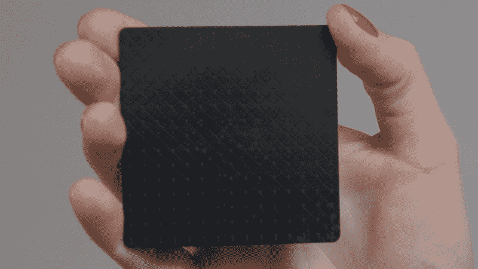
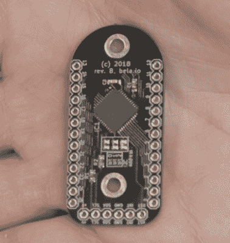

# Trill:为您的项目提供简单的位置触摸传感器

> 原文：<https://hackaday.com/2019/09/16/trill-easy-positional-touch-sensors-for-your-projects/>

如今，制造电容式触摸感应按钮很容易；许多微控制器都内置了电容感应硬件。这对于简单的开/关控制来说是可行的，但如果你想要一个线性的、位置敏感的输入，就像你在电脑触摸板或智能手机屏幕上看到的那样，该怎么办呢？不那么容易——至少到目前为止。 *Trill* 是一个电容式触摸传感器系列，您可以将其作为线性滑块、方形触摸板或通过创建自己的触摸表面添加到您的项目中。

Trill 是由设计 [Bela](https://bela.io/) 的同一个团队创建的，Bela 是一个嵌入式平台，用于低延迟交互应用程序，尤其是音频。新型 Trill 传感器依靠电容感测来跟踪手指运动，并通过 I2C 与您选择的微控制器或开发板进行通信。 [Trill I2C 库](https://github.com/BelaPlatform/Trill)的目标是 Arduino 和 Bela，但应该很容易移植到任何 I2C 主机。

硬件和软件都是开源的——或者将会是开源的，因为今天早上发布的 Kickstarter 已经实现了它的目标。为这些传感器供电的赛普拉斯 [CY8C20636A](https://www.cypress.com/file/138731/download) (PDF)控制器的固件将由 NC-SA 逐 CC 发布。但是，从控制器本身开始听起来 Trill 已经为您做了很多工作，所以让我们看看目前为止我们所知道的，以及一些合理的推测。

Trill Bar: 101 x 22 mm linear touch sensor

Trill Bar 是一个 101×22 mm 的传感器，可以检测单个轴上的多达五个同时触摸，它报告每个触摸的长轴位置和大小。有趣的是，传感器可以用坚固的剪刀剪成最小 40 x 14 mm 的尺寸，这听起来很适合各种项目。最小尺寸大概是由控制器和电路板背面相关元件的尺寸决定的。

我们确实知道每个都包含一个微控制器和“高分辨率模拟硬件和定制固件”Cypress 有一份很好的应用说明，解释了这些传感器所基于的 T2 技术。Trill Bar 传感器由多条之字形走线组成，每条走线都连接到一个容性传感器输入端。触摸该条时，固件会测量相邻走线上的电容变化，并根据走线上的电容分布估计每个手指的位置。然后根据总电容变化来估计每次触摸的“大小”。尽管有很多细节，底层硬件支持许多不同的滤波器和调谐参数。正确处理这些问题可能并不简单——已经为您解决了这个问题(并在板上填充)是 Trill 产品的价值所在。

Trill Bar: 101 x 22 mm linear touch sensor

虽然线性传感器很有趣，但我们对 Trill Square 更感兴趣，它是一种 69 x 69 毫米见方的 2 轴传感器。这个版本只感应单个手指触摸，但包括大小感应。它可以缩减到 33 x 16 mm，同样，这一限制可能是由于背面电路的尺寸。

有源侧有许多菱形焊盘，可以看到一个 15 x 15 过孔阵列。我快速浏览了一下 Cypress 文档，发现容性检测输入采用矩阵模式，两个轴交错使用线性滑块。硬件的滑块处理再次被使用，实现为两个相互重叠 90 度的滑块。把这种感知转移到硬件上真的很好，我们可以想象用这个东西可以构建各种有趣的界面。

Trill Craft

完成新传感器的是 Trill Craft，它放弃了内置的感应垫，所以你可以添加自己的感应垫。45 x 22 mm 电路板有 30 个电容感测通道，可以连接到任何导电物体，创建自己的传感器。例如，Kickstarter 页面显示了一种乐器，其中的传感器似乎是铜管的一部分。

条形和方形传感器的感测分辨率据称小于 0.1 毫米，尽管没有关于准确度或精度的规范。然而，对于预期的用途来说，这可能并不重要——手指的位置无论如何都不是非常准确或精确，当使用这样的界面时，你通常会实时调整你的手指。所有传感器的读取延迟都是 5 毫秒。

Trill 页面上的一个视频显示了一个由四个 Trill 正方形组成的阵列，用于创建一个更大的界面，顶部应用了一层薄乙烯板。这看起来会开启一些有趣的可能性。这三种型号中任何一种的单个传感器起价为 14 英镑(17.50 美元)。

我很想得到其中的一些东西来尝试一下，但是看起来我不得不像其他人一样等待。如果你对这样的传感器有什么有趣的用途，或者对它们的工作原理有更多的了解，请在下面的评论中发表意见。

 [https://www.youtube.com/embed/er07EFHnh1k?version=3&rel=1&showsearch=0&showinfo=1&iv_load_policy=1&fs=1&hl=en-US&autohide=2&wmode=transparent](https://www.youtube.com/embed/er07EFHnh1k?version=3&rel=1&showsearch=0&showinfo=1&iv_load_policy=1&fs=1&hl=en-US&autohide=2&wmode=transparent)

