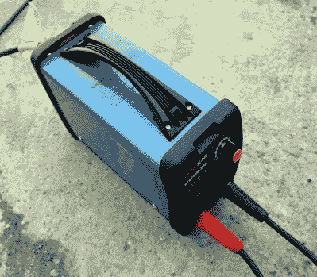
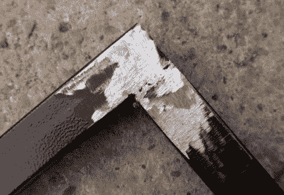
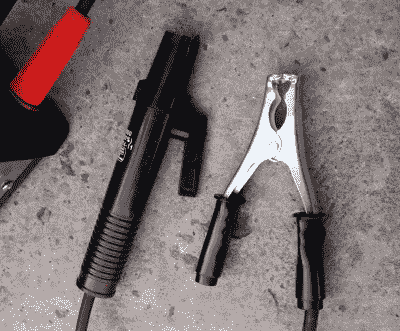

# 便宜的逆变焊机值得吗？

> 原文：<https://hackaday.com/2019/09/23/is-a-cheap-inverter-welder-worth-it/>

我们都见过网上常见的廉价电焊机，价格非常诱人的小型逆变电焊机。但是他们有什么好的吗？当我当地的超市在它的供应通道里有一个时，我冒险把它放在我的购物车里，和通常一周的马麦酱放在一起。那是今年年初的某个时候。

## 你们超市卖电焊机吗？

My Workzone welder from the supermarket.

我从当地的 Aldi 那里买的是一个 Workzone WWIW-80，这是一个 80 A 的装置，花了我 60 多英镑(约 75 美元)，带有焊接引线和一个质量相当差的面罩。德国折扣超市连锁店专门定期提供各种有趣的东西，所以他们的竞争对手 Lidl 的 Parkside 品牌也有一个非常相似的单元出售。这些小型逆变焊机相当普通，所以如果你不介意放弃慷慨的 Aldi 3 年保修，你可以在网上以更低的价格找到各种品牌和规格的焊机。我见过的最便宜的大约是 35 英镑，或 44 美元，但这个价格只包括逆变器，没有焊接引线。

作为一名铁匠，我父亲从 20 世纪 90 年代起就有了一台高质量的逆变焊机，所以我的参考框架就是基于此。过去十年，当第一批微型逆变器首次进入市场时，他尝试了其中一种，但它无法满足专业焊工的要求，因此被打包。因此，我对这个单元没有很高的期望，但我需要一个我自己的，价格也值得一试。我偶尔用它来完成一般的重型焊接任务，修理一些农业机械和配件，以及在 7 毫米厚的窄船上重建一些台阶。它在这些任务中表现得很好，因为我不是一个熟练的焊工，我的工作也不是最整洁的，但它让我做了一件令人满意的工作。

## 这些焊工表现如何？

This is a stick weld on 1mm thickness tube using a 2.5mm rod at 40A. It’s not the best weld you’ll ever see, but that someone with my limited skill could do this I find amazing.

逆变焊机出现已经有很长时间了，所以使用交流电焊机的读者可能会比以前少。对我来说，这种比较是一种平滑，我相对缺乏焊接技能，这表现在我发现逆变器不像我父亲那样容易引弧，但一旦电弧产生，就更容易画出和控制它。我可以用逆变焊机更容易地填充焊接孔，更好地控制电流意味着我可以更容易地处理较轻的工作，而我的能力通常会更好地服务于 MIG 焊机。

为了证明这一点，我决定推动限制一点，并尝试工作区焊机与一些边角料 1 毫米厚的方管从我的 makerspace 废品箱。这些来自办公室的桌脚，是那种可以和任何电焊机一起挑战极限的原料。因为这是一个相对较小的焊机，我使用 2.5 毫米的焊条，正如你所料，在较高的电流下，它会很高兴地在 1 毫米的管壁上吹一个洞。这就是为什么你通常会在这样的任务中使用 MIG，事实上在 80 A 时，我得到了更接近切割而不是焊接的奖励。将电流调回到 40 A，我可以很容易地重建孔，当试图以直角连接两块时，我可以产生一个完整的平滑焊缝。对我来说，焊接这种材料的能力是惊人的，因为我从来没有用电焊机在这么薄的金属上做到过。这几乎是汽车车身的厚度，我从来没有想象过甚至一个逆变器可以接近。值得一提的是，将电弧保持在仅 40 A 更具挑战性。

## …它们的局限性是什么？

我把我的工作区描述成一个有能力的小焊机，它在我使用它的工作中为我提供了很好的服务，它的能力甚至让我感到惊讶。它的不足在哪里，焊工喜欢它，如果他们这么好，为什么更好的焊工存在？

I’m fine with the electrode holder but the earth clamp could be more substantial.

就构造而言，这些装置对于严肃的临时用户来说足够坚固。一个坚固的金属片外壳，带有体面的冷却孔和风扇以防止过热，以及用于导线的黄铜锁定连接。如果你习惯于其他开关模式电源:常见的电子设备和环形变压器，它们就没什么特别的了。导线很结实，检查证明是铜导线，而不是我担心的铝导线，因为这是通过欧洲经销商销售的，所以所有东西都带有欧洲标准标记。如果你从网上购买类似的焊机，它可能没有这些认证，所以要小心安全标准不严格的设备。

他们与专业级焊工的不同之处在于他们的工作周期，在某些情况下可能还在于他们声称的能力。这不是你用于大规模制造或建造船只的焊机，而是你放在商店里用于短期焊接任务的焊机，或者也许你有一个轻量级和便携式的备份，用于你的商店焊机太大而无法到达的工作。如果让我大胆猜测为什么我爸爸的小逆变焊机会坏，我会把手指放在工作周期上:一个铁匠在现场安装一件工件的要求可能对它来说太多了。因此，如果你是一个偶尔的焊工，这将是好的，但如果你一直使用它，它可能会支付投资多一点。

此外，小型逆变焊机的技术指标有时也很乐观。Workzone 单元的容量相对适中，为 80 A，但类似的型号声称能够达到 200 A 的情况并不少见。当仅花费几十美元的东西就其价格而言似乎不切实际的有前途的容量时，假设探索其极限将加速其灭亡是合理的。你付出什么就会得到什么，也许如果你的需求流向更大的潮流，你多付出一点就会得到回报。

在黑客时代的读者中，将会有焊接技能远远超过我的人，以及许多有类似廉价逆变焊机经验的人。我希望分享我的经验能帮助你决定是否要尝试这些设备，并且一如既往地在评论中听到你的观点。