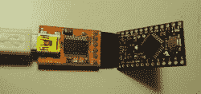

# 为视障人士照亮道路

> 原文：<https://hackaday.com/2019/09/28/lighting-the-way-for-the-visually-impaired/>

孟加拉机器人专家[nabilphysics]的最新创造可能听起来很熟悉。他的[激光增强手套](https://hackaday.io/project/165637-gadget-for-visually-impaired-people-gvip)让用户能够检测他们面前水平的物体，就像视觉障碍者使用手杖或杆子在物理空间中导航一样。

作为物理手杖的替身，他使用了 [VL53L0X](https://www.adafruit.com/product/3317) 飞行时间(TOF)传感器，该传感器检测激光源反射回传感器所需的时间。这些比红外距离传感器更精确，比超声波传感器具有更好的方向性。

虽然传感器可能会受到背景光或其他飞行时间传感器的干扰，但主要优势是计算速度(它依赖于单次拍摄来计算场景内的距离)和简化距离数据测量的有效距离算法。与需要复杂相关算法的立体视觉相比，为飞行时间传感器提取信息的过程完全是直接的，只需要少量的处理能力。

 该手套向用户提供触觉反馈，以确定是否有物体挡住了他们的路。反馈通过 Arduino Pro Mini 控制，由 LiPo 电池远程供电。代码从 FTDI 适配器上传到 Arduino，其工作原理是从飞行时间传感器获取连续读数，并确定前方的物体是否在手套的 450 毫米范围内，此时它会触发振动电机，提醒用户物体的存在。

由于该项目使用的手套是自行车手套，所以外形很简单 Arduino、电机、电池和开关都位于手套顶部的一个塑料盒内，而飞行时间传感器在手套打开时伸出来进行连续测量。

一般来说，设置相当简单，但使用飞行时间传感器而不是红外或声纳传感器的想法很有趣。在传感器的更广泛用途中，激光雷达已经是用于自动驾驶汽车和依赖距离感测的机器人组件的事实上的传感器。这种三维数据在这里不会有太大的用处，而且这种传感器没有机械移动部件，因为它不依赖于激光雷达系统使用的激光束的逐点扫描。

The [HackadayPrize2019](https://prize.supplyframe.com) is Sponsored by:     