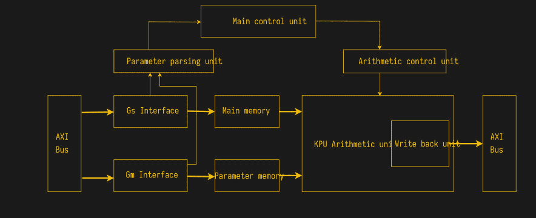
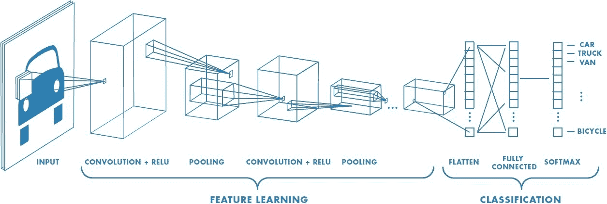
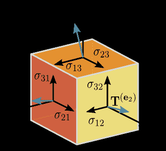

# AI 芯片到底有多智能，真的吗？

> 原文：<https://hackaday.com/2019/11/04/how-smart-are-ai-chips-really/>

“人工智能”这个术语最棒的地方在于，没人能真正告诉你它到底是什么意思。其主要原因源于术语“智力”，其定义从实践逻辑推理的能力到执行认知任务或构思交响乐的能力。当谈到人类的智力时，自我意识、复杂的认知能力以及计划和激励自己的能力等属性通常被认为是决定性的特征。但坦率地说，什么是“智力”，什么不是“智力”，还有待商榷。

毋庸置疑的是，人工智能是一座营销金矿。这种模糊性让世界各地的营销部门都变得人工智能快乐起来，宣称他们的产品是人工智能支持的，并坚持认为他们的语音助手会“智能地”回应一个人的查询。人们可能会开始相信，我们正处在一个由机器人和强大的人工智能居住的美好未来的尖端，这些人工智能会关注我们的每一个突发奇想。

在本文中，我们将着眼于这些说法背后的现实，思考人类向第一类文明发展的进程。但这是 Hackaday，所以我们也将挖掘一些人工智能芯片的内部，包括 Kendryte K210，并看看今天的硬件如何适应我们辉煌的未来。

## 介绍 K210

[Kendryte K210 片上系统](https://hackaday.com/2019/02/14/new-part-day-a-risc-v-cpu-for-eight-dollars/)是当今最前沿的人工智能芯片，结合了双核 64 位 RISC-V 处理器，以及常见的一系列外设。对于这款芯片的目标市场， [Kendryte](https://kendryte.com/) 总结为:

> 中文的 Kendryte 是研究智力的意思。
> 这款芯片的主要应用领域在物联网领域。该芯片提供人工智能解决方案，为
> 增加智能。

相关的有 *KPU* 处理器， [K210 数据表](https://kendryte.com/downloads/)描述为:

> KPU 是一个通用神经网络处理器，具有内置的卷积、
> 批处理规范化、激活和池化操作。它可以实时检测人脸或
> 物体。

The Kendryte K210 KPU’s schematic overview. (Credit: Kendryte)

在同一个 PDF 文件中，我们可以找到有关 KPU 功能集的更多详细信息:

*   针对卷积神经网络(CNN)。
*   支持 1×1 或 3×3 维的 CNN 内核。
*   支持任何类型的激活功能。

这一切都给了我们一个明确的暗示，我们在这里处理的是一点硅，旨在加速卷积神经网络(CNN)的处理，卷积神经网络通常用于涉及机器视觉的领域。简而言之，卷积被用作过滤器，增强一些特征，如边缘、线和点，然后这些特征被用作神经网络中更深层的输入。机器视觉，更具体地说是物体和面部识别，可能是他们擅长的。

那么这个装置的智能在哪里呢？

## 用 CNN 让机器看见

CNN 的目的是给计算机系统添加类似于视网膜的东西，就像其他算法一样，如递归神经网络(RNNs)和隐马尔可夫模型(HMMs)用于自然语言识别。本质上，它增加了一些类似于感觉的东西，以及(取决于类型)与感觉相关的皮层部分。(如果一个 CNN 在做人类视网膜做的事情，一个 CNN 是人工智能，那么我实际上有“智能视网膜”吗？)

与视网膜非常相似，用于机器视觉的 CNN 用于减少原始图像信息量。借助 K210 SoC,“KPU”外设可用于将 CPU 密集型操作卸载至专用硬件，从而加快处理速度。这本质上与使用视频处理器来加速类似的并行任务与图形处理单元 (GPGPU)处理上的[通用计算是一样的，正如 CUDA 和 OpenCL 所流行的那样。](https://en.wikipedia.org/wiki/General-purpose_computing_on_graphics_processing_units)

CNN 由许多连续的元素组成，通常是输入层，许多卷积层，每个卷积层都有自己的汇集层，最后是一个完全连接的层，其工作方式很像经典的人工神经网络(ANN)。所谓的内核应用于卷积层，内核(通常是 2×2 或 3×3 大小的网格)应用于该层。这个内核的功能本质上与 CUDA 或 OpenCL 内核相同，因为它将相同的指令应用于许多数据实例( [SIMD](https://en.wikipedia.org/wiki/SIMD) )。

Layers in a CNN

CNN 的基本[目标是降低原始数据密度](https://towardsdatascience.com/a-comprehensive-guide-to-convolutional-neural-networks-the-eli5-way-3bd2b1164a53)(红色、绿色和蓝色通道，用于 RGB 数据)，以便完全连接的层最终只剩下基本数据，如物体的粗略轮廓或形状，然后可以通过训练好的神经网络进行分类，如[前馈神经网络](https://en.wikipedia.org/wiki/Feedforward_neural_network)。该网络将基于其训练数据输出概率结果。更复杂的实现将使用完全连接的层，该层也具有反馈以改进其分类。

## 这是标量和向量

A basic stress tensor. (TimothyRias, CC BY 3.0)

所以 K210 本质上是一个矢量处理器。它针对进行卷积和构建加权和的特殊数学进行了优化。而且速度非常快。这就像一个没有图形硬件的 GPU。

或者反过来说，GPU 就像一个 AI 加速器。即使是旧笔记本电脑中的低端显卡或内置 GPU 也是一个“人工智能引擎”，比 K210、 [NVidia Jetson](https://en.wikipedia.org/wiki/Nvidia_Jetson) 系统和类似的嵌入式“机器学习”或“机器视觉”目标系统强大许多倍。有了一些代数知识和 GPGPU 框架(或者使用 GLSL 着色器，如果你是铁杆),你也可以使用你的 GPU 来运行所有这些“人工智能”应用程序。或者做材料科学，或者别的什么。只是*数学*。

## 这还不是未来？

不幸的是，营销部门为我们描绘的现实与公司高墙之外的现实大相径庭。即使几十年的研究给了我们新的方法来处理信息和分类输入，比以往任何时候都更快，但我们并没有在我们购买的硬件中嵌入小大脑。

我们所拥有的是代数和向量处理器的精彩应用，后者变得比以往任何时候都更强大，更实惠，这在很大程度上归功于 GPU 推动的发展。由于图形卡，矢量处理能力迅速扩展，在某些方面超过了 CPU 的发展。对于科学、医学和许多其他领域来说，这是一个巨大的福音。也许有一天向量处理器将成为第一批人工智能的基础，因为那时它们可能会被称为向量处理器，但现在我们至少可以让你的汽车告诉你它是否认为它看到了一只猫或一个小孩。

你把人工智能协处理器用好了吗？请在评论中告诉我们。