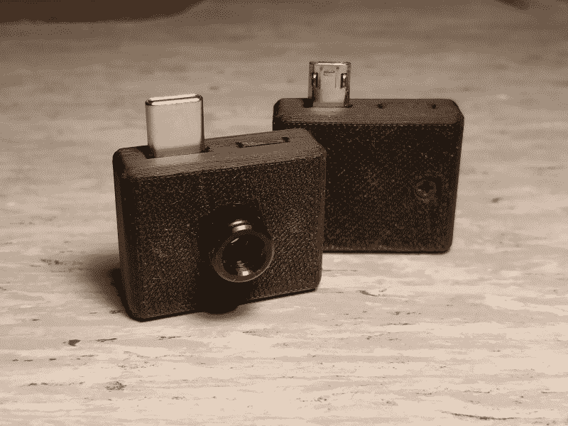
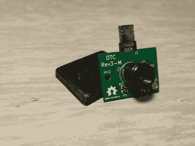
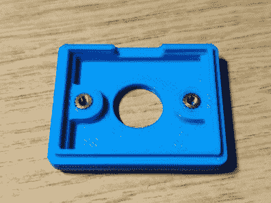
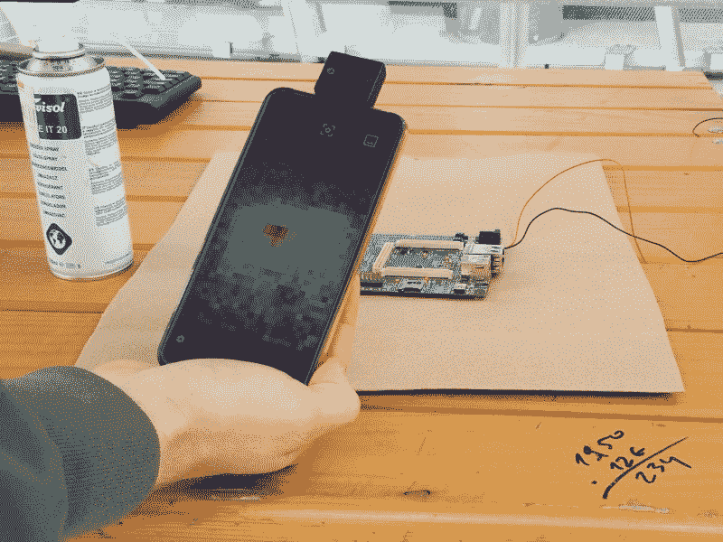

# 用热感摄像机加热

> 原文：<https://hackaday.com/2019/09/22/getting-the-heat-on-with-a-thermal-camera/>

需要一个快速的方法在明天上班前告诉你的体温吗？学生制造商[The Marpe]最近制作了一款时尚的家用热感相机,看起来甚至像一个傻瓜相机。它通过将 MLX90640 远红外(FIR)热传感器的读数与 STM32F042F6Px 微控制器集成在一起，作为 Android 硬件附件工作。所有这些都通过 USB (MicroUSB 或 Type C)连接到一个 Android 应用程序。

在该应用程序上，用户可以查看、拍摄照片，并显示打开的热感相机生成的热感图像。他的 GitHub 上也有开放 Android 应用程序的代码[。](https://github.com/openthermalcamera/Android-Application)

FIR 传感器包含一个小型 IR 像素阵列，集成用来测量内部芯片的环境温度，并提供传感器来测量 VDD。传感器阵列上的每个像素都对聚焦在其上的红外能量做出响应，从而产生电信号，该电信号由相机处理器处理，以创建物体的表观温度图。传感器和 VDD 的输出存储在内部 RAM 中，可通过 3.3V I2C 访问。它们不仅成本低、分辨率相当高，而且可以通过 Digi-Key 订购。

该微控制器基于 STM32 平台，具有 32 位性能、低功耗(2V 至 3.6V 和 48 MHz)和相当低的成本。定制设计的 PCB 安装在带有 M2.5 插件的 3D 打印外壳内，以方便组装。[The Marpe]使用 Esra 烙铁创建了一个热插入工具，以便于组装，并使热插入的结果更加一致，从而获得更好的整体光洁度。

    

该项目已经在斯洛文尼亚的柳布拉纳市和意大利的里雅斯特市展出。这里，开放的热感相机正在一个有短路组件的故障 PCB 上进行测试，显示了 Android 应用程序的热感相机显示器上的短路位置。

相机的其他用途可以是家庭绝缘检查，漏水检测，野生动物观察，甚至是判断你的烙铁是否足够热可以使用。我们会说这是一个非常有用的 DIY 项目！

The [HackadayPrize2019](https://prize.supplyframe.com) is Sponsored by:     