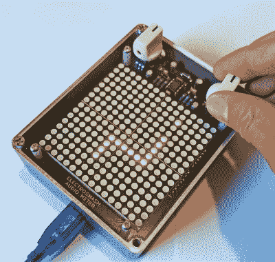

# 一个坚硬的摇动 Arduino 可视化防护罩

> 原文：<https://hackaday.com/2019/09/22/a-hard-rocking-arduino-visualization-shield/>

整个夏天[[electro mash]对 Arduino 音频指示器](https://www.electrosmash.com/arduino-audio-meter)进行了最后的润色，这是 Arduino Uno 的一个保护罩，它在一组四个 8×8 LED 点阵上可视化输入音频信号的各个方面。显然，它是用在吉他踏板上的，但由于团队提供了令人难以置信的文档和示例代码集，该项目有望成为各种音频实验的优秀平台。

 传入的音频通过 MCP6002 放大后送入 Uno 的模数转换器，在那里通过用户上传的任何草图进行处理。用户输入由带按钮的数字编码器提供。一组四个 MAX7219 芯片控制整个 256 像素矩阵，Arduino 上只有三个引脚。显示器的分辨率允许 Arduino 音频指示器显示的不仅仅是简单的 VU 指示器，它甚至可以显示文本和基本图形。

[【electro mash】提供了各种与 Arduino 音频测量仪](https://www.electrosmash.com/forum/arduino-audio-meter/485-how-to-start-programming-the-arduino-audio-mete)配合使用的草图，这些草图提供了预期的音频可视化功能，但它们也提供了许多有趣的草图，以意想不到的方式扩展设备的功能。其中一些可能对舞台音乐家有用，比如为你的吉他调音的工具，而另一些是硬件的有趣用途，比如“贪吃蛇”游戏。

随着整个项目作为开源发布，用户可以自由地使用 Arduino 音频指示器。编写您自己的定制软件显然是使项目成为您自己的项目的第一步，但是添加额外的硬件特性和功能当然也不是不可能的。

我们自己的[Lewin Day]曾经带领我们经历了制作精品吉他踏板的努力，虽然音频音频仪的功能有些有限，因为它没有能力改变通过它的音频，但我们仍然有兴趣看看社区一旦有了一种简单的方法将他们的想法付诸实践后会产生什么。

 [https://www.youtube.com/embed/IUKeNdt1Qo0?version=3&rel=1&showsearch=0&showinfo=1&iv_load_policy=1&fs=1&hl=en-US&autohide=2&wmode=transparent](https://www.youtube.com/embed/IUKeNdt1Qo0?version=3&rel=1&showsearch=0&showinfo=1&iv_load_policy=1&fs=1&hl=en-US&autohide=2&wmode=transparent)

