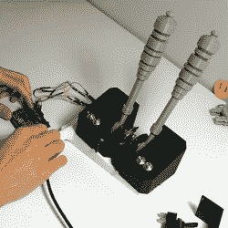

# 修补匠试点项目曲柄驾驶舱沉浸到 11

> 原文：<https://hackaday.com/2019/09/25/tinker-pilot-project-cranks-cockpit-immersion-to-11/>

虚拟现实中正在试验的一个更有趣的想法是虚拟和现实世界对象的 1:1 映射，这样虚拟表示就可以以正常的方式进行物理交互。Tinker Pilot 是由 lluíS 和 JAVI 开发的一个虚拟现实宇宙飞船模拟器项目，该项目采用了这一想法，旨在将驾驶舱的操纵杆、开关和其他硬件映射到现实世界中。那是什么意思？这意味着一个虚拟的驾驶舱，里面有飞行操纵杆、控制杆和开关，它们实际上存在于它们看起来存在的地方。

关于项目设计的一些事情引起了我们的注意。一个是串行通信协议，旨在与微控制器轻松接口，允许程序和任何定制外设之间的反馈。(顺便说一句，这是 Kerbal 太空计划与 KSPSerialIO 采用的相同方法，它使[能够在用户希望实现的任何复杂程度上定制任务控制硬件](https://hackaday.com/2018/01/23/building-a-better-kerbal-space-program-controller/)。)

在预告预告片(嵌入下方)中，从大约 1:09 开始展示了各种可能性[，在预告片中，用 CAD 绘制了一个定制控制器，然后 3D 打印并连接到 Arduino，最后 3D 模型作为实际工作单元的 1:1 表示导入驾驶舱，并带有视觉位置反馈。](https://www.youtube.com/watch?v=CU8TM5ZFGh0&t=69)

与我们看到的这个椅子实验不同，这个实验将一个 Vive 追踪器连接到椅子上，没有迹象表明在 Tinker Pilot 的单个控制上需要位置追踪器。在驾驶舱布局中，可以合理地期望控制保持在相对于驾驶舱的固定位置，这意味着它们可以被设置为物理布局的 1:1 表示，否则就被搁置。如今，即使是个人开发人员或小团队也可以进行这种实验，这是非常了不起的，看到这些想法被赋予一些实验是非常令人着迷的。

 [https://www.youtube.com/embed/CU8TM5ZFGh0?version=3&rel=1&showsearch=0&showinfo=1&iv_load_policy=1&fs=1&hl=en-US&autohide=2&wmode=transparent](https://www.youtube.com/embed/CU8TM5ZFGh0?version=3&rel=1&showsearch=0&showinfo=1&iv_load_policy=1&fs=1&hl=en-US&autohide=2&wmode=transparent)

