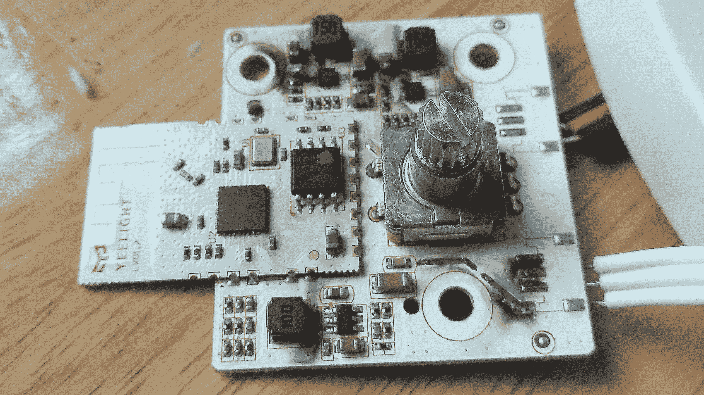
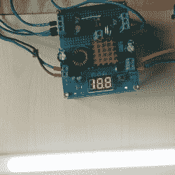
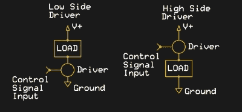
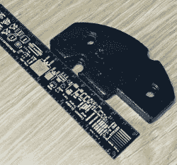
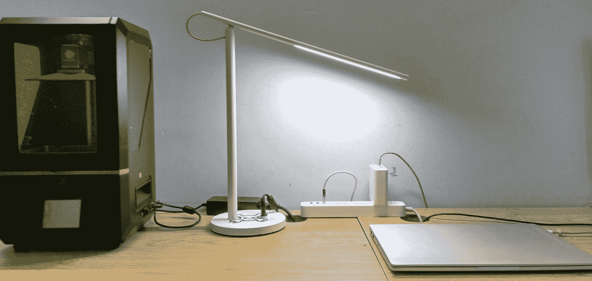

# 油炸台灯重生:如何使用 ESP8266 构建互联设备

> 原文：<https://hackaday.com/2019/10/01/fried-desk-lamp-reborn-how-to-use-esp8266-to-build-connected-devices/>

有些黑客是出于天赋或需要，而其他的则是因为我们愚蠢的无能。这不是关于第一种的故事。但它确实给了我一个借口，来展示设计 WiFi 连接设备是多么容易，这些设备按照你*想要的方式工作，而不是按照制造商的想法工作。*

 *它最初是一个明智的想法——越南的消费电子产品有许多不同类型的交流电源插头:A、C、G、F 和 I 相当常见，其中 A 和 C 最为常见。为了快速回顾所有这些看起来像什么，[这个网站很好地总结了它](http://mattporwoll.com/international-plug-types)。当然有通用的电源适配器，但它们往往不适合我最常见的类型(C ),导致每当你打喷嚏时都会间歇性地断电。所以我想我应该把我的设备上的所有插头都换成 A 型(对你们这些北美人来说很常见)，因为它在我所有的电源条类型中都适用，主要是剩余的服务器 PDU。

这是非常简单的，直到我走到我的台灯前。作为一款别致的小米智能灯，他们选择在插头中隐藏一个变压器，尺寸如此之小，以至于我没有注意到它。因此，它接受的不是温和的 12 伏 DC，而是 220 伏交流电。随着一道明亮的闪光和砰的一声，它最后一次照亮了我的桌子。

## 有时候你就是放不下

灯具在我们的生活中占据了一个奇怪的位置(光的带来者，书桌或餐桌的占有者)。也许你们中的一些人还记得[标志性的宜家灯具广告](http://www.youtube.com/watch?v=ZdIJOE9jNcM)，与他们的建议相反，你确实为灯具感到难过。幸运的是，这个故事有一个[续集](http://www.youtube.com/watch?v=SN_LW0p_5Ek)，类似于 Hackaday 如何看待一个小女孩从垃圾桶里拿出灯并赋予它新生命的事情。今天，我们将进行类似的灯修复静脉。与视频中不同的是，我们需要更换的不仅仅是灯泡！



We can infer quite a bit from the scorched board — first, that this is a rebranded a Yeelight lamp. Second, that it uses two high-side LED drivers, one for cold white light, and the other for warm. Third, the ESP module means that it’s ripe for modification.

打开箱子，露出了烧焦的电子设备。除了一个用于桶形插孔的小电路板，它似乎包括两个高端 LED 驱动器，一个用于降低 12V 输入的 DC-DC 转换器，一个 Yeelight 品牌的 ESP 模块，以及一个用于控制的组合电位器-按钮。

我从来没有觉得有必要在手机上安装另一个(潜在的数据采集)应用程序来控制一盏灯，所以到目前为止只使用了按钮。在网上快速搜索甚至发现了简单地移除 WiFi 功能的项目。

像那些修改的作者一样，我喜欢灯的设计，但不信任 WiFi 功能。随着这些功能的破坏性优化，我决定重新实现它们，因为我发现设备上的物理按钮使用起来有点麻烦。我只在我的笔记本电脑上工作到很晚的时候才使用这个灯，所以一个简单的桌面或键盘到 Python 脚本的快捷方式将是控制它的一个方便的方法。灯的底部有两块大金属板作为镇流器，其中一块可以拆下来，为我不太小型化的控制电路腾出空间，而不会使灯失去平衡。像往常一样，我用的是 Wemos Mini D1 变种的 ESP8266，运行 NodeMCU。这次固件非常标准——默认选项加上 PWM 模块。

## NodeMCU 灯控制器协议

为了最小化复杂性，我使用了一个简单的程序流程。ESP8266 打开，连接到我的家庭 WiFi 网络，然后等待端口 10001 上的 UDP 数据包。当收到一个时，前四个字符是设备 ID，第五个是通道(0 或 1-冷或暖白色 led)，最后四个字符是 0-1023 之间的所需亮度。



The LEDs still work well at 18-20 volts.

收到有效命令后，D1 和 D2 引脚上的 PWM 信号将根据需要改变。该信号驱动晶体管或 MOSFET 进入开关模式。我用晶体管和金属氧化物半导体场效应晶体管进行了测试，结果显示，led 灯需要大约 20 伏的电压才能达到高亮度，只消耗很低的电流。由于我没有 P 沟道半导体，我选择了便宜的 2N2222 晶体管，而不是更贵的 3.3v MOSFET。使用 N 沟道器件会产生不良影响，我们将在后面讨论。为了处理 ESP8266 和 led 的电源，我使用了两个串联的廉价通用 DC-DC 电压转换器，从 2-12v 的任何 DC 输入提供 20v 和 5v 线路。

我从一些简单的代码开始连接到我的 WiFi 网络(init.lua ),并在连接建立后运行 program.lua:

```

wifi.setmode(wifi.STATION)
wifi.setphymode(wifi.PHYMODE_B)
station_cfg={}
station_cfg.ssid="Network Name"
station_cfg.pwd="Network Password"
station_cfg.save=true
wifi.sta.config(station_cfg)

tmr.alarm(1,1000, 1, function() if wifi.sta.getip()==nil then print(" Wait for IP address!") else print("New IP address is "..wifi.sta.getip()) tmr.stop(1)  dofile('program.lua') end end)

```

UDP 数据包控制代码(program.lua)很简单，并且顺利通过了测试:

```

-- Set up two GPIO pins as outputs to be used to control lamp brightness
gpio.mode(1, gpio.OUTPUT)
gpio.mode(2, gpio.OUTPUT)

-- Make sure they start from a known state
gpio.write(1, gpio.LOW)
gpio.write(2, gpio.LOW)

-- Set the pins to work as PWM outputs at 1kHz, 0% duty cycle and start
pwm.setup(1, 1000, 0)
pwm.setup(2, 1000, 0)
pwm.start(1)
pwm.start(2)

-- Listen on port 10001 for UDP packets
port=10001
srv=net.createServer(net.UDP)
srv:on("receive", function(srv, pkt)
    -- When a packet is received, split it into 3 sections. First 4 characters as deviceid, next one as channel, last one as brightness
    print("Command Received")
    deviceid = string.sub(pkt, 1, 4)	
    channel = string.sub(pkt, -5, -5)
    brightness = string.sub(pkt, -4)	
    -- If deviceid equals device name, change the duty cycle of the selected channel to change the lamp brightness
    if deviceid == 'lamp' then
        print('Lamp command received')
	print(channel)
	print(brightness)
        pwm.setduty(channel, brightness)

    else
        print('invalid data')
	end
   end)
-- Whenever done, go back to listening.
srv:listen(port)

```

对于这些测试，我编写了一个简单的 Python 脚本，它发送一个包来将灯设置为给定的亮度。后来，它成了我笔记本电脑上的一个可执行脚本，然后[成了 Ubuntu 的键盘快捷键](http://help.ubuntu.com/stable/ubuntu-help/keyboard-shortcuts-set.html.en)。注意:根据您选择的操作系统，下面的第一行可能会有所不同:

```

#!/usr/bin/env python
import socket
import time
PORTNUM = 10001

#Broadcast a single UDP packet to all devices on local network containing a 75% brightness command
s = socket.socket(socket.AF_INET, socket.SOCK_DGRAM, 0)
s.setsockopt(socket.SOL_SOCKET, socket.SO_REUSEADDR, 1)
s.setsockopt(socket.SOL_SOCKET, socket.SO_BROADCAST, 1)
data='lamp10750'
s.sendto(data, ('192.168.1.255', PORTNUM))
print data

```



High side and Low side driver circuits. Source: [AVRFreaks Forums](https://www.avrfreaks.net/forum/high-and-low-side-driver)

## 从高端切换到低端

现在，我们到了麻烦的部分。灯具中最初的 LED 驱动器使用高端控制，也就是说，它们位于电源和负载(LED)之间，根据需要提供电流。这意味着我们的 led 灯有 3 根电缆暴露在外:两根电源线和一根公共地线。利用 P 沟道半导体可以轻松实现高端控制，但对于我们的情况，利用 N 沟道器件则不切实际。n 沟道器件通常用于低端控制:它们位于负载和地之间。对于这些器件，led 最好有单独的接地，共用一个电源。



A surprising amount of the lamp is just ballast. Hardly a complaint — it has a nice weight to it and leaves plenty of space for repairs and modifications.

在试验板期间，让我迷惑的是，我实际上是用足够高的基极电压来驱动 2N2222，使其能够在高端配置下工作，我忘记了这是可能的，并且不能在实际电路中轻易复制。我不得不满足于用 2N2222 实现低端控制，并暂时断开一个 LED 灯通道。这足以拥有一个功能灯，下次我在 Nhat Tao electronics market 时，我可以挑选一些小的 P 沟道晶体管来启用这两个通道。

在把所有的电子元件塞进镇流器原来的位置后，我注意到亮度/颜色控制电位计原来的位置正好适合一个母插孔。加上这一点，最终结果看起来还算不错。我插上 12 伏的电源，一切都完全失灵了。

罪魁祸首还是过高的输入电压。虽然额定输入电压为 12V，但升压转换器实际上无法承受该电压，因此无声无息地停止了工作。在用备用件替换它并使用 9V 适配器后，faciat lux！



在这一点上，我可以添加某种类型的挑战响应安全性，但我不会这样做，因为它是一盏灯。如果你要千里迢迢跑到我的区域只是为了(恶意？)照亮我的桌子，一会儿我会带着我的猎狐装备去找你，我们可以去吃点点心。

我确实注意到在 1khz 的 PWM 频率下有一些非常小的闪烁，这是 PWM 模块允许的最大值。使用相对较新但名字平淡的 PWM2 模块可以获得更高的 PWM 频率。当需要更少的亮度级时尤其如此，例如，我不需要每个通道 1024 个亮度级，16 个就可以了。但是，我怀疑闪烁可能是由电源等其他因素引起的。当我升级到 P 沟道晶体管时，我会调整频率，看看是否有帮助。目前，灯工作良好，控制系统反应迅速可靠。*