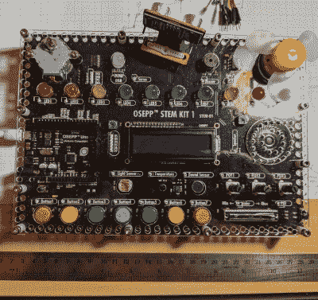
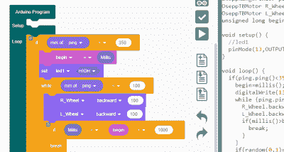
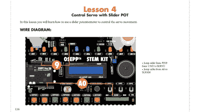
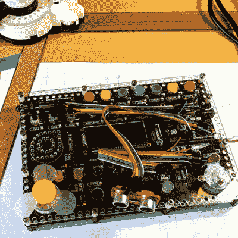

# 复习:OSEPP STEM 套件 1，在折扣通道找到的初学者多合一板

> 原文：<https://hackaday.com/2019/09/26/review-osepp-stem-kit-1-a-beginners-all-in-one-board-found-in-the-discount-aisle/>

顾名思义，[OSEP STEM 板](https://www.osepp.com/starter-kits/122-osepp-stem-kit-1)是一个嵌入式项目板，主要面向教育。你使用跳线连接组件和一个视觉块编码语言，使它去。

我对 Radio Shack 等公司的[套件有着美好的回忆，这些套件在一块板上有几十个零件，用弹簧端子用跳线将它们连接起来。用像“200 合 1”这样的点击诱饵标题做广告，你会得到一本书，告诉你如何用电线把零件做成一个收音机、一个闹钟、一个闪光灯，或者其他任何东西。](https://hackaday.com/2019/02/10/there-are-200-electronic-kits-in-that-box/)

STEM 套件 1 是这些套件的现代 arduino 驱动版本。该板托管一个独立的 Arduino UNO 克隆(包括在工具包中)，也有一系列你可能想钩到它的东西。像扬声器和步进电机这样的东西都有驱动器，所以你可以很容易地从 arduino 驱动它们。你也可以用一堆跳线来连接。大多数需要永久连接的东西(如接地)都预先布线在 PCB 上。其他连接使用单个引脚。您可以看到这种排列，三个旋转罐在标签(“POT1”)等旁边有一个单独的销。).

 我是个大甩卖迷，所以当我看到当地一家商店有售价约 30 美元的 OSEPP 的 STEM board 时，我不得不拿起一个。这些主板的建议价格是 150 美元，但大多数时候我看到它们的标价是 100 美元左右。以如此低的折扣价格，我忍不住去看看。

那么，像这样的嵌入式多合一项目套件是否符合这一传统呢？我在董事会呆了一段时间。底线是，如果你能在价格上找到一个交易，我认为它是值得的。全价，也许不是。休息之后，请加入我，我将介绍 OSEPP 所提供的内容。

## 船上有什么？

有大量的输入和输出设备:

*   7 个按钮
*   电位计(3 个旋转和 1 个滑动)
*   被动红外传感器(PIR)
*   光敏感元件
*   声音传感器
*   LM35 温度传感器
*   10 个发光二极管(各种颜色)
*   伺服电动机
*   步进电机
*   直流电动机
*   液晶显示器
*   门铃
*   扬声器
*   RGB LED

此外，该套件在一个小支架中配有一个超声波距离传感器，可以连接到步进电机。这是唯一一个需要电源和地线但还没有连接的部分。

 因为棋盘的核心是一个 Arduino UNO 克隆体，所以你可以做任何你喜欢的事情来给它编程。然而，OSEPP 吹捧他们的[视觉框图](https://github.com/DIYOSEPP/oseppBlock)语言基本上是[刮痕](https://scratch.mit.edu/)。你可以在大多数平台上免费使用它，甚至还有一个基于网络的版本，尽管它不能下载代码。它看起来像 Scratch 或您以前见过的其他面向块的系统。

我通常不喜欢视觉块语言，但是这个至少向您展示了它生成的实际 Arduino 代码，所以这并不坏。但是您仍然可以使用您喜欢的任何其他方法，例如标准 IDE 或 PlatformIO。

你可以在下面看到一个关于该板的视频。

 [https://www.youtube.com/embed/tvLo1Z7o5pk?version=3&rel=1&showsearch=0&showinfo=1&iv_load_policy=1&fs=1&hl=en-US&autohide=2&wmode=transparent](https://www.youtube.com/embed/tvLo1Z7o5pk?version=3&rel=1&showsearch=0&showinfo=1&iv_load_policy=1&fs=1&hl=en-US&autohide=2&wmode=transparent)

## 好的和坏的

董事会感觉很充实，能够承受一点虐待。有一个很好的组件范围，我喜欢 arduino 是一个真正的子板，而不仅仅是建立在 PCB 上。尽管使用了 block 语言，我还是很喜欢这本指南手册。它非常光滑，项目范围从红外门铃到迷你钢琴。你可以在下面看到一页——非常生动清晰。

 当然，150 美元的建议零售价有点令人不快。你可能会认为一个带有少量 led 和其他部件的试验板是一个成本低得多的选择，但只要看看适合初学者的 arduino 套件，你就会发现价格到处都是。另一方面，有了一个零件包，你就必须知道如何连接像步进电机或 DC 电机这样的东西，所以已经为你做好了就有价值了。没有一袋零件乱放也是有价值的。

套件中的跨接导线一端有引脚，另一端有插孔。针脚插入 Arduino 的连接器，插座穿过组件上的针脚。这些没有弹簧夹可靠，也不通用。

在我看来，套件设计中最糟糕的部分是引脚紧挨着每个组件。这有利于理解，但会造成布线混乱。例如，有十个 led，将它们全部连接起来意味着将跳线延伸到电路板的两边。跳线也不是很长，因此任何复杂的项目都会有电线在传感器和 LCD 之间交叉。

 当然，在这幅图中，我可以从线束中去掉一些电线，但这也没多大帮助。如果你需要连接几个以上的可用组件，你会搞得一团糟。我会放上某种弹簧夹，甚至螺丝端子，并把它们都放在电路板的顶部和底部，用清晰的颜色编码标记它们的连接位置。那么所有的线路都不会碍事。他们可能有一些其他的方法，在这个价格下，他们可以承受 PCB 上额外的几英寸。

还有一些其他的事情，将会很好地完成这个工具包。我会喜欢这本小册子中有一个关于直接使用 Arduino IDE 的简短章节，以便人们知道它的存在。甚至连一个小的试验板也能让你自己探索，但这需要不同类型的跳线。

## 使用距离传感器的简短示例

我想做一些与董事会，所以我决定玩距离传感器和伺服。距离传感器有点烦人，因为你必须将它全部连接起来，而且当你运输电路板时，它有脱落的趋势。

这个演示(你可以在网上找到)不会赢得任何创意奖。程序移动伺服系统，以 5 度的增量从 0 度扫描到 180 度。它测量前方物体的距离。当它完成扫描时，如果它看到了近处的东西(你可以调整灵敏度)，它会将传感器移回那个位置，并等待 30 秒。否则，它会继续扫描。

真的，这和其他 Arduino 程序没什么区别。这才是重点。尽管书中强调了点击式语言，但这实际上只是一个 Arduino。

## 概括起来

对于我发现的深层销售价格，该板将很好地为学生或任何开始使用 Arduino 或微控制器的人服务。即使是更高级的观众，如果只是想找到一种快速制作原型的方法，也可能会觉得花 30 或 40 美元是值得的。但按全价计算，很难想象这有什么意义，因为布线混乱，扩展选择有限。