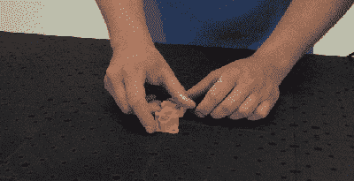

# 模块化夹具板非常适合小批量生产

> 原文：<https://hackaday.com/2019/09/26/modular-fixture-plates-perfect-for-small-production-runs/>

如果你曾经做过任何需要一点组装的小批量生产，你就会知道夹具和固定装置可以节省大量的时间。然而，这些通常需要安装，这意味着您最终要在工作台上钻孔或制作一次性安装板。[吉姆·史密斯]对这个问题并不陌生，他创造了 [Pact Plate](https://www.kickstarter.com/projects/grassrootsmfg/pact-plate-a-modular-and-reconfigurable-base-plate-system) ，这是一种负担得起的组合夹具板，并正在 Kickstarter 上开展活动以生产它。

每块板的尺寸为 150 毫米× 150 毫米，带有 25 毫米× 25 毫米的网格孔，带 M4 螺纹插件。这允许快速和容易地安装到板上和从板上移除，而不需要钻额外的孔。板可以用螺栓连接在一起形成更大的板。演示视频显示他使用各种 3D 打印夹具、肘节夹具、PCB 和零件支架([可下载](http://www.grassrootsengineering.com/blog/2019/09/24/announcing-the-launch-of-pact-plate/))甚至机器人来快速设置小型组装站。这也可以在原型和开发阶段节省大量的时间来固定部件。

[Jim]的原型都是 3D 打印的，但他希望获得模具，使用注射成型来生产板材。他没有说他打算用什么材料，但很可能是某种纤维增强塑料。他声称硬度接近压铸铝。我们希望看到的另一件事是用一些塞子堵住未使用的孔，以防止小部件掉入孔中。

虽然夹具板并不新鲜，但它们通常比 20 美元的 Pact 板贵得多。众筹活动总是有风险，但看起来[吉姆]已经把所有的基础都考虑得很好了。原型制作工作已经完成，所以只需要制作工具和测试样品，对于这样的设计来说，这应该相当简单。

我们之前已经展示过一些[吉姆]的项目，包括一个 [3D 打印的皮划艇](https://hackaday.com/2014/03/19/3d-printers-can-only-make-trinkets-what-about-kayaks/)和他用来打印它的[大型 3D 打印机](https://hackaday.com/2011/09/08/huge-diy-3d-printer-predictably-prints-huge-3d-items/)。