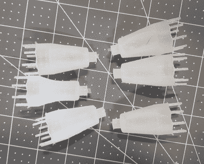

# 硅胶注射器给零件生产打了一针强心剂

> 原文：<https://hackaday.com/2019/09/26/silicone-injector-gives-parts-production-a-shot-in-the-arm/>

如果成功意味着再也不用做讨厌的工作，我们中的许多人都乐意花几个小时想出一个能节省我们几秒钟的解决方案。[弗兰肯斯坦·哈德森]模制了足够多的硅胶部件，以至于他厌倦了所有的手工劳动，所以他[制造了一个硅胶注射器来为他做这件事](https://imgur.com/gallery/Qu8E48X)。现在，他所要做的就是一点一点地推动把手，直到硅胶开始从模具的通气孔中渗出。

 上图中的模具旨在为直升机通信连接制造小护罩[，就像这个](https://chapmaneng.com/shop/moulded-silicone-parts/)。他在业内的朋友非常喜欢它们，所以他决定卖掉它们，因此需要扩大生产规模。现在他可以一次做六个。

他设计了支架，将一对注射器并排固定在底板上。有一个杠杆可以同时推动两个柱塞，还有一个适配器可以将导管固定在注射器喷嘴上。排出的两部分硅树脂向下移动到一个双筒混合喷嘴，该喷嘴将硅树脂挤压到模具的顶部。

很自然，我们会建议自动化杠杆操作，但是[弗兰肯斯坦德森]已经计划用步进器和 Arduino 来做这件事。现在他正致力于增加软管直径以加快流速，这意味着要更换适配器。一旦分类完成，他计划发布 STLs 和它泵送硅胶的视频。

有没有想过反过来，用硅胶来模制热塑料？[是啊，那是个东西](https://hackaday.com/2015/02/16/turning-a-3d-printer-into-an-injection-molding-machine/)。

通过 [r/functionalprint](https://www.reddit.com/r/functionalprint/comments/d7nxhc/silicone_injector_and_3_part_mould/)