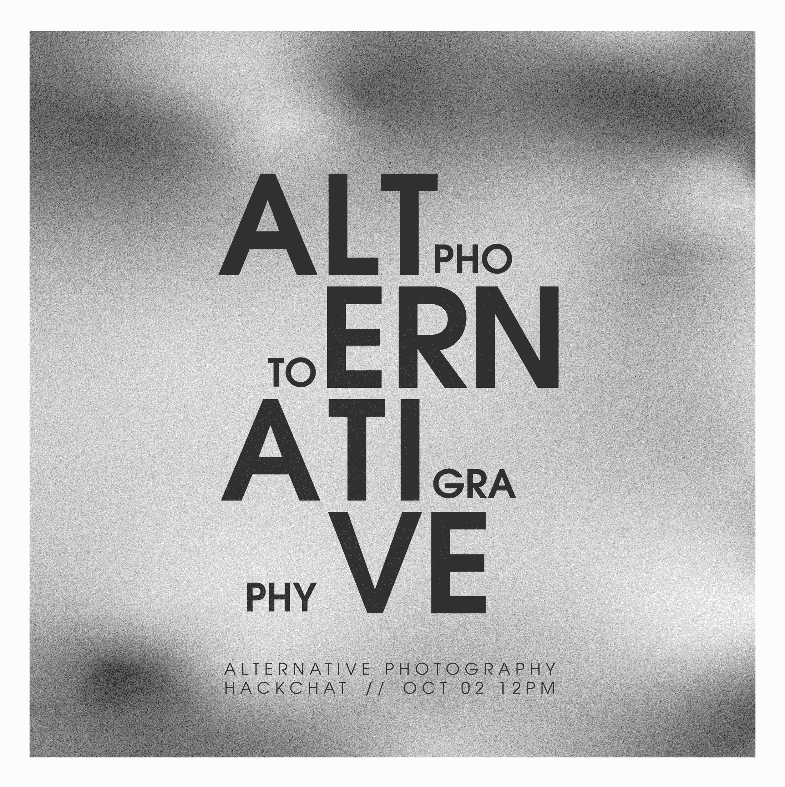

# 另类摄影黑客聊天

> 原文：<https://hackaday.com/2019/09/30/alternative-photography-hack-chat/>

加入我们太平洋时间 10 月 2 日星期三中午与 [Pierre-Loup Martin](https://hackaday.io/troisiemetype) 的[另类摄影黑客聊天](https://hackaday.io/event/166697-alternative-photography-hack-chat)！

似乎很久以前，硅的物理性质就取代了银的化学性质，成为创作照片的主要手段，以至于我们中很少有人拥有胶片相机，家庭暗房也是很久以前的遗物。没有人怀疑，用一个可以装进口袋的小设备快速拍照，甚至创作出摄影天才的作品，是一个世界奇迹，但数码照片仍然缺乏电影摄影的灵魂。

重现老派摄影的样子是一个相对较小的专业摄影师群体的热情所在，他们用一百年来都没有广泛使用的设备和化学物质来进行拍摄。这种特殊行业的工具很难在商业上获得，所以交替摄影过程的从业者被定义为黑客，使当前的设备屈从于旧的方式。Pierre-Loup 就是这样一位艺术家，他使用[胶棉板](https://en.wikipedia.org/wiki/Collodion_process)、[被黑掉的大幅面相机](https://hackaday.io/project/166590-polaroid-sx70-600-back)、针孔相机以及大量的化学品和工艺——任何能让他捕捉到独特图像的东西。[他的照片](https://www.flickr.com/photos/troisieme_type/)怪异，带有 Photoshop 很难创造的模拟瑕疵。

加入我们，让 Pierre-Loup 带我们领略另类摄影的世界。我们将看看另类摄影中使用的不同化学物质，为什么有人想尝试它的原因，以及实现它所需的设备。摄影一直都是一个骗局，直到它不再是；Pierre-Loup 将向我们展示他是如何试图将一些灵魂重新融入其中的。

 我们的黑客聊天是 [Hackaday.io 黑客聊天群发消息](https://hackaday.io/messages/room/2369)中的社区直播活动。本周，我们将于太平洋时间 10 月 2 日星期三中午 12:00 坐下来讨论。如果时区让你烦恼，我们有[一个方便的时区转换器](https://www.timeanddate.com/countdown/generic?iso=20191002T12&p0=224&msg=Alternative+Photography+Hack+Chat&font=cursive)。

点击右边的那个发言气泡，你会被直接带到 Hackaday.io 上的黑客聊天群，不用等到周三；随时加入，你可以看到社区在谈论什么。

