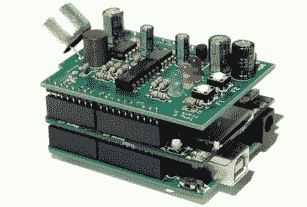
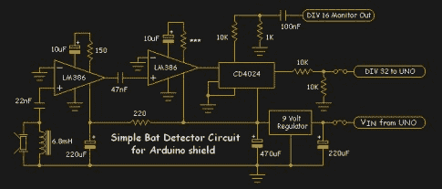
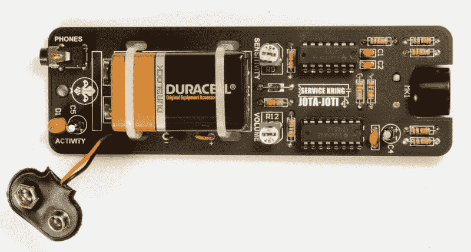
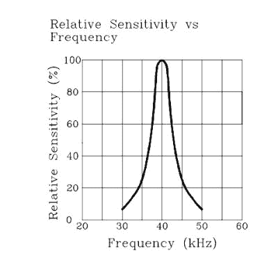
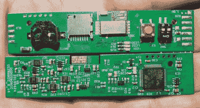
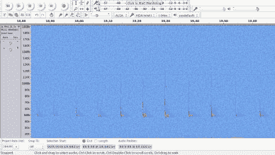

# 担心你的钟楼里有蝙蝠？两只蝙蝠探测器的故事

> 原文：<https://hackaday.com/2019/10/17/worried-about-bats-in-your-belfry-a-tale-of-two-bat-detectors/>

作为一个热爱科技和野生动物，也需要开发一个旧农舍的人，去蝙蝠探测器兔子洞是一次难以抗拒的旅程。蝙蝠是黑客监控的理想动物，因为它们从嘴里和鼻子里发出超声波频率来相互交流，探测猎物，并在树木等障碍物周围导航——所有这些都是在漆黑的黑暗中完成的。不利的一面是，许多物种喜欢在废弃的建筑中安家，在欧盟这里受到保护，开发商需要进行严格的调查，尽可能确保没有蝙蝠栖息在这里。

Perfect habitat for bats.

显然，当局要求进行专业的独立调查，但黑客仍然有很多机会通过进行“预调查”来参与。如果有问题，用 DIY 探测器找到蝙蝠栖息地将会立即告诉我们，并给我们一个重新思考我们计划的开端。

正如所料，蝙蝠探测器有各种形状和大小，使用各种电子技术使它们更便宜或更容易使用。蝙蝠探测器最常用的技术有四种。

1.  **外差:**就像调谐收音机一样，在不降低通话速度的情况下降低音调。
2.  **时间扩展:**大块的数据被减速到人类可听见的频率。
3.  **分频:**使用数字计数器 IC 实时分频。
4.  **全频谱:**全声谱被记录为 wav 文件。

幸运的是，最近的技术进步使制造商能够生产相对便宜的全光谱设备，这种设备提供了最佳的分辨率和识别实际蝙蝠物种的最佳机会。

DIY 蝙蝠探测器往往是分频型的，非常有助于发现从建筑物中出现的蝙蝠。扬声器或耳机发出的声音可以提示我们确认，我们瞥见的短暂的黑色形状实际上是一只蝙蝠，而不是前景中的飞蛾。我用其中的一个探测器和一个录像机来确认一只蝙蝠确实没有从一个旧烟囱里出来。唷！

## 这项技术

  The Ardubat, created by Tony Messina. A three layer device using Arduino Uno and SD card reader.  ArduBat schematic by Tony Messina

作为开源协作和迭代的一个很好的例子， [Ardubat](http://home.earthlink.net/~bat-detector/ArduBat/) 最初由 Frank Pliquett 构思，然后由 Tony Messina 扩展，最近由 [Service Kring](http://kitbuilding.org/index.php?option=com_phocadownload&view=category&download=20:manual-bat-detector&id=3:english-en&Itemid=457&lang=en) 简化。

Ardubat 是一款基于 TI CD4024 芯片的分频检波器，由两个 LM386 放大器供电。蝙蝠的探测结果被发送到 SD 卡上，随后可以对其进行分析，试图了解该物种。然而，由于该电路的工作原理是将模拟信号预失真为数字信号，然后进行分频，因此振幅信息无法通过。

BAT DETECTOR 2015, simplified version of Ardubat developed by Service Kring.

蝙蝠探测器 2015 同样基于 CD4024，但使用紧凑型四通道放大器 TL074CNE4。其中三个通道馈入分频器芯片，第四个是耳机放大器。这是一个非常简洁的设计，信号 LED 直接来自 CD4024。它是一个完整的 DIY 焊接工具包，包括邮费在内大约 10 美元。是的…$10 !！！

这些检测器的最大限制之一是超声波传感器本身，其频率响应通常与此处所示的曲线相似。最近， [Knowles](https://www.knowles.com/subdepartment/dpt-microphones/subdpt-sisonic-surface-mount-mems) 发布了超宽范围 MEMS SMT 麦克风，其工作频率高达 125，000 Hz 甚至更高！一些蝙蝠，最著名的是小马蹄铁，可以发出高达 115，000 赫兹的叫声。然而，这些老式的传感器在检测英国发现的大约 90%的蝙蝠方面非常出色，并且比外差检测器灵敏得多。

我选择的“专业”选项是 Dodotronics 的 [UltraMic384，它使用诺尔斯驻极体 FG23629 麦克风和32 位集成 ARM Cortex M4 微控制器，能够记录高达 192，000 Hz 的音频频谱。也有一些不错的 DIY 黑客选项，如树莓派](https://www.dodotronic.com/product-category/usb-microphones/?v=79cba1185463)的[音频注入器 Ultra 2，它可以以高达 96，000 Hz 的频率记录——但这对于所有蝙蝠来说还不够好。请注意，采样速率是音频频率的两倍，这很容易让人混淆。以 384 KB/s 的速度进行超高频采样将会以 192 KHz 的频率进行记录。](http://www.audioinjector.net/rpi-ultra)

  UltraMic348 top and bottom of circuit board shown. There’s only one board in the device itself!  Common Pippistrelle bat echolocation calls using Audacity software.

这些类型的全谱设备可以使用 Audacity 软件产生高分辨率的声谱图或光谱图。这对于想要知道实际蝙蝠种类的野生动物爱好者非常有帮助，尽管即使有最好的技术，有时仍然很难或不可能确定种类，特别是在鼠耳蝠属中。

因此，现在我们完全有能力使用 DIY 探测器，结合摄像机和几对人类眼球来检查废弃建筑中的蝙蝠。全光谱探测器将被设置为记录整个晚上，并用于检查是否有任何我们可能错过的活动，并至少告诉我们蝙蝠是什么属。

我们现在需要的只是一些机器学习来自动识别物种。ML 是蝙蝠探测的一个新领域，但是由于不同物种叫声的相似性，还没有人制造出一个可靠的系统。我们知道[神经网络正被用于识别大象的发声](https://www.npr.org/2019/10/13/769848647/solving-the-challenges-to-counting-forest-elephants)，这个概念在这里应该是适用的。无畏黑客的未来项目？至于 ardu bat——它迫切需要一个更好的麦克风，如果不是昂贵的 [FG23629](https://www.mouser.co.uk/ProductDetail/Knowles/FG-23629-P16?qs=3unH%2FDqlvl%2FLGWBkw2YfzA%3D%3D) ，那么 50 美分的 Knowles SMT [SPU0410LR5H](https://www.mouser.co.uk/ProductDetail/Knowles/SPU0410LR5H-QB?qs=ZBAH5PeHI6spSaDz04PSrQ%3D%3D) ，它也有很好的频率响应曲线。

[主图:[鼠耳蝠](https://commons.wikimedia.org/wiki/File:Myotis_bechsteinii-flying.jpg)作者 Dietmar Nill CC-BY-SA 2.5]