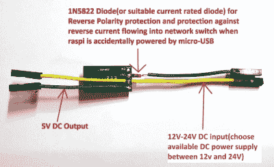

# 用 PoE 和树莓 Pi 3 大概两块钱

> 原文：<https://hackaday.com/2019/09/30/using-poe-with-a-raspberry-pi-3-for-about-two-bucks/>

当 Raspberry Pi 3 Model B+在 2018 年 3 月宣布时，其新功能之一是能够(更容易地)通过以太网供电(PoE)供电，官方 PoE 帽子的价格仅为 21 美元。这个东西第一次也几乎像预期的那样工作。但对一些人来说，这还不够好，结果[艾伯特·大卫]推出了一个他称之为“穷人的 PoE”的解决方案，价格约为 2 美元。

他的解决方案通过使用所谓的[无源 PoE](https://en.wikipedia.org/wiki/Power_over_Ethernet#Passive) 使它变得格外便宜，这种技术将电压注入到用于 PoE 的网络电缆的导线上，而不需要任何握手。总的来说，这被认为是一种非常可靠的(尽管是非标准的)PoE 形式，在某些东西化为乌有之前一直工作得很好。它还便宜得离谱，一个 PoE 注射器适配器(RJ-45 插头& 2.1×5.5 毫米电源插孔到 RJ-45 插孔)售价约为 80 美分，一个可以处理 12V 输入的 DC-DC 降压转换器售价约为 50 美分。

 剩下的 2 美元预算大部分花在布线和热收缩上，从而形成一个非常紧凑的 PoE 解决方案，直接插入 Raspberry Pi 3 板上的 PoE 接头，降压转换器输出进入地，+5V 引脚位于 Raspberry Pi 的 GPIO 接头上。

更好的解决方案是采用任何标准 PoE 协议来协商合适的电压。也许这可以是高科技，5 美元的解决方案，具有一个 MCU 和一个小 PCB？