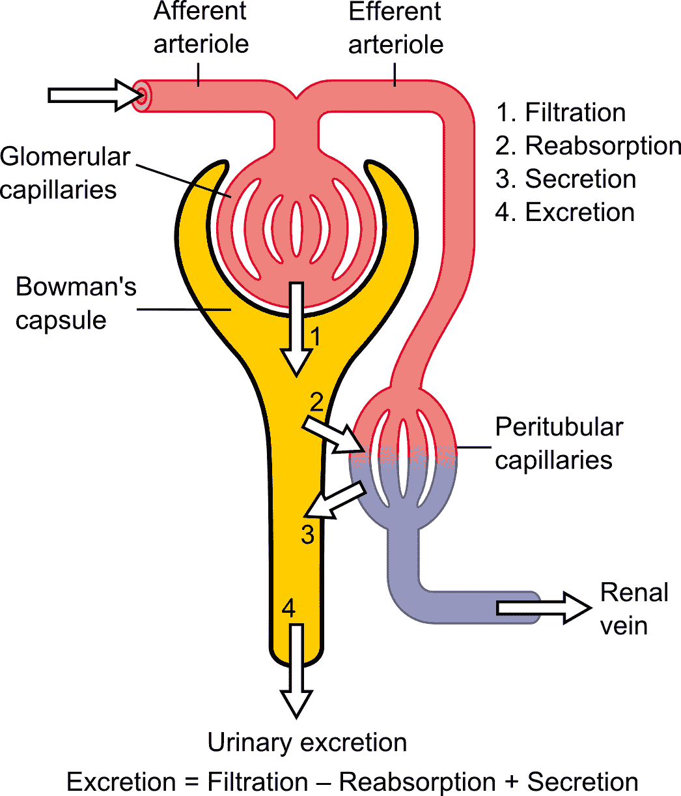
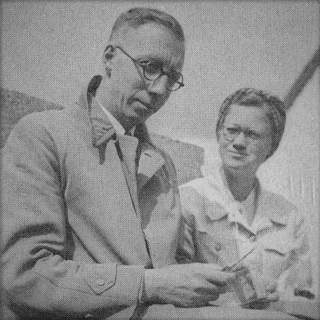
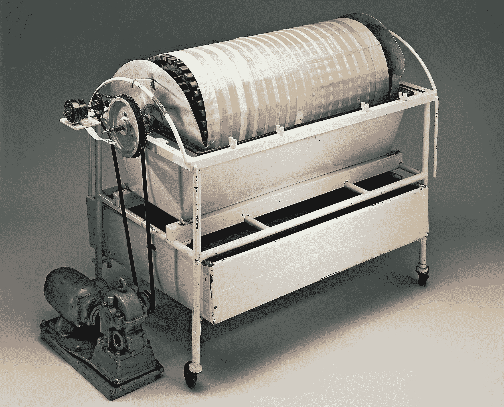
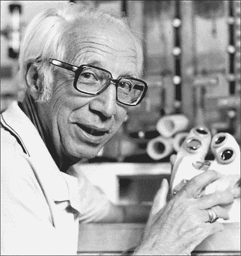

# 威廉·科尔夫的人造器官

> 原文：<https://hackaday.com/2019/10/09/willem-kolffs-artificial-organs/>

在我年轻的时候，我为一家收费的救护车服务公司工作，虽然我们都为紧急呼叫而活，但日常的交通是支付账单的呼叫。与汽车失事或心脏病发作时警灯鸣响的魅力和兴奋相比，交通工具平淡无奇。最无聊的是每天从疗养院到透析中心的旅程，那里有一排排舒适的椅子，每张椅子前都有一台冰箱大小的机器，用来过滤肾衰竭患者的血液，让他们再活几天。

可悲的是，这些病人中的大多数都是注定要失败的；许多人需要肾移植，但没有合适的供体，有些人根本不适合移植。透析实际上是他们和缓慢、痛苦的死亡之间的唯一障碍，我可以看到至少他们中的一些人看到等待的透析机而欢呼。肾脏的工作原理至少在 19 世纪就已经为人所知，但直到 1945 年，一位荷兰医生才利用废旧汽车零件和香肠肠衣，制造出这些机器的前身:第一个人造肾脏。

## 恢复平衡

 

肾单位的示意图，肾脏的功能单位。来源:madhero 88【CC BY 3.0】，[via Wikimedia Commons](https://commons.wikimedia.org/wiki/File:Physiology_of_Nephron.png)

肾脏是令人着迷的器官，完美地适应了它们从血液中过滤代谢废物的主要作用。蛋白质和核酸富含氮，当其中一种在体内分解时，就会产生尿素和尿酸。那些含氮废物在一定浓度以上是有毒的；肾脏的工作是过滤废物，用水稀释废物，然后以尿液的形式排出。

我们可能都在学校的某个地方看到过这背后的原理。渗透是溶液通过半透膜如生物组织寻求溶剂和溶质之间平衡的趋势。在肾脏中，含有含氮废物(溶质)的血浆(溶剂)流经毛细血管(半透膜)。膜的另一面是一种称为鲍曼囊的结构，含氮废物以及相当数量的氯化钠、葡萄糖和氨基酸流入其中。滤液中的大部分水和一些溶质被沿着鲍曼囊的毛细血管重新吸收，其余的以尿液的形式排出。

健康的肾脏是效率的奇迹，每天过滤体内全部血浆 60 次。在产生的 180 升大量滤液中，几乎所有的滤液都被重新吸收，剩下大约 2 升的尿液被排出。没有肾脏，身体将无法维持体液平衡、血液 pH 值和重要电解质的正确浓度。恶心、呕吐和水肿会很快出现；不可避免的死亡将是缓慢而可怕的，年轻的威廉·科尔夫医生将亲身体会到这一点。

## 没办法死

Dr. Kolff and his wife Janke in Nazi-occupied Kampen, 1941.

1938 年，一名 22 岁的男子因急性肾衰竭住进了荷兰格罗宁根大学的医院。科尔夫医生刚从医学院毕业，比他的病人大不了多少，被指派负责这个病例。真的没什么可做的；虽然科尔夫博士确切地知道发生了什么——每天有多达 20 克的尿素在该男子体内积累，慢慢地毒害他——但没有办法清除它。科尔夫医生无能为力，只能眼睁睁地看着这个人死去。

科尔夫博士急于找到拯救这类病人的方法，开始寻找“启动”肾脏的方法。几年来，他一直在寻找刺激肾脏改善其功能的药物，但没有找到。然后，历史发生了意想不到的转折，世界爆发了战争。当德国人横扫荷兰时，科尔夫博士恰好在海牙。当纳粹轰炸机在头顶上蜂拥而至时，他去了医院，并自愿建立了一个血库。经过四天的搜寻设备和物资以及躲避纳粹狙击手，医院的第一个血库开始运作。它一直运作到今天。

为了躲避纳粹占领，他离开了大学医院，前往较小的城市坎彭。那里的医院很高兴得到帮助，并支付给这位年轻的内科医生足够的钱，让他重新开始肾脏治疗。这一次，他将专注于人造肾脏。

科尔夫博士用玻璃纸香肠肠衣做过实验。他用掺有尿素的血液填充它们，然后将它们放入盐水溶液中。经过一段时间的搅拌，尿素已经穿过半透性玻璃纸膜进入盐浴，从血液中去除。他有了人工肾脏的基础。

## 玻璃纸和盐水

他在血库方面的专业知识现在会派上用场。在体外处理大量的血液不是一项简单的任务，这样做给了科尔夫博士信心，让一台机器来做肾脏的工作是可能的。他从实验中得知，他需要 10 米长的肠衣，而且血液和盐溶液都需要循环。他用木板条做了一个滚筒，把它挂在一根轴上，这样它的一半直径就在洗衣桶里了。玻璃纸管缠绕在鼓上，浴缸充满盐水。管子里装满了病人的血液，一个马达轻轻地转动着圆筒，让它穿过盐水浴。当血液被清洗干净后，就会被输回给病人。

A later version of Dr, Kolff’s artificial kidney, this one using 40 meters of cellophane tubing rather than the 10 meters of the prototype. Source: [Rijksmuseum Boerhaave](https://rijksmuseumboerhaave.nl)

人造肾脏很粗糙，而且最初并不十分有效。在坎彭接受治疗的前 15 名患者中，只有一人幸存，科尔夫博士承认，如果没有这种治疗，她可能会活下来。直到 1945 年，透析才有了第一次明确的成功:一名 67 岁的妇女因与纳粹合作而入狱。人们强烈要求科尔夫医生让她死去，但他给她做了透析，她从昏迷中醒了过来。她又活了七年。人造肾脏已经证明了自己。

## 更接近心脏

Dr. Kolff and a later version of his artificial implantable heart. Source: University of Utah

攻克了透析技术，并与世界各地的医生自由分享了他的设计，1950 年，科尔夫博士在著名的克利夫兰诊所获得了一份工作。在那里，他的兴趣转向了其他人造器官，包括心内直视手术的问题。当时没有办法在手术中绕过心脏，所以他开始建造第一个膜式氧合器，这是一种将血液泵过多孔塑料膜的机器，在去除二氧化碳的同时给血液供氧。这最终让冠状动脉旁路手术成为一种常见的外科手术，仅在美国每年就有 20 万例。

科尔夫博士还将他的创造性思维转向了人造心脏。事实上，第一个可植入的人造心脏 Jarvik-7 是 Kolff 的设计之一。它是以罗伯特·贾维克博士的名字命名的，他是科尔夫的一个学生，也是团队的项目经理。1981 年，Jarvik-7 被植入巴内·克拉克体内，他在多系统衰竭前存活了 112 天。

威廉·科尔夫博士有着漫长而传奇的职业生涯，最终在 86 岁退休。他的人造器官，尤其是他的人造肾脏，拯救了无数人的生命，并继续沿用至今。他们从香肠肠衣和装满盐水的洗衣桶这样平凡的东西开始，这只会让成就更加令人印象深刻。