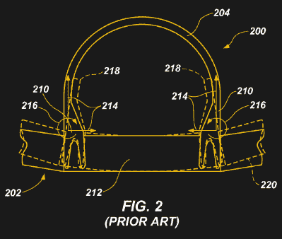

# 泡菜叉到底是什么，为什么它会加剧波音 737 的困境？

> 原文：<https://hackaday.com/2019/09/30/what-on-earth-is-a-pickle-fork-and-why-is-it-adding-to-boeings-737-woes/>

公平地说，2019 年对飞机制造商波音公司来说不是一个好年景，因为其新的 737 MAX 飞机被[发现包含一个软件故障](https://hackaday.com/2019/03/14/mcas-and-the-737-when-small-changes-have-huge-consequences/)，可能导致飞机进入俯冲并坠毁。现在，关于 737 的另一个问题的故事正在流传，早期 737NG 飞机[中的一些所谓的“泡菜叉”被发现出现裂缝](https://komonews.com/news/local/exclusive-unexpected-cracking-found-on-critical-boeing-737ng-equipment)。

这是一个令人担忧的故事，围绕它的起源有无数种理论，但它也应该有一个令人放心的角度:支撑航空业的艰苦的维护检查系统已经按照预期发挥作用。这个问题在任何灾难性故障发生之前就已经被发现了。这不是波音目前需要的故事，但他们和监管机构无疑将努力工作，以产生一种新的设计，并确保它适用于飞机。

## 泡菜叉的作用

对于我们这些不从事航空业的人来说，这提出了一个问题:究竟什么是泡菜叉？这个故事的报道告诉我们，这与将机翼连接到机身有关，但如果没有一架方便的 737 打开来看看，我们就不会知道了。

幸运的是，有一个全面的描述，以及波音公司自己对机翼连接技术的评论，这可以在他们的一项专利中找到。 [US9399508B2](https://patents.google.com/patent/US9399508) 关注的是用于机翼-机身支架的主动悬挂系统，这本身就是一个引人入胜的读物，但我们关注的部分是专利 PDF 第 12 页上对现有机翼固定装置的描述。

A cross-section of the aircraft wing fixing, in which we’ve highlighted the role of the pickle forks. (Boeing)

泡菜叉是一种这样命名的组件，因为它与厨房用具相似，它牢牢地附着在机身的每一侧，并有两个叉子在机身下方延伸，在那里它们附着在翼梁上。

对于没有航空经验的好奇工程师来说，专利的图 2 进一步回答了这个问题，图 2 提供了一个方便的横截面。他们讨论的另一个机翼附件涉及到销的使用，从而引出了专利发明的要点。传统的机翼固定件将力作为刚性单元从机翼传递到机身，要求机身足够坚固以承受这些力，这给大型飞机的设计者带来了问题。主动悬挂系统旨在减轻这一点，我们很想听听评论中的读者，他们可能会告诉我们更多。

我们认为，有科学头脑的公众可以通过挖掘波音专利中的解释，更深入地看待新闻报道中挑出的组件，这是一种授权。我们不羡慕波音工程师的工作，因为他们正在努力生产替代品，我们希望听到他们的解决方案。

【via [黑客新闻](https://news.ycombinator.com/item?id=21102408)

[Header image: [AMX 波音 737 XA-PAM](https://commons.wikimedia.org/wiki/File:AMX_Boeing_B737_XA-PAM.JPG) 由 Jean-Philippe Boulet CC-BY 3.0 提供]