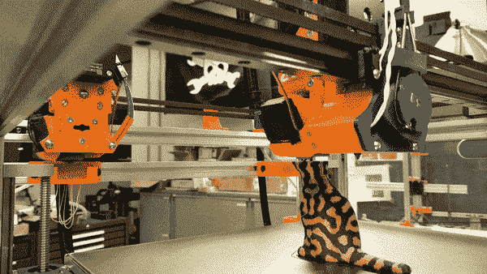
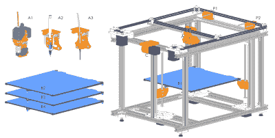
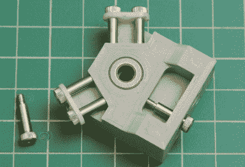
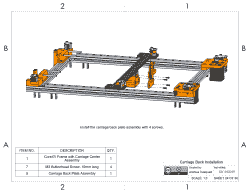
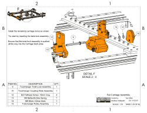
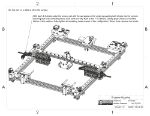
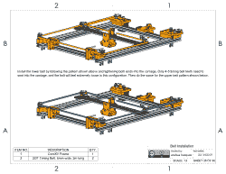

# Jubilee:一个改变的工具向世界各地的 3D 打印机黑客致敬

> 原文：<https://hackaday.com/2019/11/14/jubilee-a-toolchanging-homage-to-3d-printer-hackers-everywhere/>

我承认我在 3D 打印游戏上迟到了。当我在 2018 年刚刚拿起我的第一台打印机时，我们其他人已经渗出了十多年的美丽打印。在那段时间里，我们看到许多人为了恶作剧而重新想象硬件，而不仅仅是打印塑料。十年的黑客生涯让我开始思考:如果 3D 打印的杀手级应用不是打印会怎样？如果是*可编程运动*呢？有鉴于此，我想知道:如果我们有一台能让我们运动的机器会怎么样？如果扩展这些运动能力是一个一流的功能呢？如果我们有一台*意味着*被黑客攻击的机器会怎么样？

一年后，我激动地发布了开源的多工具运动平台[，我称之为 *Jubilee*](https://github.com/machineagency/jubilee/wiki) 。对于一个渴望改变工具的 3D 打印机的世界来说，Jubilee 可能是你可以自己建造的最好的改变工具的 3D 打印机——只需要一套手工工具和一些耐心。但不止于此。凭借由 E3D 建立的标准化工具模式和运动学耦合的热插拔床，Jubilee 可以被任何希望利用其可编程运动功能实现特定自动化的人扩展。

Jubilee 是我对你这个 3D 打印机黑客的敬意；但是它的目的是服务于整个开源社区。在世界各地，科学家、艺术家和黑客都使用自动化机器的精度来进行个人探索和表达。但是我们现在使用的工具要么很贵，要么很笨重——通常伴随着很高的学习曲线，但没有预先承诺它们会满足我们的需求。为此，Jubilee 实际上是为了获取推动事情发展所需的知识。Jubilee 想成为 motion 的 *API。*

当谈到在三维空间中精确地移动工具时，我可以帮你搞定。至于定义 Jubilee 能做什么，那就看你自己了。

## 硬件中的 API

玩 3D 打印机可以发生在堆栈的所有级别。有些人从零开始构建自己的硬件。其他人玩软件来产生特定的物理输出。我会将硬件设计松散地绑定为基础设施(T0)和应用程序(T3)。如今，创建一个定制的应用程序通常需要这两个领域的专业知识。在设计 Jubilee 的时候，我想把 motion *的基础设施*封装到一个平台中，这样其他人就可以很容易地构建应用程序。

在面向对象编程中，有一种设计模式叫做*关注点分离*。这个想法是，软件应该以模块化的形式编写，这样一个部分不需要知道另一个部分的细节来调用它。这个原则就是软件库的构建方式。库隐藏了它们所做工作的复杂性，而是公开了一个干净的*应用程序编程接口*，或者 API，从这里可以调用它们。不要误解我。模块化硬件的想法在工程领域已经存在好几代了，但是面向对象编程在使这些想法明确化方面做得非常好。

Building on Jubilee’s “API” is a matter of adding both custom tools (like this extruder, pen, and syringe) and bed plates.

为了将*关注点分离*应用于 Jubilee，我需要一种方法将*基础设施*与*应用程序*分离。为此，我在机床支架和 Z 轴上都安装了运动联轴器。这样做使得*床平台和工具都是可移动的。更重要的是，由于它们是运动学耦合的，它们可以一次又一次地被移除和替换，而不会丢失对机器的注册。高度可重复系统的概念使工具更换成为可能。*

## 工具更换

在 Jubilee，工具放在机器前面的架子上。当使用一种工具的任务完成时，Jubilee 将其当前工具停放在各自的停放位置，并自动拾取下一个任务的工具。用于更换工具的所有软件逻辑都由固件级的脚本处理，使得切片器命令与调用您想要使用的下一个工具的编号一样简单，如 T0、T1 等。与上面的*关注点分离*模式一样，我这样做是为了确保 Jubilee 的硬件尽可能与切片器无关。

我的第一个工具更换设置受到了 2018 年 E3D 的这条推文[的启发。在接下来的几个月里，E3D](https://twitter.com/E3DOnline/status/1038494717464522758)[友好地将 CAD 文件发布到他们的耦合系统](https://hackaday.com/2019/07/04/e3ds-love-letter-to-toolchanging-3d-printers/)，我修改了我最初设计的尺寸，以与他们的工具板兼容。我将在另一篇文章中谈到我的设置有何不同。但是现在，重要的是要知道 *API* 是一样的。换句话说，E3D 板和印刷银禧工具板都可以工作。

## 可制造性

在 Hackaday 上，我们会发现自己将硬件描述为“大部分是打印的”和“自我复制的”这些词源于 RepRap 的早期，RepRap 3D 打印机背后的想法是它可以自我复制。我个人很喜欢这个故事，但它有局限性。有些机器，如车床，自由度有限，这就限制了它们所能产生的几何特征。其他机器，如 3D 打印机和激光切割机，只能从有限的材料范围内生产零件。但让我产生如此深刻共鸣的是一个潜在的想法，即从零开始提升我们自己的个人制造能力。当个人可以将原材料转化为成品时，通过这种叙事产生了赋权和自力更生的概念。

Even with minimal machining process, we can produce high-fidelity parts, like this early version of the toolchanger carriage.

为了把这个故事变成可操作的东西，我们需要一个新词，一个新的设计标准。所以我们实验室做了一个。我们称之为*可制造性*。可制造性是一个定性的词，用来描述一个设计在没有专业工具和专业知识的情况下由一个人制造的*能力*。可制造性就像可制造性。但区别在于，可制造性的前提是对可用制造资源的理解，而可制造性的前提是对人的理解、对工具的使用以及如何使用工具的知识。类似地，*的可制造性设计*类似于*的制造性设计*，其中制造商是一个人，拥有有限的资源和最少的培训。

重要的想法是，如果我们真正了解人，我们可以给任何人引导他们自己的基础设施的能力，如果我们在设计中做一些额外的事情，把人放在第一位。有了 Jubilee，我尽最大努力在 [wiki](https://github.com/machineagency/jubilee/wiki) 中预先列出了必备知识。Jubilee 的现成零件都可以少量购买，没有昂贵的最低订购量。Jubilee 的大多数制造部件都使用 3D 打印机，以避免需要熟练的机器操作知识。类似地，这种设计是为没有专业手工制作技能的人手工组装而设计的

然而，没有什么是完美的！当我试图设计 Jubilee 以消除机加工零件时，[三个零件必须进行机加工](https://github.com/machineagency/jubilee/wiki/Parts-to-Machine-(or-buy))。但是为了填补空白，一些社区机械师好心地为我们生产这些零件。

## 给我们的大好时光戴上礼帽的指令

我是在健康的乐高剂量下长大的。当时，我认为这些指示是理所当然的；它们只是宇宙飞船的一种手段。然而，回过头来看，我被他们将一个 500 多件的套件组装得如此干净而震惊了。他们的风格简洁明了。每页中所有需要的部分都被提前调用*。见鬼，如果你是和朋友或爱人一起盖房子，你甚至可以把这个过程并行化，一个人砌砖，另一个人为下一步挖部件。(其他人过去有喜欢的乐高约会之夜吗？)这种风格可以翻译成多种语言——因为没有单词！见鬼，我很确定在我能读书之前我就能看乐高手册了！而且是一致的。一旦你完成了第一套，你就对下一套指令的格式有了一个非常清晰的想法。*

久比利的指示灵感来自我的砌砖岁月。首先，在设计中，零件需要尽可能具有完全约束的连接点。这意味着零件只需要以一种方式固定在一起。他们不能在一系列运动中来回滑动，否则不同的人会以不同的方式聚集禧年，其中一些不会工作！这就是使用说明的地方。步骤以一步一步的方式直观地显示出来，以尽量减少字数。使用特殊工具的调优说明也在视觉上有详细说明。我的希望是，任何人，不仅仅是经验丰富的机器制造商，都可以按照文档中的组装过程来建造 Jubilee。最后，为了帮助沿途的人们，我创建了一个[不和谐](https://discord.gg/h5BCUdU)频道，让人们可以提出集会问题并加入社区讨论。不和谐的反馈也是最受欢迎的！我正在尽我最大的努力在说明书和维基文档中进行改进。

## 挑战极限

虽然一台机器适合所有的数控机床听起来很酷，但这并不值得庆祝。相反，Jubilee 仅用于非承重应用。这些天来，我尽了最大努力将 Jubilee 改造成一台坚如磐石的多工具打印机，但即使如此，我仍然在摆弄打印设置，以找到一个我喜欢的中间地带。

Dear World, may your finest Benchies of 2020 be multicolor.

所以即使 Jubilee 不能杂耍笨重的切割工具，事实证明 Jubilee *能*做的空间还是相当丰富的。除了 3D 打印，我和我的实验室伙伴还玩了注射器的多工具液体处理，多色笔绘图，USB 显微镜的图像拼接。

最后，我有太多的事情要在一篇文章中说，但我保证我会很快涵盖一些我最喜欢的硬件细节。

## 所有人的研究结果

一年前，我收拾好车库里的机械商店，跨进了研究生院。对我来说，博士学位是成为教师的最后一个主要障碍。不管喜欢与否，我都需要面对它。但我不想让读研成为未来教书的五年模式，我想找到一些方法让这段经历对别人有意义，而不仅仅是我自己，现在，而不是毕业后。经历了这一不幸的一年后，我很兴奋地说，银禧既是为了受你们启发的*也是为了*，黑客们。这是我在这个世界上的一部分，我希望它对你来说是有意义的。它并不完美，但很实用，我们都可以在它的基础上发展。

当我大约一年前开始这个项目时，我偶尔会发布一个进度视频来记录好的和坏的方面。想到一年前我们从这种情况开始:

 [https://www.youtube.com/embed/ibJpjYAcjaM?version=3&rel=1&showsearch=0&showinfo=1&iv_load_policy=1&fs=1&hl=en-US&autohide=2&wmode=transparent](https://www.youtube.com/embed/ibJpjYAcjaM?version=3&rel=1&showsearch=0&showinfo=1&iv_load_policy=1&fs=1&hl=en-US&autohide=2&wmode=transparent)

对此:

 [https://www.youtube.com/embed/7jGilt5ijQo?version=3&rel=1&showsearch=0&showinfo=1&iv_load_policy=1&fs=1&hl=en-US&autohide=2&wmode=transparent](https://www.youtube.com/embed/7jGilt5ijQo?version=3&rel=1&showsearch=0&showinfo=1&iv_load_policy=1&fs=1&hl=en-US&autohide=2&wmode=transparent)

诚然，就研究生院的实验室而言，我很幸运。我遇到了一位教授，娜迪亚·皮克(在一家[超级公司](https://hackaday.com/2019/05/28/hackaday-superconference-tickets-and-proposals-are-live-right-now/)！)，他在开源硬件运动的早期帮助建立了第一个私人实验室。通过她的努力，我的双手可以解放出来处理像 Jubilee 这样的项目。通过她精明的谈判，我们的实验室能够将我们所有的设计作为开源向你开放，黑客伙伴——没有任何附加条件！

有了开放的设计，我们可以开始重复彼此的想法，为每个人扩展工具改变生态系统。上个月，一些人已经开始建造他们自己的禧年。有的已经在换工具了！

video credits to @Danal (via Discord) showcasing a successful tool lock

但是为什么让我们享受所有的乐趣呢？Jubilee 的文档、BOM 和 CAD 文件供您尽情享用。现在是进入一个特设自动化世界的最佳时机。因此，向前迈进，创造你自己的工具改变的个人冒险。分享你对不和谐的抱怨和悲伤。当然，如果你让 Jubilee 做了一些很棒的事情，请在 Hackaday 上给我们写信。

(最后，如果你觉得读研很酷，为什么不跟我们一起玩呢？)