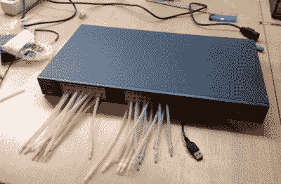

# 介绍第一位思科认证调酒师

> 原文：<https://hackaday.com/2019/10/04/introducing-the-first-cisco-certified-mixologist/>

你很难找到一个没有几个思科路由器或交换机的 IT 后台办公室。我们甚至敢打赌，现在有相当多的人正在阅读这篇文章，他们手里有一大堆这样的文章。它们是我们大多数人都没有实际用途的东西，但我们仍然不忍心扔掉。但看起来[斯文·坦托]已经找到了一个理想的中间地带:[他没有丢弃他的思科 Catalyst 交换机，而是把它们变成了自动调酒师](https://beastiebytes.com/robarboter.html)。

 受前面那些完美的小方孔的启发，[斯文]在每个交换机上安装了多达 24 个蠕动泵，每个以太网端口一个。为了把他所有的管道都装进去，这些开关被自然地拆成了原来的空壳，尽管他确实提到，它们原来的电源被证明对保持 24 个高耗电马达的良好供电是有用的。

马达连接到一组继电器，继电器依次由 ESP32 *和 Arduino Nano*投掷。[Sven]解释说，他不确定 ESP32 是否可以用 3 V 输出启动继电器，所以他决定只使用他已经知道可以处理这项任务的 Arduino。两个微控制器协同工作，ESP32 上的 web 界面最终会在需要启动泵时向 Arduino 发送 I2C 命令。

[Sven]提到他的机器人调酒师在 2019 年混沌交流营中大受欢迎，[我们知道电脑控制的酒精在那里自由流动](https://hackaday.com/2019/08/22/ubabot-mixes-up-50-cocktails-to-quench-cccamp-thirst/)。当然，如果你不打算带着你的 barbot 去黑客训练营，[你可以让它看起来更时髦一点。](https://hackaday.com/2019/04/17/cocktail-barbot-takes-things-up-a-level/)

 [https://www.youtube.com/embed/L4NPNJzPEr4?version=3&rel=1&showsearch=0&showinfo=1&iv_load_policy=1&fs=1&hl=en-US&autohide=2&wmode=transparent](https://www.youtube.com/embed/L4NPNJzPEr4?version=3&rel=1&showsearch=0&showinfo=1&iv_load_policy=1&fs=1&hl=en-US&autohide=2&wmode=transparent)

