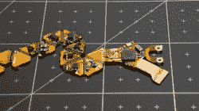
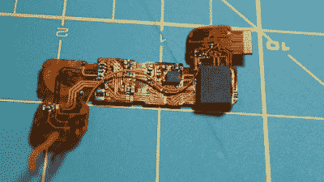

# 这些骰子知道你是否作弊

> 原文：<https://hackaday.com/2019/10/09/these-dice-know-if-youre-cheating/>

D&D 的粉丝们肯定知道一对好骰子的重要性。如果你的骰子不仅时尚，而且聪明呢？对于那些曾经不得不和名声不好的兄弟姐妹或朋友一起玩桌游的人来说，[电动骰子](https://hackaday.io/project/28377-electronic-dice)可能是你的救星。

骰子通过蓝牙配置，通过加速度计捕捉游戏过程中的滚动和统计数据。

PCB 必须具有柔性表面，特别是展开的二十面体形状，以便形成将设计限制为两层的芯片形状。每个面都有一个朝外的 LED，用来照亮那一面的数字。led 由可充电电池直接供电，可充电电池使用一个小线圈进行无线感应充电。[ [Jean Simonet](https://hackaday.io/jean.simonet) ]没有选择 Qi 充电器芯片组来调节效率低于阈值时传输的最大功率，而是使用更简单的充电器设置，使用全桥整流器、电容器和线性调节器来为接收端创建稳定的 5V 电源。

虽然最初的模具设计需要注射成型的塑料外壳，但更简单的解决方案是简单地用树脂浇铸设计。电子元件被放入一个骰子模具中，就像普通的骰子一样进行铸造。

幸运的是，这也解决了需要将组件安装在带可移动盖子的螺旋容器内的问题，这在寻找符合尺寸的电池方面带来了麻烦。这些在阿里巴巴上廉价购买的 led 灯被菊花链连接起来，以降低布线的复杂性。

然而，led 的一个问题是，即使在强度为 0 的情况下，调制强度的内部 PWM 仍然开启，持续消耗 21 mA(对于芯片上的 21 个 led)。这会导致电池在 2-3 小时后耗尽。[Simonet]使用的解决方案是添加一个晶体管来切断 led 的电源，并让 MCU 在 led 关闭时切换晶体管。即使这种解决方案也没有解决整个问题，因为 led 仍然会消耗数据和时钟线路的电流，所以这些线路在进入睡眠之前必须处于低电平。

使用小型降压转换器将 LiPo 电压降至 3.3V 存在一些稳定性问题，因此功率调节由 MCU 直接完成。关闭芯片由连接到电源降压转换器的磁性开关控制，当有磁铁时，该开关关闭逻辑。当电源关闭时，这最初会导致 LED 控制线浮动，从而将 LED 变为任意颜色。解决方案是将磁传感器的输出连接到 MCU，并允许软件处理 led。

可能是因为 creator [Simonet]碰巧也是一名游戏开发人员，但电子芯片的早期开发阶段(CAD、电路原理图、原型制作、手工焊接组件)是在 Twitch 上进行的，甚至在构建阶段也增加了一些交互性。最终的结果可能很小，但这些骰子肯定有很大的大脑！

 [https://www.youtube.com/embed/kwV8mDrF0RU?version=3&rel=1&showsearch=0&showinfo=1&iv_load_policy=1&fs=1&hl=en-US&autohide=2&wmode=transparent](https://www.youtube.com/embed/kwV8mDrF0RU?version=3&rel=1&showsearch=0&showinfo=1&iv_load_policy=1&fs=1&hl=en-US&autohide=2&wmode=transparent)

The [HackadayPrize2019](https://prize.supplyframe.com) is Sponsored by:     