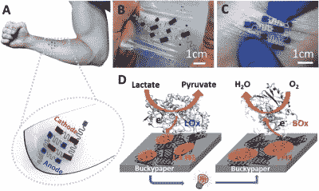
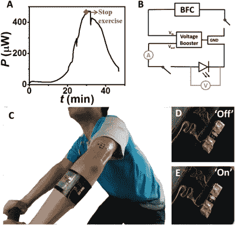

# 这种生物燃料电池从你的汗水中获取能量

> 原文：<https://hackaday.com/2019/10/04/this-biofuel-cell-harvests-energy-from-your-sweat/>

格勒诺布尔阿尔卑斯大学和圣地亚哥大学的研究人员最近开发了一种能够从人体汗液中产生电能的柔性设备并获得专利。乳酸盐/氧气生物燃料电池已经被证明可以点亮 LED，从而推动通过可穿戴设备获取能量领域的进一步发展。

【via 先进功能材料】

该研究于 2019 年 9 月 25 日发表在 [*先进功能材料*](https://onlinelibrary.wiley.com/doi/full/10.1002/adfm.201905785) 上。这种生物燃料电池在可穿戴设备领域的潜在应用包括医疗和运动监控。通过使用人体体液中存在的生物燃料，该设备可以依赖于一种容易与人体整合的高效能源。

科学家开发了一种柔性导电材料，由碳纳米管、交联聚合物和酶相互连接组成，并通过丝网印刷印刷。这种复合材料被称为布基纸，使用碳纳米管作为电极材料。

乳酸氧化酶作为阳极，胆红素氧化酶(来自血液中的黄色化合物)作为阴极。鉴于乳酸盐的理论高功率密度，这项技术有可能产生比目前 450 W 的发电量更大的功率。

 

【通过高级功能材料】

细胞跟随皮肤的变形，通过氧还原和汗液中乳酸的氧化产生电能。升压转换器用于增加电压，以持续为 LED 供电。生物燃料电池目前提供 0.74V 的开路电压。由于发电的测量必须在生物燃料电池贴着人类皮肤的情况下进行，该设备已经显示出即使在拉伸和压缩时也是高效的。

目前，最大的生产成本是转化汗液中化合物的酶的价格。除了成本考虑，研究人员还需要寻找提高电压的方法，以便为更大的便携式设备供电。

随着围绕可穿戴技术的所有[令人兴奋的研究，希望我们能很快听到这个研究小组的进一步发展和应用！](https://hackaday.com/2017/04/10/souped-up-next-gen-wearables/)

【感谢 Qes 的提示！]