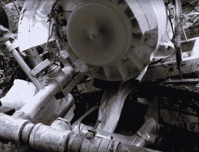

# 欧洲人现在有权进行修复——这意味着我们其他人可能也会这么做

> 原文：<https://hackaday.com/2019/10/09/europeans-now-have-the-right-to-repair-and-that-means-the-rest-of-us-probably-will-too/>

任何一个曾经面对过最近制造的坏了的家用电器的人都会知道，有时候修理它们会非常困难。在许多情况下，制造商不愿意销售更多的产品来制造比保修期长得多的设备，不愿意在设计时就考虑到可拆卸性或可维修性，也不愿意提供备件来延长设备的寿命。作为硬件黑客，我们尽最大努力使用自制的替换组件、热熔胶和电缆扎带，但太多时候，另一个应该有足够寿命的设备却被扔进了垃圾堆。

[![Czech waste management workers dismantle scrap washing machines. Tormale [CC BY-SA 3.0].](img/ea22a1c4e01cc16d94273d935ab42d19.png)](https://hackaday.com/wp-content/uploads/2019/10/1280px-DVO_4792.jpg) 

捷克废物管理工人拆除报废洗衣机。Tormale [ [CC BY-SA 3.0](https://commons.wikimedia.org/wiki/File:DVO_4792.JPG) 。如果我们对修理一件家用电器束手无策，那么普通大众就更是如此，由此产生的堆积如山的电子垃圾足以成为一个问题，以至于欧盟正在引入管理其可修理性的新规则。新法律要求[在欧盟管辖范围内销售的某些类别的家用电器和其他设备](https://ec.europa.eu/energy/en/regulation-laying-down-ecodesign-requirements-1-october-2019)必须有一个可更换零件的保证期，并且它们的设计必须能够使用标准工具进行操作。这些特殊类别包括洗衣机、洗碗机、冰箱、电视等等。

让我们深入了解这一决定的后果，它可能会影响欧盟以外的市场，并有望带来可用于维修及其他用途的零件供应。

## 当一个大客户接受维修权时，所有人都会这么做

多年来，修复我们所拥有的东西的权利一直是我们社区的一个热门话题，而且确实在这些页面中多次出现。最近的立法将无助于一些关键战场，如使用 DRM 来限制 John Deere 拖拉机的维护，但它将对远远超出欧盟边界的国内设备市场产生巨大影响。欧盟成员国共同代表了一个如此重要的市场，这些规则将影响在所有市场销售的设备的设计，因为这些设备的制造现在是一项全球性的事业。因此，有理由预期，例如，在巴黎销售的韩国制造的洗衣机将与在迈阿密销售的洗衣机具有相同的基础，并且两台机器将从相同的替换零件供应中受益。

It’s likely that parts suppliers such as [espares](https://www.espares.co.uk/) will continue to sell parts to everyone, and not just the trade.

然而，这个故事并非没有尾巴，因为有消息称，这些备件将不会提供给消费者，而是只提供给家电维修行业。我们认为这是一种倒退，因为通过将维修限制在指定的少数人手中，很难说这是一种普遍的维修权利，但我们也预计，通常的电器零件在线供应商将乐于向所有人出售，一个繁荣的灰色市场将会涌现，以填补市场中的任何缺口。还有一个问题是，它可能会对低端家电市场产生什么影响，例如，备件负担会对低于 50 美元的中国面包机的供应产生什么影响？我们希望低端产品制造商采用基本上标准的零件库来解决这一问题，但一个担忧是，这可能会提高家电拥有者的门槛，对不太富裕的消费者不利。

## 这是一个好消息，那么硬件黑客社区呢？

This [hydropower generator](https://hackaday.com/2014/09/01/hydropower-from-a-washing-mashine/) for off-grid living uses a washing machine motor.

到目前为止，这是一个消费者的故事，但我们的硬件黑客世界呢？回到这篇文章的开头，这很可能意味着在未来我们更有可能能够修复那些横在我们长椅上的废弃电器，但对我们来说还有更多。这一措施将意味着大量现成的零部件将作为备件进入市场，尽管其中许多零部件将仅限于其预期用途，但仍有大量零部件的用途将远远超出预期。期待看到更多[无刷电机](https://ec.europa.eu/energy/sites/ener/files/documents/c-2019-2125_en_act_part1_v3.pdf)，阀门，泵，以及更多大规模生产和灰色市场价格的产品，并开始思考如何使用它们。

在写这篇文章的时候，新闻流中充满了环保抗议，从格蕾塔·图恩伯格到灭绝叛乱，再到玻利维亚首都，不可否认的是，它们代表了主流的时代精神。欧洲权利修复法不是以个人自由的名义，而是旨在减少对环境的影响。我们生产的每件产品都有碳排放和其他影响的沉没成本。给予每个人尽可能长的寿命是符合公众利益的，总的来说，这项法律旨在通过延长寿命和可修复性思维来减少浪费。我认为这是不可避免的，我们将看到同样的风气蔓延到其他司法管辖区和制造业领域。