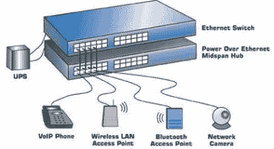
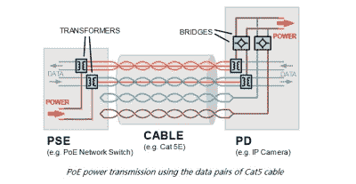

# 以太网供电(PoE)如何工作

> 原文：<https://hackaday.com/2019/10/24/how-power-over-ethernet-poe-works/>

远程以太网设备需要两样东西:电源和以太网。你可能会认为这也意味着两根电缆，一根粗电缆用来传输运行所需的电流，另一根细电缆用来传输数据。但是没有！

以太网供电(PoE)允许您将电力和数据传输到网络设备。这是通过双绞线以太网布线实现的，它允许一根电缆驱动两个连接。与电源线和数据线分开相比，使用 PoE 的主要优势在于简化了安装过程——需要跟踪和购买的电缆更少。对于较小的办公室来说，必须布线新电路或变压器以将交流电转换成 DC 的麻烦可能会令人烦恼。

在不易获得电力或无法选择额外布线的情况下，PoE 也是一种优势。以太网电缆通常敷设在天花板上，而电源则敷设在地板附近。此外，PoE 具有过载、短路保护功能，可安全供电。由于电力集中供应，因此不需要额外的电源，并且扩展电力输送变得容易得多。

### 使用 PoE 的设备

【经 PowerOverEthernet.com】

随着办公室选择从中央电源为电话供电，而不是托管较小的电源来为单独的电话供电，VoIP 电话变得越来越普遍。智能摄像机或 IP 摄像机已经使用以太网来传输视频数据，因此使用 PoE 可以简化安装过程。无线接入点可以通过主路由器轻松连接到以太网，这比寻找单独的电源更方便。

其他使用 PoE 的设备包括 RFID 阅读器、IPTV 解码器、门禁系统，有时甚至包括挂钟。如果它已经使用了以太网，并且不消耗太多电力，它是 PoE 的一个很好的候选。

在供电方面，假设大多数使用 PoE 的设备都是某种形式的网络设备，那么为 PoE 系统供电的主要设备应该是以太网交换机。另一种选择是使用 PoE 注入器，它与非 PoE 交换机配合使用，以确保设备能够从交换机之外的其他电源获得电力。

### 它是如何工作的

历史上，PoE 是通过简单地将额外的线路连接到 DC 电源来实现的。早期的动力注射器不提供任何智能协议，只是将动力注入系统。最常见的方法是给 100Base-TX 以太网不使用的一对电线供电。然而，这可能很容易破坏不是为接受电力而设计的设备。IEEE 802.3 工作组在 1999 年开始了他们的第一个正式 PoE 项目，名为 IEEE 802.3 af。

【通过光纤通信】

该标准利用以太网布线中四对双绞线中的两对，向用电设备提供高达 13 W 的功率。这对于 VoIP 电话、IP 摄像头、门禁控制器和其他设备来说是足够的。2009 年，IEEE 802.3 工作组发布了第二个 PoE 标准，IEEE 802.3at。这增加了一个功率等级，可提供高达 25.5 W 的功率，允许云台摄像机使用该技术。

虽然进一步的标准尚未发布，但专有技术已经使用 PoE 术语来描述他们的供电方法。IEEE 802.3 工作组的一个新项目是 2018 年发布的 [IEEE 802.3bt](https://standards.ieee.org/standard/802_3bt-2018.html) 标准，该标准利用所有四个双绞线向用电设备提供高达 71 W 的功率。

但是这种能量是有代价的:以太网电缆没有电力电缆那样的导电截面，电阻损耗也更高。由于电缆中的功率损耗与电流的平方成正比，PoE 系统通过使用更高的电压(从 40 V 到 60 V)将电流降至最低，然后在接收设备中进行降压。即便如此， [PoE 规范允许电缆本身有 15%的功率损耗](https://en.wikipedia.org/wiki/Power_over_Ethernet#Standard_implementation)。例如，您的 12 W 远程设备可能在墙上消耗 14 W，剩余的 2 W 用来加热您的爬行空间。提议的 70 W IEEE 802.3bt 标准可以将多达 30 W 的热量放入导线中。

更大的问题通常是电力不足。802.4af PoE 标准最大功率输出低于 15.4 W(输出 13 W)，足以为大多数网络设备提供电力。对于较高功耗的设备，如网络 PTZ 相机，情况并非如此。

虽然标准中规定了最大电源，但需要提供更大功率的电源不会影响器件的性能。该设备将汲取运行所需的尽可能多的电流，因此没有过载的风险，只有热线。

所以爱伦坡也不是没有权衡。然而，在设备上接受 PoE 肯定有很多好处，当然我们也欢迎一个电线更少的世界。这对于路由器、电话和它们的朋友来说太棒了。但是当你的耗电设备在晚上给你取暖时，可能是时候把它们插到墙上了。