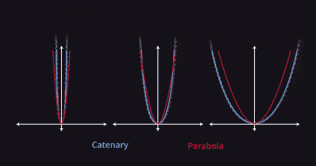
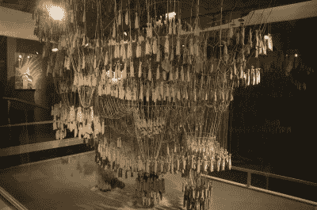
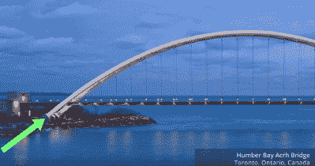
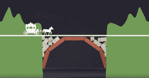
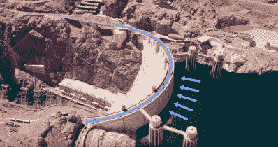

# 如何建造最坚固的拱门

> 原文：<https://hackaday.com/2019/10/15/how-to-build-the-strongest-arches/>

说到建筑特色，可能没有多少建筑像拱门一样令人难忘。从简单的弯曲结构到看似不可能完成的任务——在半空中支撑如此大的重量的可折叠形状，它们自然吸引了几代建筑师。

对于土木工程师来说，学习计算作用在拱上的力、材料强度和属性以及跨几个拱的重量分布可能是熟悉的，但对于任何只有基础物理学和 CAD 背景的人来说，很容易认为拱是理所当然的。毕竟，它们点缀着罗马沟渠、中国长城，甚至出现在拱门国家公园的大自然中。我们在大教堂、清真寺、大门中看到它们，甚至在圣路易斯大门拱门中也有纪念。即使是了望塔和水井的圆形建筑，以及我们自己的肋骨框架，都是由于拱门的属性。

但是建造一座坚固的拱门到底需要什么呢？

### 基本概念

拱门与链条有许多共同的关键概念。首先，拱门的重量对其形状没有影响，但两端之间的距离有影响。在一定长度(以周长衡量)的拱形内形成的每个形状被称为**悬链线**，与抛物线相似。

【滑铁卢大学】

虽然不是所有的拱门都是由砖块建造的，但所有的拱门在其建筑材料的接触点之间都表现出张力，形成了一个相互推压的连接器压缩系统。这对建筑者有利，因为材料之间的摩擦加上这种张力使材料保持在原位。

虽然拱门确实是持久耐用的结构，但如果它们的形状不适合承载的负荷，它们就会倒塌。鉴于拱和链之间的相似性，链(张力系统)中承载负载所需的角度可以反映为拱承载相同负载所需的角度。

Image source: [[KK Clark](http://adventures-of-kk.blogspot.com/2012/05/day-8-bike-tour-gaudi.html)]

巴塞罗那的圣家族大教堂对其宏伟的拱门也采用了同样的技术。建筑师安东尼·高迪(Antoni Gaudí)最初建造了一个颠倒的巴西利卡模型，根据屋顶和他打算添加到结构中的其他功能增加重量。由此产生的轮廓正是他的拱门支撑大殿其余部分重量所必需的形状。

对于桥梁，由于没有很大的静力，只要拱本身有足够的重量，就不需要考虑荷载的位置。这是因为类似于在重链或轻链上增加重量，拱越重，它从负载的应用中转化的就越少。

### 修改拱门

对大多数人来说，一个有趣的困惑是弄清楚哪些足弓能够支撑自己的体重。滑铁卢大学的 Wayne Brodland 教授在他关于工程模型的课程中解释说，只要一个拱门是从相同端点悬挂的相同长度的链条的镜像，那么它的形状是有效的，并且可以承受其自身的重量。

这说明了较重的半圆拱、较轻的具有较宽端点的拱和较高的具有较近端点的拱，这被称为**链测试**。该测试要求链条在颠倒镜像时能够安装在拱形内。这也解释了为什么较厚的足弓能够采用较薄的足弓不能采用的形状。

另一种选择是使链条的形状适应拱门的形状。因为这需要向外用力拉链条，逆转这些力向内推动足弓可以保持它的形状。

【via University of Waterloo】

施加在拱门两端的力是矢量力:不仅向下推，还向外推。这两个力被垂直于表面的法向力和平行于表面的摩擦力抵消了。如果拱产生的力大于平衡拱的力，特别是如果水平力大于保持端点在适当位置所需的摩擦力，那么拱会倒塌。出于这个原因，增加表面摩擦力可以帮助足弓保持原位。在建筑项目中，拱的端部支撑通常是倾斜的，以便更好地将力传递到拱的端点。

### 拱形支架

然而，除了简单地修改端点之外，水平力也可以由拱形物周围的东西提供。通常，这是以桥梁周围的砖块和混凝土的形式出现的。

【via University of Waterloo】

对于一排多个拱，可以使其两端的水平力平衡，每个拱为相邻拱提供必要的平衡力。允许它们由更细的柱支撑。

在胡佛大坝的例子中，大坝中阻挡水的结构的形状是一个拱形，荷载作用在拱形的顶部。在这个例子中，很明显拱门的形状可以映射成一条链的形状。

【via University of Waterloo】

然而，并不是所有的拱门都是结构性的，很多时候桥梁会简单地使用拱门作为装饰特征。尽管如此，很明显，关于 arches 还有比我们最初知道的更多的东西需要了解——也许你会将其中的一些概念融入到你的下一个构建项目中！

【感谢 Chris Lam 的提示！]