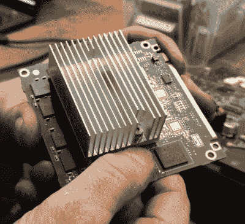

# 磨损的 EMMC 芯片正在削弱旧的 Teslas

> 原文：<https://hackaday.com/2019/10/17/worn-out-emmc-chips-are-crippling-older-teslas/>

不言而喻，大多数人购买电动汽车的主要原因是因为他们想减少或消除汽油的使用。即使你并不十分担心你的生态足迹，事实是在许多地方电价如此之低，以至于一辆电动汽车比一加仑 2.50 美元以上的汽油要便宜。

另一个优点是，至少在理论上，降低了整体维护成本。虽然现代电动汽车当然会配备传感器和复杂的车载计算机系统，但同样的情况也适用于过去十年中推出的几乎所有内燃机汽车。但是从机械角度来看，电动车出问题的可能性要小得多。对于电动汽车的车主来说，换油、火花塞污染、气缸垫破裂的威胁都在后视镜里。

不幸的是，高科技电动汽车的兴起似乎也迎来了一个意外故障和维护困难的新时代。举个例子，[一些老款 Teslas 的车主发现他们有被困在路边的风险](https://insideevs.com/news/376037/tesla-mcu-emmc-memory-issue/)一个我们大多数人更可能联想到丢失一些文件或照片的故障:磁盘读取错误。

## Linux 大声日志记录

就像姐妹公司 SpaceX 的火箭和宇宙飞船一样，特斯拉的车辆由 Linux 驱动，运行在基本上现成的计算硬件上。直到 2018 年，Model S 和 X 在 NVIDIA Tegra 3 上运行开源操作系统，此时他们将媒体控制单元(MCU)切换到英特尔凌动解决方案。在这两种情况下，Linux 系统都存储在嵌入式多媒体控制器(eMMC)闪存芯片上，而不是您可能期望的可移动存储设备上。

Tegra module from a pre-2018 Tesla MCU

在正常情况下，这不是问题。实际上有数十亿台设备在 eMMC 芯片上运行 Linux。但是任何有能力的嵌入式 Linux 开发人员都会采取必要的措施，确保操作系统的各种日志文件不会被写入焊接在主板上的不可替换的存储设备中

不幸的是，由于仍然不太清楚的原因，运行在 MCU 上的 Linux 版本正是这样做的。更糟糕的是，特斯拉的图形界面似乎正在生成自己的额外日志信息。尽管很可能没有人会真的去读它们，但是特斯拉每行驶一秒钟，日志文件中就会增加更多的行。

现在，似乎向基于 Tegra 的老 MCU 上的 eMMC 芯片几乎连续不断地写入数据终于开始产生影响了。特斯拉论坛上的车主报告说，他们的 MCU 崩溃了，让昂贵的车辆处于“跛行回家模式”，这使得汽车仍然可以驾驶，但无法充电。特斯拉为这个问题规定的修复方法是以几千美元的成本完全替换 MCU。由于这种故障几乎肯定会在工厂保修期过后发生，因此车主必须自己买单。

## 我们需要一个更大的芯片

一般来说，一个 flash 设备的每个块只能写入几千次。因此，为了延长它们的使用寿命，当数据写入驱动器时，它基本上会在物理设备周围移动[，这一过程称为损耗均衡](https://hackaday.com/2016/08/03/single-board-revolution-preventing-flash-memory-corruption/)。因为这个额外的问题是针对闪存的，所以需要一些时间来完善控制器，并对现代日志文件系统进行必要的调整，以适应新的存储介质。但是今天，这些问题在很大程度上得到了解决，而不是大多数用户需要关心的事情。

对 Tesla 来说不幸的是，Tegra 模块上的 eMMC 芯片似乎太小了，无法容纳最新版本的固件，同时仍在芯片上留下足够的空闲块来实现有效的损耗均衡。由于只剩下 eMMC 的一小部分可用，系统别无选择，只能一遍又一遍地重用相同的块。

Phil Sadow 在过去几年里一直在为 Tesla 不提供的地方提供维修服务，据他说，官方对较新的英特尔主板问题的解决方案只是给它们一个更大的 eMMC。这将保持更多可用的空闲块，因此驱动器将能够执行磨损平衡，但他说，特斯拉仍然没有解决 Linux 操作系统不断产生日志条目的根本问题。鉴于越来越多的软件通过空中更新被推送到车辆上，这个问题最终可能也会影响到这些较新的 MCU。

 [https://www.youtube.com/embed/o-7b1waoj9Q?version=3&rel=1&showsearch=0&showinfo=1&iv_load_policy=1&fs=1&hl=en-US&autohide=2&wmode=transparent](https://www.youtube.com/embed/o-7b1waoj9Q?version=3&rel=1&showsearch=0&showinfo=1&iv_load_policy=1&fs=1&hl=en-US&autohide=2&wmode=transparent)

## 回避明显的事实

对于那些对嵌入式 Linux 有一定经验的人来说，这个问题的解决方案似乎是显而易见的。要么将日志文件重定向到 RAM，这样它们就不会被写到存储设备，要么干脆一起禁用日志记录。这是一个连树莓派社区都非常熟悉的技巧，甚至被用来在生锈的旧时代从 T2 笔记本电脑中挤出更多的电池寿命，所以特斯拉的工程师怎么可能不这样做呢？

简单的回答是，我们就是不知道。一种说法是，特斯拉希望确保所有可能的数据都存储在一个非易失性设备中，以便在发生事故时可用。[随着他们继续完善他们的自动驾驶技术](https://hackaday.com/2019/03/04/does-teslas-autosteer-make-cars-less-safe/)，从失事车辆中恢复的数据对汽车制造商来说具有特殊的价值。但 Phil 指出，在新的英特尔 MCU 中，正常的车辆诊断信息存储在 SD 上，而不是 eMMC 上；更重要的是，无论如何，Linux 日志条目在事故调查中的用途似乎有限。

目前，2018 年之前的 S 型和 X 型车辆的车主似乎没有太多选择。Tegra 板可以从 MCU 中移除，日志记录可以被禁用，但自然地，这样的修改可能会使您与 Tesla 陷入困境。另一种选择是等到 eMMC 芯片咽下最后一口气，然后不情愿地付钱给特斯拉去修复一个最终是他们造成的问题。它可能不是旧的汽缸盖衬垫，但似乎即使是电动汽车也有一些昂贵的小精灵潜伏在引擎盖下。