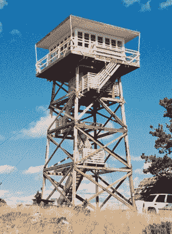
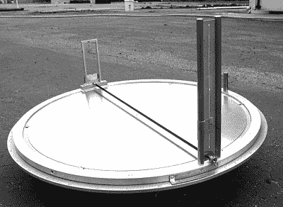
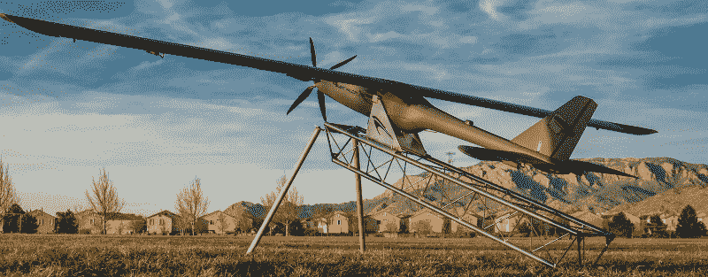

# 消防警戒的最后几天

> 原文：<https://hackaday.com/2019/10/15/the-final-days-of-the-fire-lookouts/>

一个多世纪以来，美国林务局雇佣男男女女从孤立的了望塔上监视大片荒野。除了一副双筒望远镜和一张地图之外，这些了望员充当了扑灭野火的早期预警系统。最终，这些塔将配备无线电，后来还将配备手机或卫星连接到互联网，但除此之外，火灾了望的工作自 20 世纪以来几乎没有变化。

 就像古代看守灯塔的人一样，火场周围有一种浪漫气氛。独自坐在他们的塔里，他们大部分时间都花在看他们记忆了几年甚至几十年的地平线上，仔细观察最轻微的烟雾。与世隔绝对一些人来说是监狱，对另一些人来说是天堂。1956 年夏天，作家杰克·凯鲁亚克在华盛顿州德索莱峰的一座瞭望塔中度过，他在几部作品中描述了这段经历，包括《荒凉天使》。

但是慢慢地，在公众完全察觉不到的变化中，消防警戒的时代已经接近尾声。随着技术的进步，让一个人连续几个月呆在高塔上的想法似乎越来越过时了。许多人坚决反对自动化取代人类工人的想法，但在火灾了望的情况下，很难反对它。计算机视觉提供了一只坚定不移的眼睛，可以探测到数英亩林地中哪怕是最小的烟柱，而配备 GPS 的无人机可以精确定位并进行现场评估，而不会危及人类生命。

美国林务局一度运营着 5000 多座永久性火灾瞭望塔，但如今这一数字已减少到数百座。随着这一小众工作变得更加默默无闻，让我们来看看火灾了望台最著名的工具，以及即将取代它的现代技术。

## 奥斯本火警探测器

在最基本的层面上，火灾了望员的工作是发现和定位可能发生火灾的第一个迹象。这可以归结为仔细扫描地平线上的烟雾迹象，如果看到了，就在地图上标出烟羽的位置，并将其位置传达给值班的消防队员。火灾了望员完成这项任务实际上只需要一张他或她正在监视的区域的地图，最好是一副双筒望远镜或一架小型望远镜。事实上，在 20 世纪之前，这已经是现有设备的极限了。

但是在 1911 年，威廉·布什内尔·奥斯本发明了一种工具，这种工具最终成为火灾了望的标志:奥斯本探火仪。这个装置是一种照准仪，有一个周围区域的大圆形地图和一个在地图上方旋转的瞄准仪。一些 Firefinder 的变体使用了有效的步枪瞄准镜，但其他的则使用了“窥视”瞄准镜，只不过是一条钻了一个小洞的金属条。在这两种情况下，操作者都要旋转测火仪，直到他们可以通过瞄准器看到烟柱的底部。

圆形地图的中心代表了塔的位置，罗盘指向标在整个圆周上。当看到烟雾时，测火仪标记的旋转角度将与目标的方位角相对应。这个标题可以转发到附近的其他塔，假设他们可以从他们的有利位置看到烟雾，允许三角测量火灾的位置。

如果该地区没有其他塔，或者他们无法从自己的位置看到烟雾，测火仪的操作员可以使用瞄准镜上的高程测量标记来估计距离。有了指南针和烟离塔底有多远的概念，地面上的工作人员至少有足够的信息来开始他们的搜索。

 [https://www.youtube.com/embed/cSR2eriM-DI?version=3&rel=1&showsearch=0&showinfo=1&iv_load_policy=1&fs=1&hl=en-US&autohide=2&wmode=transparent](https://www.youtube.com/embed/cSR2eriM-DI?version=3&rel=1&showsearch=0&showinfo=1&iv_load_policy=1&fs=1&hl=en-US&autohide=2&wmode=transparent)

## 回到未来

Osborne Firefinder 是一个简单的设备，只有很少的移动部件，但如果设置和校准得当，它可以让消防警戒人员在那个时代以无与伦比的准确度定位潜在的危险。实际上，美国林务局没有更好的方法来确定火灾的位置，直到飞机的使用变得可行。但即便如此，Firefinder 仍然是一个引人注目的选择，因为它便宜且易于使用。

此外，Firefinder 经历了多年的发展，新的变化稳步提高了它的准确性和实用性。这些增量更新在 1934 年的版本中达到高潮，其中超过 3000 个被制造并分发到国内外的了望塔。令人难以置信的是，这个版本直到 1989 年还在美国生产。

The prototype SDTDC Firefinder

但到了 2000 年代，出现了一个问题。随着最初的奥斯本火警探测器在全国各地仍在使用，以及备件供应的减少，森林服务的圣迪马斯技术和发展中心(SDTDC)决定[研究复制老式设备](https://www.fs.fed.us/eng/pubs/html/03511311/03511311.html)。Firefinder 的各种模型在 AutoCAD 中进行了比较、分解和建模。根据经验丰富的消防瞭望员的意见，做了一些小的修改，新的和改进的 2003 型消防探测器的原型在俄勒冈州的 Odell Butte 和 Green Mountain 瞭望塔进行了建造和测试。

在测试项目成功后，加州的 Palmquist Tooling[开始制造新的 Firefinders 和替换零件](https://www.firelookout.org/osborne-ff.html)，这些零件在很大程度上与原始模型向后兼容。现代 Firefinders 的升级包括用铝取代铸铁部件以减轻重量，以及增加尼龙轴承以减少磨损。

## 天空之眼

Firefinders，无论是最初的 Osborne 版本还是更新的 SDTDC 版本，今天仍在积极使用。给定塔的固定位置作为参考点，他们给了望者一个简单可靠的方法，以合理的精度确定潜在火灾的坐标。但现实是，自动化系统可以比任何人更快、更准确地完成同样的工作。

目前，有许多不同的高科技方法被用于或考虑用于火灾探测。一个新的[天基系统刚刚在夏季上线](https://www.pge.com/en/about/newsroom/newsdetails/index.page?title=20190712_pge_introduces_revolutionary_wildfire_monitoring_using_satellite_technology_in_the_fight_against_california_wildfires)，该系统使用来自几个轨道航天器的数据，包括最新的 GOES 气象卫星，以提供对潜在或正在发生的野火的连续监测。随着每分钟一次的更新，该系统为紧急情况机构提供了近乎实时的高水平情况视图，使得协调工作的效率比过去高得多。

但是从太空中只能看到这么多。为了在不危及人类生命的情况下更近距离地观察地面情况，已经批准了几架小型无人驾驶飞行器(UAV ),用于在活跃的野火中和野火周围进行现场监测。这些飞行器可以比载人车辆或消防员更接近火场，并提供如何最好地灭火的关键信息。类似的无人机在巴黎圣母院大火中被证明是无价的，代表了近距离消防技术的一场革命。

The Silent Falcon, a solar electric UAV used for wildfire monitoring

## 山峰上的怪胎

不可否认的是，在这一点上，技术已经在很大程度上取代了消防警戒。美国林务局现在实际上出租了许多塔楼作为夏季度假小屋，因为建造它们的目的已经被卫星和无人机淘汰了。但是在这个国家的一些地方，那些塔里仍然有自称为“峰顶怪胎”的员工，旧的方式依然存在。

即使有了所有可用的现代技术，人工了望仍然是一个可行的选择。首先，他们很便宜:大多数消防警戒只在夏季雇佣，平均每小时 12 美元。一些了望员已经在同一个塔上驻扎了几十年，这给了他们宝贵的经验，了解在危机中至关重要的土地的细微差别。操作条件也需要考虑在内:无人机在夏季雷暴中飞行很困难，众所周知，夏季雷暴会引发野火。

随着时间的推移，即使这些优势也有可能被更新更先进的自动化系统所克服。但在那之前，一小群男人和女人仍然会在每年春天爬上他们的塔，在森林里守夜，除了一台奥斯本寻火器之外，几乎没有人陪伴他们，那台寻火器可能是在他们出生前几十年建造的。