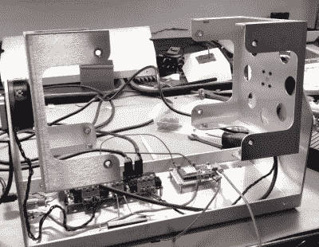

# 旋转 ESP32 显示屏将客户放在第一位

> 原文：<https://hackaday.com/2019/10/08/spinning-esp32-display-puts-the-customer-first/>

我们在 Hackaday 上展示的大多数项目都是为个人使用而构建的；旨在满足创造它们的人的需求。如果这对其他人有用，那就更好了。但偶尔我们会发现自己在为付费客户设计硬件，正如[Proto G]的这个视频所示，[这有时意味着绕远路](https://www.youtube.com/watch?v=9BwzyB9SjkM)。

 他最初的任务看起来很简单:制造一个可以旋转四个车牌的显示器，并且可以调整速度。所以[Proto G]用一些金属片敲出了一个框架，并用一个 ESP32 来驱动两个 RC 式电子速度控制器(ESC ),它们连接到几个“扁平”的无刷万向节电机上。因为不需要精确定位牌照，所以只需要编写一些代码，以美观的方式旋转马达。

不幸的是，客户随后更改了交易。现在，他们想要一个可以在每个车牌上停留片刻，然后再转向下一个车牌的摊位。不幸的是，这意味着电子稳定控制系统无法胜任这项任务。它们被抛弃，取而代之的是 ODrive 电机控制器，编码器被添加到轴上，这样 ESP32 就可以跟踪显示器的位置。[Proto G]表示，他仍然需要解决一些问题，例如如何保持两个电机同步，以及当旋转器停在某个特定的盘子上时如何减少反冲，但最终我们认为结果看起来很棒。现在，如果我们有一些牌照，我们需要烤肉店…

如果[Proto G]从一开始就知道他需要精确的定位控制，他会以不同的方式处理这个项目，并为自己节省大量时间。但当你在处理合同时，这就是生活。

 [https://www.youtube.com/embed/9BwzyB9SjkM?version=3&rel=1&showsearch=0&showinfo=1&iv_load_policy=1&fs=1&hl=en-US&autohide=2&wmode=transparent](https://www.youtube.com/embed/9BwzyB9SjkM?version=3&rel=1&showsearch=0&showinfo=1&iv_load_policy=1&fs=1&hl=en-US&autohide=2&wmode=transparent)

