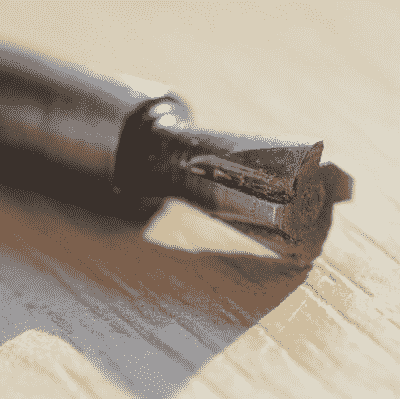

# DIY 微型燕尾立方体需要 DIY 燕尾刀具

> 原文：<https://hackaday.com/2019/10/10/diy-tiny-dovetail-cube-needs-diy-dovetail-cutter/>

Dovetail cutter, made from a 5 mm drill rod.

有一个叫燕尾形立方体的小饰品，[mitxela]认为它会是一个很好的生日礼物。从图片中可以看出，[他成功地用铝和黄铜制作了一个微型版本](https://mitxela.com/projects/tiny_dovetail_cube)。这并不是说在这个过程中没有挑战，按照[mitxela]的方式来做意味着:

*   把它变小！15 毫米的边应该可以了。
*   手头没有一个小小的燕尾形钻头，所以也做一个。
*   当然，在自由加工风格中，这一切都不需要 CNC。
*   哎呀，黄铜库存比预期的小，所以找到一个聪明的解决方案。
*   那个生日？对了，是明天。

该项目是成功的，一些小的学习经验出现了。一个是燕尾的形状捉弄了人眼。从几何学上来说，这两半是相等的，但似乎一边比另一边稍大。[mitxela]说，如果他再做一次，他会让铝边稍微大一点，以补偿这种视觉效果。此外，在如此小的工件上用刀刃去毛刺会使边缘变平，导致配合看起来不如实际精确。

尽管如此，这是一次成功和学习的经历。需要更多的证据证明[mitxela]在挑战中茁壮成长吗？看看[他那不可思议的矢量游戏机](https://hackaday.com/2018/12/26/delicious-vector-game-console-runs-pac-man-tetris-mario-and-then-some/)项目。