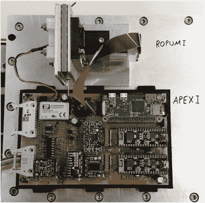

# 将 ESP32 送入太空

> 原文：<https://hackaday.com/2019/10/11/sending-an-esp32-into-space/>

就在两周前，国际空间站的工作人员发布了他们九名成员的照片——考虑到该设施一次只能容纳六名宇航员，这是一个奇怪的数字。事实上，在三名宇航员返回家园之前，船员们刚刚聚在一起吃了一顿庆祝晚餐。新加入的宇航员包括来自阿联酋的第一位宇航员哈扎·阿勒·曼苏里(他已从任务中返回)，以及宇航员杰西卡·梅厄和宇航员奥列格·斯克里波奇卡。

在对即将到来的 10(！)太空行走在接下来的三个月里，开源领域也有一些很酷的发展，首批 ESP32s 之一被发射到太空。

德国航空航天中心微重力用户支持中心(MUSC)的[Nico Maas]参与了德国航空航天中心 MORABA(移动火箭基地)发射的一项实验。发射场位于瑞典基律纳的 Esrange 航天中心，任务于当地时间 2019 年 6 月 13 日凌晨 4 点 21 分发射。

实验 APEX(高级处理器、加密和安全实验)搭载在 ATEK / MAPHEUS-8 任务上，上升到 240 公里的高度进入太空，并在六分钟微重力后返回地球。

【via AIP】

研究的目标是开发一种现成的计算机，它具有比当前标准的微芯片 ATmega328P 更强大的高速传感器和图像采集系统。飞行测试测量了系统的速度，并对其处理计算密集型测试的能力进行了压力测试。

主板包括两个 ESP32s 和一个 Raspberry Pi Zero W，运行 resinOS / balenaOS，这是一个旨在运行并行 Docker 容器并针对物联网车队管理进行优化的操作系统。

在实验之前，用于立方体卫星的星载计算机的标准是基于 ATmega/Arduino 的 ARDUSAT。自 2013 年首次用于 CubeSats 以来，性能变得有限，需要进行改进以执行更高吞吐量的数据采样或需要更多计算能力的操作。

同样值得注意的是，使用 3D 打印支架建造的系统在重返大气层时(达到 20.6 克)几乎没有划痕。

 [https://www.youtube.com/embed/JlcReUwZXFU?version=3&rel=1&showsearch=0&showinfo=1&iv_load_policy=1&fs=1&hl=en-US&autohide=2&wmode=transparent](https://www.youtube.com/embed/JlcReUwZXFU?version=3&rel=1&showsearch=0&showinfo=1&iv_load_policy=1&fs=1&hl=en-US&autohide=2&wmode=transparent)

