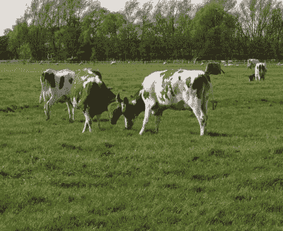
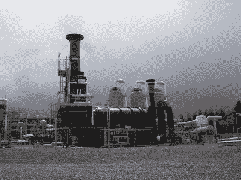
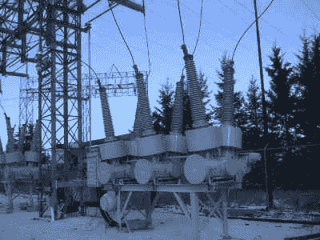
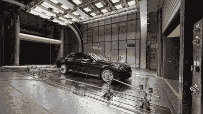

# 你没听说过的最糟糕的温室气体

> 原文：<https://hackaday.com/2019/10/23/the-worst-greenhouse-gasses-you-havent-heard-of/>

长期以来，二氧化碳引起了具有环保意识的人类的愤怒。从化石燃料的燃烧中释放出来的二氧化碳在大气中的含量比过去 40 万年中的任何时候都要高。随着全球环境变暖，降低这些数字是全球科学家和政策制定者的首要目标。

然而，这只是故事的一部分。二氧化碳并不是唯一的温室气体，许多其他气体也是全球气温上升的重要原因。随着人类在本世纪努力将气温升高控制在 2 摄氏度以下，我们需要全方位的策略来解决这个问题。

## 甲烷周围有一股难闻的气味

Ruminant animals are a major source of greenhouse gas emissions, which is probably no surprise to some.
Source: [Peter van der Sluijs](https://commons.wikimedia.org/wiki/File:Two_fighting_cows.JPG), CC-BA-SA-2.0

甲烷是一种非常有效的温室气体，在 100 年的时间里，按重量计算，其变暖潜力是二氧化碳的 28 倍。从历史上看，它主要是从自然来源释放出来的，比如细菌在停滞的水道中处理有机物质，或者从融化的永久冻土中释放出来。然而，科学家们现在认为大约[大气中 60%的甲烷是人类活动的直接结果。](https://www.nationalgeographic.com/environment/global-warming/methane/)

农业是这一领域的主要贡献者。供人类消费的反刍动物是主要的甲烷排放者，因为它们消化系统中的微生物在分解植物材料时会释放这种气体。由于对肉类和奶制品的需求没有显示出放缓的迹象，这可能很难解决。还有各种其他的气体扩散源。垃圾填埋场和污水处理厂本身也有大量的甲烷排放，石油和天然气钻探作业也经常释放甲烷。

Oil and gas operations release significant quantities of methane into the atmosphere, often due to leaks or plant malfunctions. Credit: [Hugh Chevallier](https://commons.wikimedia.org/wiki/File:Weston_Common_gas_facility-by-Hugh-Chevallier.jpg), CC:BA:SA-2.0

与二氧化碳相比，甲烷在大气中的含量很低。甲烷在大气中的寿命也很短，大约 9 年。这些因素意味着甲烷在历史上不太受环保组织的关注。然而，在从 20 世纪 90 年代到 2005 年中期达到稳定水平后，它们再次开始急剧攀升。[科学家们还没有确定这种上升的原因](https://www.wired.com/story/atmospheric-methane-levels-are-going-up-and-no-one-knows-why/)，它有可能抵消在二氧化碳 [2] 战线上抗击全球变暖来之不易的成果。各种理论从减少分解大气中甲烷的化学物质的水平，到增加牲畜产量或水力压裂工业的兴起。

不管最近价格上涨的原因是什么，遏制价格上涨都需要大量的工作。环境保护基金正在发射甲烷卫星，试图更好地定位和量化向大气中的释放，旨在阻止化石燃料操作中容易修复的泄漏。其他想法包括[使用抗生素来减少动物的甲烷排放](https://dairy-cattle.extension.org/use-of-rumensin-in-dairy-diets/)，或者[从垃圾填埋场捕获排放物并将其用作能源。](https://web.archive.org/web/20150929005545/http://www.uspowerpartners.org/Topics/SECTION6Topic-LandfillMethane.htm)很可能需要一种严格的监测和减排方法来控制甲烷水平。

## 一氧化二氮

氧化亚氮不仅仅是《速度与激情》中最受欢迎的气体。它也是一种强有力的温室气体，其温室效应是二氧化碳的 300 倍。由于有足够的持久力，它平均在大气中停留 114 年。40%的氮氧化物排放来自人类活动，就温室气体而言，它是一个重要的参与者。

农业中化肥的使用是一氧化二氮释放到大气中的主要原因。随着农场追求更高的产量，含氮肥料的使用也相应增加。其他较小的来源包括化石燃料燃烧和各种化学生产过程。

减少一氧化二氮的排放是一个难题。如果我们想继续养活尽可能多的人，降低农业产量是不切实际的。提高施肥效率反而是更可行的方法。通过在正确的时间以正确的方式施用正确的数量的肥料，既可以减少氧化亚氮的排放，也可以降低农业运营的成本。通过转向可再生能源生产或更清洁的燃烧技术来减少化石燃料的使用，可以在这一领域获得其他收益。著名的催化转化器于 20 世纪 70 年代引入汽油动力汽车，在减少这些排放方面发挥了重要作用，而[尿素喷射对柴油发动机](https://www.thoughtco.com/adblue-and-clean-diesels-85601)、[也起到了同样的作用，我们之前已经讨论过。](https://hackaday.com/2019/09/26/the-future-of-diesel-is-on-shaky-ground/)

## 硫六-现在怎么办？

Sulfur hexafluoride is used heavily in high-voltage switchgear, as seen here in this hydroelectric installation. This circuit breaker is rated to run at 115 kV, 1200 A. Credit: [Wtshymanski](https://en.wikipedia.org/wiki/User:Wtshymanski "en:User:Wtshymanski"), public domain 

最近，六氟化硫受到了严格审查。它的化学分子式 SF [6] 也为人所知，它是一种高效的温室气体[，其变暖潜力是 CO[2]T5 的 23000 倍以上。因其作为气体电介质的性能而受到重视，它被大量用于现代电网中的高压断路器。它能够构造更紧凑的开关设备，同时保持操作安全可靠。](http://apps.sepa.org.uk/spripa/Pages/SubstanceInformation.aspx?pid=10)

最近一段时间，SF [6] 的浓度开始上升，敲响了警钟。据推测，这是由于电气设备的气体泄漏。随着世界能源组合的变化，电网开始依赖更多的分布式发电，如风力发电场和太阳能。这种发电模式需要更多的电网连接，这意味着更多的开关设备，因此更多的 SF [6] 在野外。

This graph shows the lifetime equivalent emissions of AirPlus versus SF6 technology. There are major gains to be had, thanks to the low global warming potential of AirPlus. Credit: 3M/ABB

在事情失去控制之前，减缓这一趋势的工作正在进行中。ABB 和 3M 合作开发了一种替代产品，名为 AirPlus 。虽然生产过程会在一个装置的生命周期中释放更多的二氧化碳，但基于 AirPlus 的开关设备对变暖的影响应该要小得多。这是因为当释放到大气中时，AirPlus 在紫外光照射下仅 15 天就会降解，而 SF [6] 则需要 3200 年。它的全球变暖潜力小于 1，这意味着它的变暖效应甚至比 CO [2] 更小，同时提供与 SF [6] 相当的介电性能。变体可用于中压和高压应用。

随着时间的推移，随着政府努力减少 SF [6] 在新装置中的普遍存在，我们很可能会看到 AirPlus 和其他替代品获得动力。[自 2014 年以来，这种气体已经在欧盟被禁止用于所有非电气用途。](https://energypost.eu/why-the-eu-should-ban-sf6/)除非有强有力的商业案例，否则行业通常行动缓慢，因此政府干预可能会改变游戏规则，推动该领域采用更新、更清洁的技术。

## 其他氟化气体

SF [6] 只是一系列具有显著全球变暖潜力的氟化气体之一。其中许多是作为氯氟烃(T2)的替代品引入的，氯氟烃会破坏臭氧层。幸运的是，随着 1996 年氯氟化碳产量的减少，这个问题基本上得到了解决，但是它们的替代品仍然会带来更多的麻烦。

氢氟碳化物和全氟化碳等气体在高层大气中的寿命长达数百至数千年，它们对大气变暖有着巨大的影响，就每个分子而言，是二氧化碳的数千倍。它们可用作气溶胶推进剂、溶剂和阻燃剂，但主要用作冷却系统中的制冷剂。HFC-134a 是最广为人知的，广泛用于全世界的空调系统，特别是汽车。这导致它成为大气中最丰富的氢氟碳化合物。

已经做出努力，通过预防措施限制这些化学品的影响。这包括在维修和处理 HVAC 系统时更加小心，以及首先设计更能抵抗泄漏的系统。回收方法也有利于确保尽可能收集这些气体，而不是简单地排放到大气中。大规模的执法仍然是一个挑战。

Automakers are already planning to switch air conditioning systems to use gases that have less global warming potential.
Source: Mercedes Benz

有时候，最好完全避免这个问题。[正在逐步淘汰 HFC-134a 等制冷剂。](https://www.epa.gov/mvac/refrigerant-transition-environmental-impacts)美国环保局已经立法规定，到 2021 年，所有在美国生产或销售的轻型汽车都不得再使用 HFC-134a。相反，HFO-1234yf、HFC-152a 和 R-744 等替代品将是合法的。前两种是轻度易燃的，而后一种仅仅是“T2”的别称。这些制冷剂需要与现有空调不同的技术。基于一氧化碳[2]的系统尤其需要在高达 10 倍于传统系统的压力下运行。然而，技术的进步应该可以让这些气体取而代之，减少这些制冷气体对全球变暖的影响。

## 战斗仍在继续

一氧化碳仍然是主要的温室气体，但这不是全部。我们已经研究了各种各样的化学物质，每一种化学物质都有自己的重要作用，并对地球大气产生影响。这突出了一个事实:阻止全球变暖没有单一的灵丹妙药；相反，需要一种涵盖人类努力所有方面的广泛方法。

阻止这些化学品的影响是困难的，需要政府机构采取果断的行动，以及相关行业的合作。在某些情况下，会有额外的收益，而在其他情况下，解决方案会带来高成本和痛苦的变化。我们把自己设计成这种情况，所以我们也许可以把自己设计出来。不管怎样，如果人类要在下个世纪繁荣昌盛，还有许多工作要做。