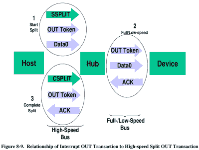

# 艰难地发现 USB 错误

> 原文：<https://hackaday.com/2019/10/20/finding-usb-bugs-the-hard-way/>

有时候调试并不像你想的那样进行。当 [USB 问题](https://www.pjrc.com/usb-hub-bug-hunting-lessons-learned/)出现时，您通常可以使用协议分析器来找到导致问题的原因。对[[保罗·斯托佛雷根](https://www.pjrc.com/author/paul/)来说，这只是寻找罪犯的漫长过程中的第一步。

### 协议分析器

出现的投诉来自一位客户，他的 2 端口 USB 集线器无法在他们的 Teensy 3.6 上工作。hub 已经在 Linux、Mac 和 Windows 上测试过，所以测试 Teensy 有什么不同是有意义的。此外，所有其他 USB 集线器在 Teensy 上工作。事实证明，在发现 bug 时，这些并不是最有用的假设。

可以使用任何协议分析仪，例如 Beagle480。它的工作方式是通过 USB 通信，复制进出的通信，并将其发送到 PC。

通常，分析仪有一个小的缓冲存储器，必须支持快速数据流。不幸的是，这偶尔会导致软件锁定。从详细打印中可以收集到的信息来看，为集线器找到了 USB 描述符。事实证明，有故障的集线器是多 TT 类型的集线器，而大多数其他集线器是单 TT(事务转换器)。

### **修复软件锁定**

因为有必要获取剩余的描述符数据，所以下一步就是修复软件锁定。在代码中写入一个紧急功能(一种断点)允许 USB 主机的电源终止，并通过程序逐步显示，虽然最初正在读取 2 端口集线器，但后来出现了一些问题。

事实证明，这个问题依赖于 USB 分割交易，仅在 USB 主机和集线器之间使用。通信是通过令牌进行的，从一个分割开始令牌开始。

事实证明，问题在于令牌没有按照正确的顺序发送。其他中心似乎在处理这件事。通过对坏的 hub 的 C++代码进行修复，hub 能够再次工作，该代码以前没有实现正确访问 register 的数据结构。集线器似乎拒绝了错误的令牌，这是导致问题的首要原因。

总而言之，虽然我肯定这是一次令人挠头的经历，但至少它让我们对 USB 通信的底层设计有了一些了解。