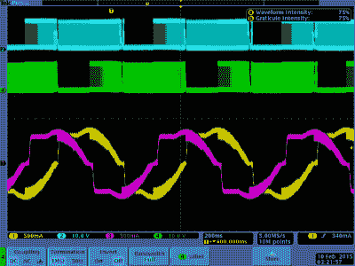

# 使用 TL 平滑器获得更好的 3D 打印效果

> 原文：<https://hackaday.com/2019/10/16/using-tl-smoothers-for-better-3d-prints/>

一些 3D 打印机会给你打印出类似鲑鱼皮的表面——这不是你在寻找高质量打印工作时想要的结果。在糟糕的打印工作中，您通常会注意到表面在抖动——即使是毫米级的抖动，这也足以使打印效果凹凸不平，并破坏表面质量。TL 平滑器有助于平滑通过 3D 打印机步进电机的信号，特别是臭名昭著的噪声 DRV8825 电机驱动器。

分析 DRV8825 的正弦波通常会显示阶跃信号，而不是平滑信号。TMC2100、TMC2208 和 TMC2130 等更新的芯片在提供平滑信号方面做得更好，常用的 A4988s 等更便宜的驱动器也是如此。

【Fugatech 3D 打印】[展示了](https://www.youtube.com/watch?v=vrFLne1OeVE)D-Force Mini 的一些打印件，这些打印件带有基于 MKS Base 1.4 smoother 的控制板，比 Marlin 更易于使用，也更智能。在使用平滑器的两个印刷上，一个使用具有四个二极管的板，而另一个使用具有八个二极管的板印刷。[Mega Making]比较了不同电机驱动器的工作方式，[实验性地展示了连接到平滑器之前和之后不同电机之间的断续。](https://www.youtube.com/watch?v=qYI9XlADed8)

黄色和粉红色的痕迹是电机每相的电流。蓝色和绿色轨迹是黄色电流相位各端的电压。【via Schrodinger Z】

drv 8825 电机的一个常见问题是其额定电压，低于大多数电源。当 3D 打印机移动速度低于 100 毫米/分钟时，电机无法平稳移动。

[Schrodinger Z]对丢失微步的原因进行了深入研究，测试了 DRV8825s 中的不同衰减模式，以及电机信号中出现次谐波振荡的原因。

因此，驱动器有一个“死区”，在那里它不能产生低电流。通过将电压偏移 1.4V(没有电流流动的点)来修改电机将允许死区被桥接。这也恰好是平滑器设计背后的逻辑，尽管当然有可能使用不同的二极管来定制功率损耗，这取决于您对电机的特定目标。

在 3D 打印机中调试信号问题可能是一件非常令人头痛的事情，但从当前的分析中理解为什么会出现微步进也是令人欣慰的。

 [https://www.youtube.com/embed/vrFLne1OeVE?version=3&rel=1&showsearch=0&showinfo=1&iv_load_policy=1&fs=1&hl=en-US&autohide=2&wmode=transparent](https://www.youtube.com/embed/vrFLne1OeVE?version=3&rel=1&showsearch=0&showinfo=1&iv_load_policy=1&fs=1&hl=en-US&autohide=2&wmode=transparent)

[谢谢基斯·O 的提示！]