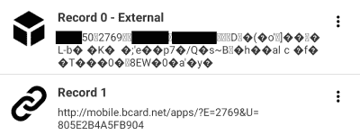
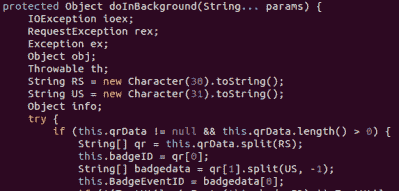

# 重温黑帽黑客:安全会议是如何召开的

> 原文：<https://hackaday.com/2019/10/18/revisiting-the-blackhat-hack-how-a-security-conference-was-pwned/>

有人记得 2018 年的黑帽 BCard hack 吗？这种攻击已被广泛记录，最臭名昭著的是[NinjaStyle]在他的原始博客帖子中披露了发现漏洞的情况。这次入侵最终泄露了每一位与会者的姓名、电子邮件地址、电话号码和个人详细信息——这是世界上最大的网络安全会议之一的一次令人尴尬的泄露。

[概括一下](https://techcrunch.com/2018/08/22/legacy-system-exposed-black-hat-2018-attendees-contact-information/):黑帽会议徽章包括一个嵌入式 NFC 标签，存储了与会者的联系方式，大概是供供应商出于营销目的扫描的。扫描标签后，[NinjaStyle]意识到自己的名字随手可得，但邮箱等信息却没有。相反，NFC 阅读器指向 BCard 应用程序，这是一款为阅读名片而开发的应用程序。

[NinjaStyle]反编译应用程序的 APK 以搜索 API 端点，并发现每个参与者都有一个使用事件标识值创建的自定义 URL。在找到似乎对应于 eventID 和 badgeID 的数据后，他通过 web 浏览器发送了一个请求，并发现他的与会者数据被完全未经验证地返回。有了这些知识，就有可能强力破解每个黑帽与会者的联系信息(有效 id 的范围在 100000-999999 之间，大约有 18000 名与会者)。使用 Burp Suite，这项任务大约需要六个小时。

他找到了 BCard 来揭示这个漏洞，通过禁用遗留系统中的漏洞 API，这个漏洞在不到一天的时间内得到了修复。即便如此，会议应用程序中的遗留 API 也并不罕见——2018 年 RSA 会议(另一个网络安全会议)也遭遇了一个未受保护的应用程序，该应用程序允许未经许可访问 [114 名与会者记录](https://arstechnica.com/information-technology/2018/04/insecure-rsa-conference-app-leaked-attendee-data/)。

随着泄露的与会者数据的广泛传播，活动组织者有望对他们使用的应用程序变得更加智能，特别是如果它们来自第三方供应商。[Yashvier Kosaraju]在 TROOPERS19 上给[做了一个关于 pen 测试几家大厂商的演讲，发现 Kitapps (Attendify)和 Eventmobi 都开发了未经授权访问与会者数据的应用。很难说前几年的应用程序还有多少，或者你使用的下一个活动应用程序是否会带有身份验证功能——只要记住保持警惕，不要泄露太多你的个人数据。](https://troopers.de/downloads/troopers19/TROOPERS19_DM_Wild_West.pdf)