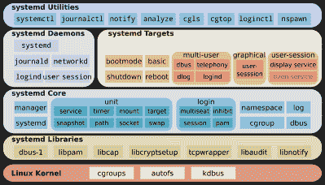

# 收拾行李——系统将带你去一个新家

> 原文：<https://hackaday.com/2019/10/16/pack-your-bags-systemd-is-taking-you-to-a-new-home/>

从第一天起，主目录就已经是任何 Unixy 系统的基础部分。它们是如此基本的元素，我们通常不会给予它们太多的思考。我们为什么要这么做？从低级的角度来看，无论`$HOME`指向什么位置，它都是一个目录，就像你在系统中发现的无数目录中的任何一个一样——除了可能位于它自己的磁盘分区上。主目录在本质上是如此不起眼，以至于人们通常不会考虑改变它们。[然后还有伦纳特吟诗](https://cfp.all-systems-go.io/ASG2019/talk/VSQRXA/)。

如果您不熟悉这个名字，他是`systemd` init 系统背后的主要开发者，现在这个系统已经被大多数 Linux 发行版所采用，作为其老版本 Unix 风格的 init 系统前辈的替代，从根本上改变了我们所知道的关于系统引导过程的一切。这种改变不仅侮辱了每一个热爱 Perl、拥有 Ken-Thompson 动作玩偶的灰胡子的人，还产生了对`systemd`和 Lennart 本人的蔑视，这接近五分钱乐队的水平。在这一点上，他下一步做什么可能已经无关紧要了，*的憎恨者将会憎恨*。那么谁比他更适合破坏我们所知道的关于主目录的一切呢？你住在哪里？

虽然，主目录只是他的最新创造[`systemd-homed`项目](https://github.com/poettering/systemd/tree/homed)~~将会让人们更加讨厌他~~的等式的一部分。大图实际上更多的是关于我们所知道的用户管理的整个概念，这听起来大胆而可怕，但在目前的状态下，它也比我们可能意识到的有更多的缺陷。所以让我们来看看它的全部内容，它背后的动机，它将要解决和提出的问题，以及是时候抛弃一些过时的哲学了。

## Systemd 快速介绍

 

只是多了一个模块…图片:shmu El Csaba Otto Traian[[CC BY-SA 3.0](https://creativecommons.org/licenses/by-sa/3.0)]，[via Wikimedia Commons](https://commons.wikimedia.org/wiki/File:Systemd_components.svg)

在我们进入`homed`部分之前，让我们就`systemd`本身达成一致。简而言之，`systemd`处理内核任务之外的所有事情来启动系统:设置用户空间，提供运行所有系统进程和守护进程所需的一切，并全程管理这些进程。它既取代了使用 PID 1 运行的旧的`init`进程，又在内核和用户空间之间提供了一个管理层，因此，它附带了一整套额外的工具和组件来实现所有这些:系统日志、登录处理、网络管理、用于各部分之间通信的 IPC，等等。因此，曾经由各种单一用途工具处理的东西已经成为了`systemd`本身的一部分，这也是坚持“一个工具，一项工作”哲学的人们不满的一个来源。

从技术上来说，`systemd`中的每个工具和组件仍然作为它自己的可执行文件发布，但是由于这些组件的相互依赖性，它们并不是真正独立的，它实际上只是一个逻辑分离。因此，`systemd-homed`是一个额外的组件，旨在处理用户管理和这些用户的主目录，紧密集成到`systemd`基础设施及其提供的所有额外服务中。

但是为什么要改变它呢？好吧，让我们来看看 Linux 当前处理用户和主目录的方式，以及`systemd-homed`打算如何改变这种方式。

## $HOME 和用户管理的现状

从一开始，用户就被存储在`/etc/passwd`文件中，其中包括用户名、系统特有的用户 id 和主目录位置。传统上，用户的密码也以散列形式存储在该文件中——在某些情况下可能仍然如此，例如嵌入式系统——但最终被移动到一个单独的`/etc/shadow`文件中，具有更多受限的文件权限。因此，在使用在影子文件中找到的密码成功登录到系统后，用户从`/etc/passwd`中的主目录条目指向的任何位置开始。

Sure you want to live here? [“Rosedale home”](https://www.flickr.com/photos/34534185@N00/8549350013)by [Sheba_Also](https://www.flickr.com/photos/34534185@N00), [CC BY-SA 2.0](https://creativecommons.org/licenses/by-sa/2.0/?ref=ccsearch&atype=html)

换句话说，对于登录到系统的最基本的过程，需要三个完全独立且相互分离的单独部分。得益于源于简单时代的定义明确的规则，这些规则自那以后基本上保持不变，而且这一过程中涉及的每一个系统和工具都很好地遵守了这些规则，这一切都进行得很好。但是如果我们想一想:这真的是最好的方法吗？

注意，这只是最基本的本地用户登录。再加上一些网络认证、额外的基于用户的资源管理或磁盘加密，您会发现`/etc/passwd`并不适合这些。那么，为什么会是— *一个工具，一项工作*，对吗？因此，我们不是在一个足够灵活的集中式用户管理系统中配置可能与用户相关的一切，而是将许多随机配置堆叠在一起，每个配置都做自己的小事。不知何故，我们对此非常满意。

然而，如果你今天必须从头开始设计一个类似的系统，你真的会选择同样的概念吗？您的系统架构师、您的老师，甚至您自己真的可以接受重复的数据库条目(用户名在`passwd`和影子文件中)、不强制的关系(主目录条目和主目录本身)，以及莫名其妙的随机附加数据:资源管理、PAM、网络认证等等吗？嗯，你现在可能已经猜到了，Lennart Poettering 并不太喜欢这样，他的目标是通过`systemd-homed`将所有围绕用户管理的独立配置实体统一到一个集中的系统中，这个系统足够灵活，可以处理未来可能需要的一切。

## 咚咚——是 Systemd

因此，`systemd-homed`将基于用户本身收集每个组件的所有配置数据，并以 JSON 文件的形式存储在特定于用户的记录中，而不是每个组件都有自己的配置。该文件将包括所有显而易见的信息，如用户名、组成员和密码散列，但也包括任何依赖于用户的系统配置和资源管理信息，以及基本上真的只是*任何*相关的内容。作为 JSON，它实际上可以包含您想放在那里的任何内容，这意味着只要需要新的特性和功能，它就可以很容易地扩展。如果你想改变某些东西，你再也不需要考虑这 36 个文件中的哪一个了。

除了用户和基于用户的系统管理之外，主目录本身将作为 LUKS 加密容器链接到它，这就是有趣的地方，即使您不认为需要统一的配置位置:加密直接与用户登录本身相耦合，这意味着不仅一旦用户登录磁盘就会自动解密，而且一旦用户注销、锁定屏幕或暂停设备，它也会自动再次加密。换句话说，当你没有登录时，你的数据是不可访问和安全的，而操作系统可以继续独立运行。

当然，这也有不利的一面。

## SSH 的鸡/蛋问题

如果主目录需要一个主动登录的用户来解密主目录，那么通过 SSH 的远程登录就会出现问题，远程登录依赖于在主目录中找到的 SSH 解密密钥(当时是加密的)。出于这个原因，SSH 在没有本地用户登录的情况下根本无法工作，这当然违背了远程访问的全部意义。

The OpenSSH logo.

话虽如此，但值得注意的是，在现阶段，`systemd-homed`主要关注的是台式机或笔记本电脑上的普通真实用户，而不是那么多系统或特定服务用户，或者在服务器上远程运行的任何东西。这听起来当然像是一个糟糕的借口，但是请记住`systemd-homed`将改变用户处理的核心，因此可以安全地假设未来的迭代将减少这种分离，并且对于任何类型的用户都将正常工作。我的意思是，如果你还需要旧的东西，没有必要重新发明轮子——但在这里你可以随意说我幼稚。

理想情况下，SSH 密钥将被迁移到公共场所用户管理记录中，但是这需要 SSH 方面做一些工作。这种情况现在还没有发生，但是话说回来，`systemd-homed`本身也只是 git 分支中一个尚未完全实现的想法。除非这个问题得到解决，否则它不太可能被邪恶的 Linux 发行版广泛采用并强加给你——但是，也许我只是过于乐观和天真了。

## 拥有便携式住宅的独立用户

但是将用户管理和主目录处理放在一个地方并结合在一起，您可以开始想象其他可能的特性。例如，可移植的主目录兼作自包含用户。也就是说，你可以将主目录保存在 u 盘或外置硬盘上，并随时随地在家中的工作站和笔记本电脑之间无缝移动。无需复制或同步您的数据，一切尽在您的掌握之中。这带来了安全性和可移植性的好处。

Or would you rather live here? By [ltenney1225](https://www.flickr.com/photos/57545119@N04/14707274736) CC BY-NC 2.0

但这还不是全部。你不一定要把你的主目录附加到你自己的设备上，它可以是朋友的设备或会议上演示者的笔记本电脑，或者任何真正兼容的设备。一旦您将主目录插入其中，您的整个用户也将自动存在于该设备上。嗯，算是自动的吧。显然，没有人希望一些随机的人在他们的系统上漫游，所以系统所有者/超级用户仍然必须首先授予您访问他们系统的权限，根据他们自己的条款配置用户和资源，并签名以避免篡改。

诚然，对于你们中的一些人来说，这听起来不像是令人惊讶的新功能，而更像是一场等待发生的安全噩梦和混乱。而且它肯定会给 Linux 的另一个核心元素带来巨大的变化，在这个核心元素中，很多东西可能会出错。这一切在现实中会如何发展还有待观察。很明显，这不会在一夜之间发生，也不会突然发生——这些变化太深刻太基本了。但是作为`systemd`本身的一部分，并且看到它对 Linux 的影响，人们不得不考虑这个*可能会在不太遥远的将来的某一天*发生。也许它应该。

## 时代在变

是的，这将破坏我们所知道的关于用户管理的一切。是的，这违背了 Unix 所代表的一切。但是它也抛弃了一个古老的概念，这个概念与软件工程世界几十年来痛苦地学习的最佳实践背道而驰。毕竟现在已经不是 70 年代，也不是 80 年代了。我们不再有各种各样的异构环境，我们不再需要为每一个系统找到能力最差的共同点。Linux 是占主导地位的，也可以说是当今唯一真正相关的开源“Unix”系统——相比之下，即使是网飞和 WhatsApp 运行 FreeBSD 也只是轶事。那么，为什么 Linux 真的要关心与“利基”操作系统的兼容性呢？这些操作系统最终还是要做自己的事情。就此而言，我们为什么还要关心 Unix 呢？

它通常回避了这样一个问题，为什么我们一直坚持认为计算机科学作为一门学科已经达到了它的哲学高峰，而它目前的大多数从业者甚至还没有出生呢？为什么我们如此疯狂地坚持一种比当今世界早几十年建立的哲学，这种哲学有无处不在的互联网、移动连接、云计算、基础设施/平台/软件/什么都不是即服务，以及上面和下面的一切都已成为现实？我们真的那么怀念黑暗时代吗？

我并不是说我们通过技术达到的复杂性必然是我们都应该希望的结果，但这就是我们今天所处的位置。而且只会越来越糟。我们越早接受这一点，并从这里继续前进，或许在前进的道路上调整我们古老的哲学，我们就越有可能成功地驯服这种发展并保持对它的控制。

是的，如果改变是由除了我们自己之外的任何人带给我们的，那它就是一件可怕的、令人害怕的、可怕的事情。但这也是不可避免的，而且`systemd-homed`可能只是谚语所说的打破的鸡蛋，它将给我们带来美味的煎蛋。时间会证明一切。