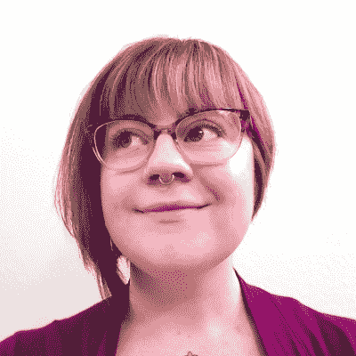
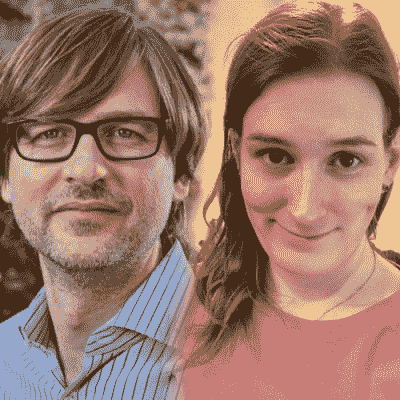
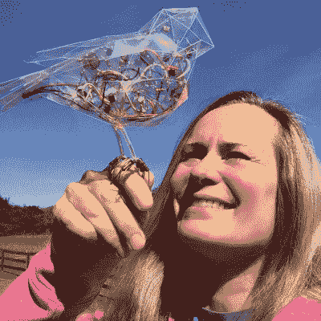
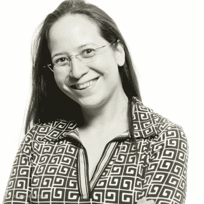
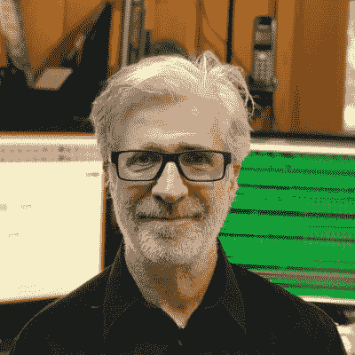
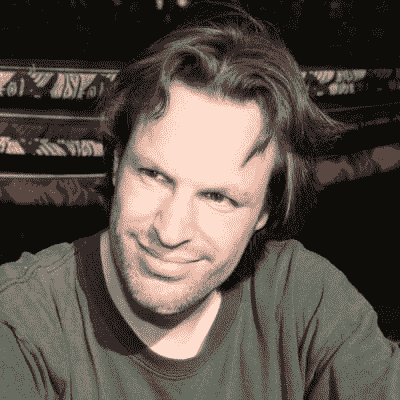

# 演讲者登上 Supercon 的舞台，暗示黑客即将到来

> 原文：<https://hackaday.com/2019/10/18/speakers-taking-the-stage-at-supercon-plus-a-hint-of-the-hacking-to-come/>

四周后的今天，黑客日超级会议进入第五个年头。从挑战性环境中的工程到提升电子艺术形式，这里还有九个演讲将会让这一年成为难忘的一年。

除了[下面的演讲者名单](https://hackaday.com/2019/09/27/heres-your-first-look-at-the-talks-of-the-2019-hackaday-superconference/)还有[三个](https://hackaday.com/2019/10/04/more-supercon-talks-taking-the-hardware-world-by-storm/)其他[公告](https://hackaday.com/2019/10/11/latest-dose-of-hardware-talks-headed-to-supercon/)，加上[工作坊](https://hackaday.com/2019/10/02/get-hands-on-at-supercon-workshop-tickets-now-available-2/)。耶鲁安·多姆伯格(又名 Sprite_TM)正在设计今年的徽章，它基于一个运行 RISC-V 内核的强大 FPGA，并使用开源合成工具。我们很快会有更多的消息，但是如果你迫不及待，请查看[他刚刚发布的扩展板规格](https://github.com/Spritetm/hadbadge2019_protoboard)，并[加入会议聊天室](https://hac.io/m/280647)了解内幕。徽章黑客肯定是我们见过的最热闹的。

票已经卖完了，但是你仍然可以在等候名单上，希望有一张票。如果您持有这些热门商品中的一种，但无法使用它，请退还您的票，以便我们可以将它交给等待的人。

## 会谈(许多会谈中的第四部分)

*   

    ### 劳雷尔·卡明斯

    **下雨的时候，倾盆大雨**

    在过去的两年里，我的工作已经超越了普通，在陌生的地方建造和制作原型，比如被困在大西洋的一艘帆船上，在科威特教美国海军陆战队，以及在佛罗伦萨飓风后在北卡罗来纳州为重要系统的发电机建造燃油表传感器。我学到的一些重要经验是关于如何在奇怪的地方采购材料和供应品，比如当亚马逊无法跨越洪水淹没的高速公路时，在北卡罗来纳州的偏远地区找到电位计，如何在科威特城找到焊接气体(以及当地厨师如何可能是你的最佳选择)，或者你可以在城市码头附近的 O'Reilly's 汽车零部件商店走多远。这些情况有助于你真正看到项目中可能发生的“工程师蠕变”。我认识到，当你处于高风险的情况下，你真的应该停止关心你的 3D 打印的边缘是否被倒角。事实上，第一版的飓风燃料计传感器被放在一个优雅的三明治袋子里展示。

*   

    ### 安吉拉·希恩

    **打造异想天开的可穿戴设备:通过有趣的原型升级**

    无论是主题派对、万圣节、角色扮演，还是沙漠中的事情，为异想天开的自我表达设计可穿戴设备都是挑战自己作为制造者、穿戴者和合作者的绝佳机会。作为一名艺术家和设计师，我意外地进入了科技行业，我发现，从电子和编程的角度来看，冒名顶替综合症往往会限制个人的可实现性。我重新构思了一个项目，将重点从“可穿戴技术硬件努力”转移到“个人风格的古怪混合媒体实验”，我创造了一个安全的空间来玩和尝试我技能范围之外的新事物，并制作了一些技术上最复杂和精美的个人作品。和我一起经历概念化和建立我的[偷色精灵项目](https://www.gellacraft.com/colorfairy)的过程，这是一次迭代设计和升级一个交互式可穿戴项目的练习，历时两年。

*   

    ### 迈克尔·奥斯曼和凯特·坦金

    **软件定义的一切**

    软件定义无线电(SDR)的流行导致了强大的开源软件工具的出现，如 GNU Radio，它支持实时数字信号处理(DSP)技术的快速发展。我们已经将这些工具用于音频和红外等无线电和非无线电应用，现在我们发现它们对于能够受益于 DSP 的各种传感器和执行器非常有用。在本次演讲中，我们将展示如何使用开源的 GreatFET 平台快速开发类似 SDR 的方法来处理任何事情。

*   

    ### 凯利·希顿

    **《黑客自然的音乐家》(或《电子自然主义的艺术》)**

    普遍缺乏对电子艺术的接受是因为缺乏理解电子媒体的评论家、策展人、收藏家和授权人，加上艺术和工程社区之间的文化差距。为了解决这个问题，我们必须扩展我们的舒适区和词汇，与不同教育背景的人进行有礼貌的、有启发性的交谈。在本次演讲中，我将讨论我对简单模拟电路设计的惊叹，这些设计模仿了像生命一样的行为，如蟋蟀的鸣叫和鸟儿的歌唱。这将包括对各种原理图的讨论和小型。以及我迄今为止工作的简要调查。

*   

    ### 茉莉·布雷克特

    **释放您的电子产品**

    在这个小组中，我们将讨论将您的项目从您的工作室交到首批用户手中的主要方法，以及您可以做些什么来扩大规模。我们将讨论常见的陷阱，以及可以利用的最佳资源。

*   

    ### 大卫·威廉姆斯

    **micro FPGA——即将到来的小型电子产品革命**

    大 FPGA 很棒。他们正在做他们一直在做的事情，实现人工智能，信号处理，军事应用等。然而，出现了一种新的可能性——用于小型应用的 FPGA 这种可能性可能更大。使用开源工具、廉价灵活的开发板和新的库，设计人员有了一套全新的选择，创造出令人难以置信的高性能、灵活、低功耗的项目和产品。

*   

    ### 尼克·普尔

    **board house 的困惑:用 PCB 设计 3D 结构、电路和传感器**

    本演示将介绍一系列设计特性或技术，并花几分钟时间探究每种特性的“陷阱”,以及 EAGLE 中的布局示例和物理示例。我想在 30 分钟内讲述尽可能多的不同技术，包括将奇怪的形状引入 EDA，由 tab 和 slot 引起的内角问题，圆角焊接，堆叠电路板，用鼠标咬模仿模型浇口，操纵自定义显示的掩膜层，弯曲的 tab 按钮，工作旋转编码器，以及手持 PCB 的人体工程学设计。

*   

    ### Ted Yapo

    **走向开源多 GHz 采样示波器**

    泰克在 1968 年设计了 14.5 GHz 采样示波器。随着简单的多层 PCB 设计、微小的表面贴装器件、速度惊人的半导体以及当今个人设计师可以利用的计算机能力，能否用普通的现成元件廉价地重新制造一个类似的采样头？应该很容易吧？不是的。在本次演讲中，我将讨论开源 GHz+采样示波器的进展，包括许多死胡同，以及一些非常有前途的线索。

*   

    ### 杰隆·多姆堡

    **打造 Hackaday 超级大会徽章**

    Hackaday Supercon 徽章的传统是建造一些不同于之前任何 super co 徽章的东西。今年的徽章将 FPGA 作为其核心组件，这带来了一些额外的挑战:FPGA 仅采用 BGA 封装，有多达 381 个焊盘要焊接，而不是只参考 SoC 的数据表来编写徽章软件，SoC 本身必须首先编写。我将讨论徽章的发展过程，以及一路上遇到的许多挑战。

## 请关注直播的 Hackaday

你将在 Supercon 看到的演讲者拥有惊人的丰富经验，我们迫不及待地想看他们的演讲。但是即使你买不到票，也不意味着你会错过。敬请关注 Hackaday，获取将于 11 月 16 日周六开始的直播链接。