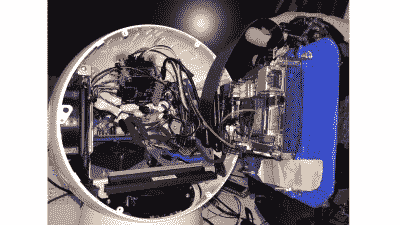

# Jibo 万岁，我们可爱的机器人伙伴

> 原文：<https://hackaday.com/2019/10/17/long-live-jibo-our-adorable-robot-companion/>

Jibo 公司制造的可爱机器人 Jibo 正在被淘汰，但这并没有阻止[古伊列梅·马丁斯]利用他的机器人伴侣进行最后一次黑客攻击。

当他发现公司将终止新 Jibos 的生产并关闭它们的服务器时，他想替换机器人的大脑，这样即使它的所有软件都已过时，它也能继续存在。到项目开始的时候，SDK 下载已经从开发者的网站上删除了，所以他们开始寻找控制 Jibo 的其他选择。

第一个挑战是不要为了拆卸 Jibo 而破坏外形。他们只是设法从底部取出电池，意识到玻璃框架容纳了大脑空间。从机器人内部，他们能够找到电子设备头部和心脏的无止境旋转接头。Jibo 在三个不同的层面上分别使用 DC 电机、编码器和红外传感器来检测参考点。

他们决定使用 Phidgets 模块来连接这些设备。虽然 DC 电机控制器处理 2A 并具有编码器端口，但 Phidgets 能够提供内置编码器和 PID 的软件。4x 数字输入模块用于检测 IR 开关并将模块连接到计算机。

[马丁斯]决定使用 LattePanda，一个可破解的 Windows 10 开发板，作为新 Jibo 的大脑。幸运的是，该板能够安装在 Jibo 的隔间内，但由于它需要更多的功率，因此该单元由 12V 调节到 5V，以便减少通过导线的电流。同时，DC 发动机在 12V 电压下运行，红外开关和编码器在 5V 电压下运行。

在 Unity3D 中开发的程序播放眼睛动画，C#程序与 Phidgets 接口。最终的配置是将 Jibo 安装到机械臂上，以增强它的行为。我们之前写过关于机器人手臂艺术家托皮的文章，它被用作 Jibo 新家的基地。

你可以在下面的视频中查看结果。

 [https://www.youtube.com/embed/0hI-v_bP-6Q?version=3&rel=1&showsearch=0&showinfo=1&iv_load_policy=1&fs=1&hl=en-US&autohide=2&wmode=transparent](https://www.youtube.com/embed/0hI-v_bP-6Q?version=3&rel=1&showsearch=0&showinfo=1&iv_load_policy=1&fs=1&hl=en-US&autohide=2&wmode=transparent)

