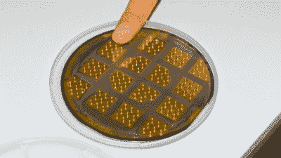

# 一种生长表簧的新方法

> 原文：<https://hackaday.com/2019/11/02/a-new-method-for-growing-watch-springs/>

瑞士联邦材料科学与技术实验室(Empa)的科学家们最近开发了一种新技术，用于将手表弹簧(T1)生长到微小的规格。事实证明，手表发条的发明为新材料的研究提供了机会。

该技术包括使用光蚀刻和电化学沉积到冷的水溶液中。与拉制和缠绕 Nivarox 线相比，这是一种非常规的制造方法。自制表业诞生以来，制造游丝一直是这项工作中最困难的部分之一。线必须被拉伸到百分之一毫米的厚度，缠绕和回火到精确的硬度、延展性和弹性，同时补偿环境因素。许多物质在制造过程中会改变它们的属性，因此 Empa 团队决定将纯材料研究作为一种方法，来寻找制造保持稳定的游丝的方法。

他们取出硅片(与用于太阳能电池板和计算机芯片的硅片相同)，在硅片上覆盖一层金和一薄层光敏涂料，并在硅片上蚀刻出弹簧的形状。然后将晶片浸入含有金属合金盐溶液的电镀槽中——弹簧充当阴极，当电流通过电镀槽时，金属沉积在弹簧底部。一旦弹簧制成，就从模具中取出并进行检查。经过一点平滑处理后，最终的弹簧被清洗并送到实验室进行原型生产。

这种电镀弹簧目前正在瑞士图恩 Empa 校区的材料力学和纳米结构实验室展出。与此同时，第一次试点测试即将结束，该团队开始与瑞士制表商合作，看看他们的弹簧能否支撑住手表的机械装置。

【感谢 Qes 的提示！]