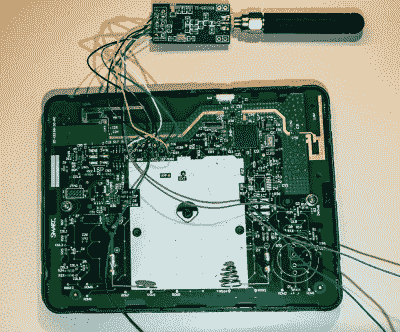

# 智能响应 XE 的频谱分析仪

> 原文：<https://hackaday.com/2019/10/22/a-spectrum-analyzer-for-the-smart-response-xe/>

还记得那个叫技术 IM-me 的女孩吗？这是一个粉红色的清仓架玩具，当人们发现它们可以用于各种无线电频率恶作剧时，它突然成为黑客界最热门的商品之一。如果你能找到一个的话，现在他们在易贝追求三位数。嗯，我们可能会看到同样的事情发生在智能响应 XE 上。

多亏了名为[ea] 的黑客的工作，这个廉价的教育设备终于开始实现我们在它身上看到的潜力，当时一次拆解显示它由兼容 Arduino 的 ATmega128RF 芯片驱动。凭借大屏幕、体面的 QWERTY 键盘和集成的无线硬件，Smart Response XE 显然将成为下一个必须重新调整用途的套件。

 尽管事实证明，[ea]并没有使用设备内置的无线硬件。在这个记录和照片非常完整的项目中，第一步是将 CC1101 收发器模块固定在 ATmega128RF 的 SPI 引脚上。然后，加载适当的固件，那个漂亮的大屏幕将向您显示 300 MHz、400 Mhz 和 900 MHz 频段上发生了什么。

但乐趣不止于此。有了 CC1101 修改的智能响应 XE，有一个全新的无线电黑客世界，你可以拉下。作为概念验证，[ea]还包括一个 POCSAG 寻呼机解码器。诚然，RTL-SDR 已经使从空中提取寻呼机消息变得相当容易，但在如此小而不起眼的东西上也能做到这一点，还是值得一提的。

如果你不知道，我们非常有兴趣看看社区可以用 Smart Response XE 做什么。在写这篇文章的时候，易贝一个好的单元的现行价格看起来大约是 10 美元，加上 CC1101 模块的 3 美元左右。[但是当我们第一次发布这个消息的时候，价格已经飙升到了顶点](https://hackaday.com/2018/07/22/classroom-gadget-turned-arduino-compatible/)，所以在你还能买的时候买便宜的吧。

【感谢 bburky 的提示。]