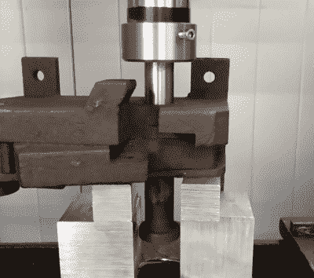

# 修复生锈的钢筋刀具

> 原文：<https://hackaday.com/2019/10/27/restoring-a-rusty-rebar-cutter/>

我们都可能遇到过大块的垃圾，它们曾经是工具，长期被忽视，被化学焊接成一堆无用的固体铁锈。这些东西可以在当地的跳蚤市场以很低的价格买到，或者更有可能在旧谷仓里找到，或者在垃圾堆里腐烂。它们看起来已经无法挽救了，但是通过适当地使用油脂和渗透性润滑剂，即使是一个令人讨厌的旧的卡住的钢筋切割机也可以重新活过来。

老实说，当我们看到下面的视频时，我们几乎错过了它。毕竟，钢筋切割机是一个非常简单的设备，像[我的机械师]制作的修复视频的一半乐趣是看到所有部件被移除、修复和替换。但最终它比我们预期的要有趣得多，也更具挑战性。

 这把刀不见了原来的柄，看上去完全像是由一块坚硬的氧化铁铸造而成。[我的机械师]结合杠杆作用、自由使用渗透油、钻孔和液压机的温和劝说，能够将主枢轴螺栓松开。

这些努力被证明对两个螺栓都是破坏性的，所以新的螺栓在车床上被制造出来，其他一些零件也是如此。新的刀具是由工具钢制成的，并且制造了一个新的手柄；在任何人评论任何人的焊接技术之前，请阅读[【Jenny】最近关于这个主题的文章](https://hackaday.com/2019/10/22/grind-your-welds-with-pride-if-thats-the-way-you-do-it)。

成品与最初的氧化垃圾明显不同，所以在传统意义上称之为“复原”会有一些争论。一个[我的机械师]视频的最终结果总是一个工具或一件装备，看起来比它制作的那天好得多，它们中的任何一个都会在我们的货架上获得荣誉。也就是说，如果他在史密森尼工作，可能很快就会被扫地出门。

不管你怎么称呼这种视频，外面有很多。我们精选了几个这种类型的例子，从对经典火柴盒汽车的热爱修复到重建古董锯台的 T2。它们足以让我们开始进行车库拍卖。或者废车场。

 [https://www.youtube.com/embed/kqLoC2U5u-g?version=3&rel=1&showsearch=0&showinfo=1&iv_load_policy=1&fs=1&hl=en-US&autohide=2&wmode=transparent](https://www.youtube.com/embed/kqLoC2U5u-g?version=3&rel=1&showsearch=0&showinfo=1&iv_load_policy=1&fs=1&hl=en-US&autohide=2&wmode=transparent)

