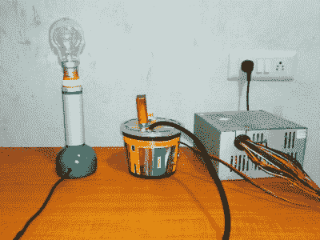

# 建造你自己的等离子球

> 原文：<https://hackaday.com/2019/10/25/build-your-own-plasma-ball/>

简单的等离子球——它装点着世界各地的科学博物馆和教室。它与范·德·格喇夫发生器共享一个位置，并方便地增加了壮观的等离子射线，点缀着它的球形表面。高压、美观、疯狂的科学比喻——什么会成为更好的 DIY 项目？

在某些背景下，等离子体是物质的第四种状态，通常通过加热中性气体或在强电磁场中电离气体来产生。自由电子的存在使等离子体能够导电，并表现出与普通气体不同的特性。在这种状态下，它还会受到磁场的影响，并经常出现在电弧中。

[离散电子家伙]用旧灯丝灯泡的外壳和连接到高压电源的点火线圈制造了一个等离子灯泡。[电源](https://0creativeengineering0.blogspot.com/2019/01/high-voltage-power-supply.html)基于 555 定时器 IC。它使用一个升压变压器(点火线圈),由方波振荡器电路在高频下驱动，作为交流电压工作。方波信号提高了进入功率晶体管的电流，增加了它的功率。

等离子体在灯泡内产生，灯泡内含有惰性气体。当接触灯泡表面时，电弧流向接触点。玻璃介质保护皮肤免受灼伤，但透明性允许血浆被看到。相当酷！

 [https://www.youtube.com/embed/_fqP5z8AYDM?version=3&rel=1&showsearch=0&showinfo=1&iv_load_policy=1&fs=1&hl=en-US&autohide=2&wmode=transparent](https://www.youtube.com/embed/_fqP5z8AYDM?version=3&rel=1&showsearch=0&showinfo=1&iv_load_policy=1&fs=1&hl=en-US&autohide=2&wmode=transparent)

The [HackadayPrize2019](https://prize.supplyframe.com) is Sponsored by:     