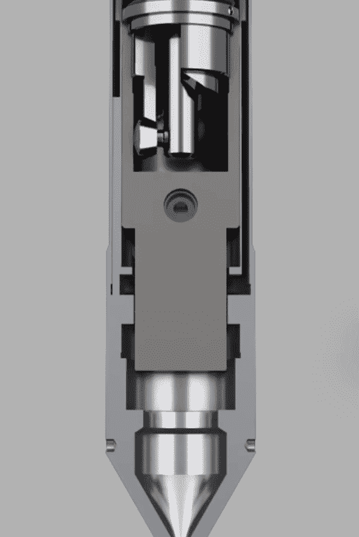
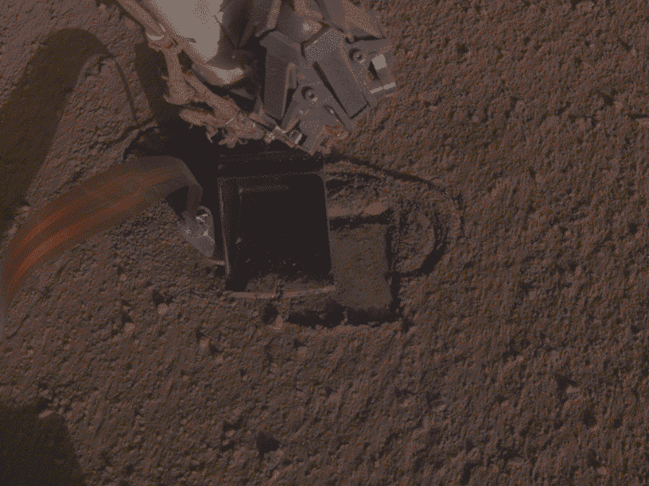

# 黑客火星:洞察鼹鼠再次行动

> 原文：<https://hackaday.com/2019/10/28/hacking-mars-insight-mole-is-on-the-move-again/>

你的工作可能很艰难，但当参与火星洞察号着陆器任务的任何工程师得知着陆器上的旗舰仪器之一，实际上正是整个任务的命名仪器，似乎是一个哑弹时，请想想他们。以任何人的标准来看，这都是糟糕的一天，它发生在夏天，当时有报道称，使用地震调查、大地测量和热传输着陆器热流和物理属性包(HP)的火星内部探索，俗称“鼹鼠”，没有按计划钻进火星风化层。

但是现在，经过几个月的头脑风暴和在地球和火星上的艰苦测试，鼹鼠似乎又开始工作了。美国宇航局宣布，在着陆器反铲挖土机的一点帮助下，HP 穿透器已经深入土壤 2 厘米。这与传热实验计划的 5 米深度相去甚远，但这是一个进步，聪明的黑客让探测器走了这么远，可能会继续挽救这个 8.28 亿美元项目计划的一大块科学。

## 火星很奇怪

Mole at work. Rendering of the HP³ penetrator mechanism. Source: [German Aerospace Center, DLR](https://www.youtube.com/watch?v=KAxiHK6dYvE)

当鼹鼠第一次开始遇到问题时，它似乎遭受了任何陆地挖沟机的命运，这些挖沟机将铲子挖到了曾经有冰川的地面上:它撞到了一块岩石。但是，根据早期任务的数据，InSight 的着陆点被特别选择在尽可能没有岩石的地方。美国宇航局和 JPL 认为，击中地下岩石的几率低至 4%，事实上，从穿透器和 InSight 部署的地震仪器传回的遥测数据似乎反对物理障碍。

在深入研究这些数据后，很明显这个问题可以归结为一个简单的事实:火星很奇怪。更具体地说，火星风化层没有科学家们预期的物理特征。穿甲弹的工作原理有点像冲击钻；电动马达转动凸轮，凸轮顶着强大的负载弹簧收回锤子。当凸轮释放时，锤子在弹簧压力下向前爆炸。由于穿甲弹中的第二个阻尼弹簧，而且由于穿甲弹壳体和风化层之间的摩擦，净力是向下的。显然，问题就出在这里:风化层的物质特性根本不是科学家所预期的。

## 还不如摇滚呢

InSight 机器人手臂上的摄像头拍摄的图像显示，最初敲入风化层的过程只成功地铰出了一个大的锥形草皮，使鼹鼠成了一个阿基特尔，没有任何东西可以推动。更重要的是，相机能够窥视孔内，看到一层榴壳，这是一个地质术语，指靠近地表的薄而硬的土壤层，是由溶解在地下水中的矿物质沉淀并将土壤颗粒粘合在一起造成的。科学家们知道火星上存在榴石外壳；事实上，这是液态水曾经存在的主要证据之一。但他们没想到会在 InSight 着陆点遇到它。

由于有一层坚硬的东西支撑着，而且完全没有摩擦力，工程师们想出了几个恢复的主意。带有反铲式铲子的机械臂被用来推动草皮的周边，希望它能把浮土压回洞里，并提供一些摩擦力。七次诱发塌陷的尝试都失败了，部分原因是 HP 实验被设置在尽可能远离着陆器的地方。这意味着机器人手臂几乎延伸到其全部行程，它可以施加在风化层上的力大大减少。

 [https://www.youtube.com/embed/uuJoyZ0IuLk?version=3&rel=1&showsearch=0&showinfo=1&iv_load_policy=1&fs=1&hl=en-US&autohide=2&wmode=transparent](https://www.youtube.com/embed/uuJoyZ0IuLk?version=3&rel=1&showsearch=0&showinfo=1&iv_load_policy=1&fs=1&hl=en-US&autohide=2&wmode=transparent)

## 确定问题

B 计划包括小心翼翼地用桶把鼹鼠钉在洞边。鉴于向火星发送命令和获取数据之间的时间差，这里发生灾难的可能性很高。铲斗很容易损坏鼹鼠，特别是在船体和长 Kapton 尾部之间的脆弱连接处，尾部包含穿甲弹的动力和数据以及土壤传感器。

经过充分的测试后，钉钉子被确定为足够安全，可以尝试，结合使用铲子将材料拖进草皮，组合摩擦力足以给鼹鼠所需的咬力，开始在榴莲皮中前进。

从长远来看，这种方法的效果如何，以及一旦鼹鼠超出机械臂的帮助范围会发生什么，还有待观察。同样不清楚的是，在没有进一步帮助的情况下，探测器是否能完全穿过榴莲壳，榴莲壳的厚度可能从几毫米到几米不等。该小组正在寻找方法，如果榴石壳层很难穿过，可以使用铲斗直接推动穿甲弹的背部。

这将是一个像以前在太空中进行的任何操作一样冒险的操作，这样的举动可能是最后的努力，因为它可能会耗费惠普的生命。但至少 InSight 团队仍然有一些选择，并最终在一系列棘手的问题上取得了进展。