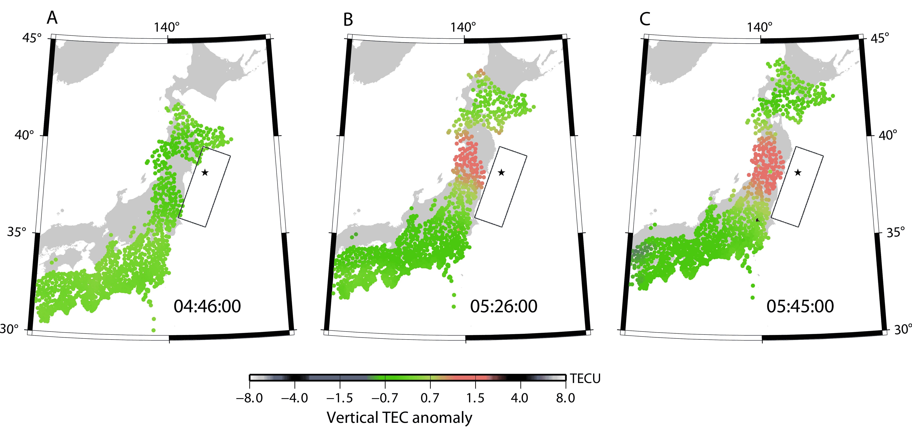

# 高频传播和地震

> 原文：<https://hackaday.com/2019/11/12/hf-propagation-and-earthquakes/>

尽管现代天气预报取得了成功，飓风、暴风雪，甚至臭名昭著的不可预测的龙卷风在袭击前都能被例行公事地探测到，但可靠地预测大自然愤怒的一个方面却避开了我们:地震。20 世纪中期板块构造理论的发展和全球地震传感器网络的建设给了地质学家理解地震如何发生的工具，甚至提供了准确预测即将到来的地震的诱人可能性。然而，这样的努力只取得了有限的成功，并且有足够多的假警报，以至于大多数预测地震的努力都在 20 世纪 90 年代末左右被放弃了。

结果可能是科学家们在错误的地方寻找地震来临的可靠预测。一些地质学家和地球物理学家已经确信，与其观察地球的抽搐和痉挛，不如观察天空的状况可能会更有收获。他们正在利用来自太空和地面的无线电波的传播来证明他们的观点，即电离层在地震发生前后会做一些有趣的事情。

## 压力下

虽然关于地震发生及其后果的记录可以追溯到很久以前，但是直到最近我们才知道是什么导致了地球的震动。地球物理学很复杂，但基本原理很容易掌握:当漂浮在地幔熔融岩石上的巨大构造板块在断层线上相对移动时，摩擦力会使它们粘在一起。应变在它们之间积累，当应变最终克服与之相反的摩擦力时，储存在变形岩石中的巨大势能被释放出来，于是地面移动了。

早期预测地震的尝试依赖于从井水水位变化到奇怪的动物行为的一切，基于这样一种理论，即断层处的前兆运动可能会导致动物不知何故会感知到的次声振动。地质学家还试图从他们的地震记录网络检测到的几乎持续不断的震颤和小地震中梳理出模式，将它们与事后的更大地震相关联。尽管几十年的努力，这些都没有得到回报。

要改变地震探测模式，需要一场大地震和一位有独特准备的科学家的偶然观察。2011 年 3 月，灾难性的日本东北地震(7.9 级地震)重创了福岛第一核电站，引发了毁灭性的海啸，夺去了近 16，000 人的生命，此后，大多数科学家都在研究地震数据，以了解更多关于地震的信息。但是日本北海道大学的 Kosuke Heki 教授有另一个想法:如果地震导致电离层发生变化会怎么样？

Heki 是空间大地测量学方面的专家，主要使用基于空间的系统探索地球的形状、形状位置和重力场。他知道电离层的变化会影响地面上的 GPS 和 GNSS 接收器，借助日本庞大的接收器网络来跟踪地壳的最小运动，他能够在地震震中的正上方发现异常的电子聚集。更重要的是，这些建筑比地震开始前提前了 40 分钟。

Ionospheric total electron content (TEC) increased in the 40 minutes preceding the Tohoku quake, as assessed by surface GPS signal changes in the area near the epicenter. Source: Heki, K. ( 2011), Ionospheric electron enhancement preceding the 2011 Tohoku‐Oki earthquake, Geophys. Res. Lett., 38, L17312, [doi:10.1029/2011GL047908](https://doi.org/10.1029/2011GL047908).

从表面上看，电离层能够以某种方式对地球深处发生的事情做出反应似乎有点牵强。但事实证明，地球和大气之间存在着深层的电联系。理解这些联系的关键在于即将断裂的断层处岩石中出现的微裂缝。地质断层处岩石中积累的应力不会在一次事件中释放。想象一下慢慢弯曲一支铅笔来折断它——铅笔开始弯曲，油漆开始开裂，当木质纤维开始爆裂时，你会听到微弱的噼啪声，然后铅笔突然断裂成两截。岩石的行为非常相似，如果在一个非常不同的尺度上，它是在主裂缝之前发生的微裂缝，可以为电离层扰动提供动力。

该理论认为，岩石矿物颗粒中的化学键，特别是两个氧原子之间的过氧键，被微裂缝打破。这留下了电荷不平衡，过氧键的一边有过量的电子，另一边有正空穴。这些空穴倾向于从岩石的高应力区域迁移到无应力区域，这导致它们最终到达表面，使其带有净正电荷。随着下面岩石中的应力增加，到达表面的正空穴数量迅速增加，从大气中吸引电子来平衡电荷。移动的电荷产生了一个巨大的电磁场，可以一直到达电离层，创造了 Heki 教授观察到的那种异常现象。

自东北地震以来，Heki 教授已经做了大量的工作来改进他的数据和完善他的模型。他挖掘了历史记录，修改了计算方法，以满足众多直言不讳的批评者，但地球物理学界尚未完全接受他的工作。鉴于之前地震预测的尝试令人失望，这是可以理解的，但 Heki 正在慢慢赢得怀疑者的支持，部分原因是对电离层的状态和研究手段有浓厚兴趣的公民科学家的努力:业余无线电操作员。

## 失去跳跃

尽管业余无线电运营商在设备上花了很多钱，但如果没有电离层的配合，这些钱大部分都是无用的。与视线之外的人联系依赖于从某物上反射信号，而通常情况下，这种东西是聚集在数百公里上空的带电粒子的折射层。电离层的各层主要在太阳电离辐射的影响下，每天都有涨落。Hams 被调谐到这些周期中，任何改变电离层状态的东西都是无线电圈相当感兴趣的话题。

来自加拿大的业余无线电操作员 Alex Schwarz (VE7DXW)出场了。为了测量 2017 年席卷北美的日食引起的传播变化，施瓦兹建造了他称之为[“射频地震仪”](http://users.skynet.be/myspace/mdsr/index.html)。使用定制的 SDR 软件和接入短波接收机或 ham 收发器中频级的特殊下变频器，RF 地震仪监测高频(HF)波段上宽带噪声的变化，ham 最常用于通过电离层跳跃进行长距离接触。日食路径上的多个站点监测到了高频传播，但不幸的是，当月亮的阴影遮住了太阳的电离辐射时，噪声水平没有出现预期的变化。

射频地震仪似乎失败了，但亚历克斯一直在监测情况，一年多一点后，温哥华岛海岸发生了一次小地震。这场 4.9 级的地震完全符合噪音水平的峰值，这表明震区上空的电离层表现与 Heki 博士预测的一样。此外，目前困扰全球的太阳活动极小期状况几乎排除了传播变化的正常太阳原因。看起来电离层的变化肯定是由地震引起的。

2019 年 11 月 7 日的 RF 地震仪捕捉。在当天全球范围内由物理地震仪检测到的 9 次地震中，根据射频地震仪网络的测量，所有地震的射频传播都有相应的变化。来源:VE7DXW

从那时起，Schwarz 和他的公民科学家小组对四年的 RF 地震仪数据进行了回顾性研究，并将其与同一时期的已知地震列表进行了比较。在 171 次 6.1 级以上的地震中，他们的数据显示，在地震发生的时间，80 米波段上出现了噪音峰值。在许多这样的观测中，噪音峰值在地震开始前明显可见。Schwarz 准备了一份方便的 PDF 指南来解释信息丰富的地震图，以及对 2016 年观察到的所有主要地震的分析。

很明显，RF 地震仪还不能宣称对地震有可靠的预测能力。就此而言，赫基博士的太空观测也不支持这种说法。但是，看起来电离层的变化肯定可以在时间和空间上与地震相关联，事实上，这种现象可以用相对简单的设备在大范围内观察到，这意味着我们很快就会知道事情的真相。