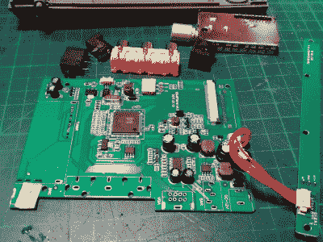

# Amstrad 便携式获得现代液晶显示器移植

> 原文：<https://hackaday.com/2019/10/30/amstrad-portable-gets-a-modern-lcd-transplant/>

在真实的硬件上玩经典游戏是我们许多人都喜欢的体验，但有时硬件对于现代人来说有点太复古了。一个很好的例子就是最初安装在 Amstrad PPC640 便携式 8086 PC 上的可怜的单色 LCD ,[ dry gol]最近拿起了它。他决定，如果他[把它换成一个时钟上没有 30 多年的显示器](https://retrohax.net/amstrad-ppc640-modshax/)，他的便携式 Amstrad 会议将会更加令人愉快。

为了平息任何老式硬件爱好者的抱怨，值得一提的是，原来的 LCD 实际上已经损坏，无论如何都需要更换。诚然[Drygol]可以试图找到一个当代的面板来代替它，但看看改装后的 PPC640 令人难以置信的前后照片，很难说他没有做出正确的决定，将现代显示器扔进基本上是原创的计算机。

Getting the new LCD’s PCB ready for installation.

[Drygol]说他在易贝买了一台便宜的 4:3 液晶电视，幸运的是，他发现新面板完美地嵌入了原来的框架。要把它扣上，需要拆除 RF 罐和电视 PCB 上的所有母连接，另外他还必须在显示器外壳的背面切一些孔来安装 LCD 的控制装置，但总的来说，它看起来很普通。

当然，把新的液晶显示器放在原来的框架里只是成功的一半，它仍然需要以某种方式连接到电脑上。为了让每个人都玩得很好，[Drygol]正在使用一种商用的 MDA/CGA/EGA 到 VGA 转换器，它安装在电池原本应该去的地方。连接到 PPC640 的外部显示器连接器，它允许他驱动新的显示器，而不必使用原来的 LCD 接口。

[Drygol]通过在最近的记忆中执行一些最令人印象深刻的复古硬件修复和修改，已经为自己赢得了一些名声。从令人难以置信的修复一个破碎的 Atari 800XL 外壳的工作到他的 T2 华丽定制的 Amiga A500 T3，他的项目肯定会让观众中的复古硬件爱好者满意。

 [https://www.youtube.com/embed/3MHMM8vQiEw?version=3&rel=1&showsearch=0&showinfo=1&iv_load_policy=1&fs=1&hl=en-US&autohide=2&wmode=transparent](https://www.youtube.com/embed/3MHMM8vQiEw?version=3&rel=1&showsearch=0&showinfo=1&iv_load_policy=1&fs=1&hl=en-US&autohide=2&wmode=transparent)

