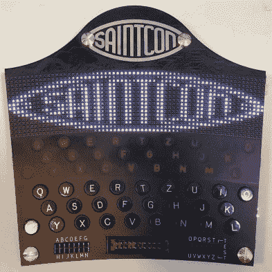
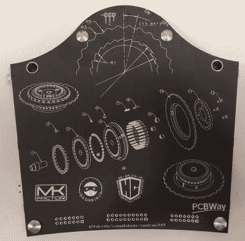
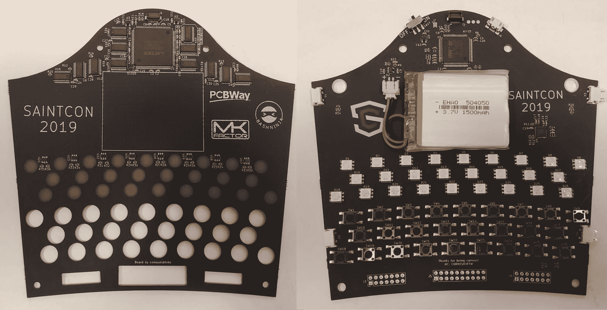
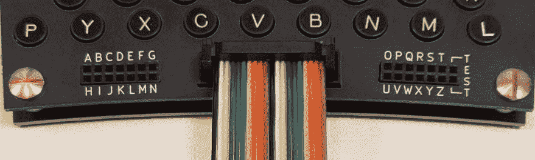
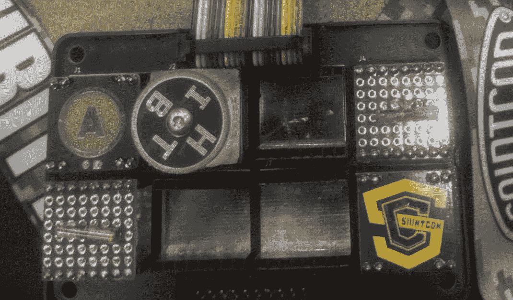
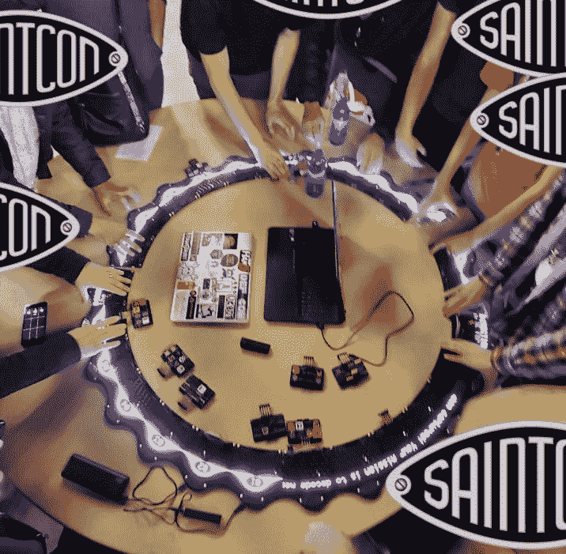

# Saintcon 徽章不再是一个谜

> 原文：<https://hackaday.com/2019/10/31/saintcon-badge-is-an-enigma-no-more/>

整个周末，推特上都是来自犹他州普罗沃的年度安全会议 Saintcon 的消息。现在周末已经结束了，我们终于可以得到我们一直垂涎的弯曲的 LED 覆盖徽章的完整硬件和软件来源，以及它的创造者 [ [compukidmike](https://twitter.com/compukidmike) ]和 [bashNinja](https://twitter.com/_bashNinja) ]写的[。让我们开始吧，看看有什么在等着我们！](https://mkfactor.com/?p=100)

## 设计

    

今年的徽章被设计成代表一台恩尼格玛机器的单个转子上的一个齿。一台[英格玛机的全部功能相当复杂](https://hackaday.com/2017/08/22/the-enigma-enigma-how-the-enigma-machine-worked/)，但是一个单独的设备有三个转子，每个转子有 26 个齿(每个齿对应一个字母)，还有一个键盘用于输入，一个字符显示器用于显示每个加密的字母。作为参考，徽章的背面有一张徽章在英格玛系统中的位置图。

徽章设计让人想起二战时期的设备，每个单元都包括一个完整的 QWERTZ 键盘(带标签的按键！)和用于单个字符输出的 RGB“灯板”，但与原版不同的是，还有一个弯曲的 16 x 64 RGB LED 显示屏，由那些迷人的约 1 毫米 x 1 毫米的小 LED 制成。总之，该设备包括 1051 个发光二极管！结合非同寻常的非直线形状的徽章和英格玛风格的 Saintcon 标志，使其具有吸引力，凝聚力的外观。

The inside of the sandwich. Top on left (flipped over), bottom on right.

## 技术规格

幸运的是，为了满足 Saintcon 与会者的脊椎治疗需求，徽章创作者选择不像最初那样用木头制作底盘。相反，它是由越来越普遍的“PCBAs 三明治”方法形成的，它确实是一种三明治！上 PCBA 主要致力于令人愉快的 RGB 显示器及其支持硬件。在图像的顶部，您可以看到点阵 ICE40HX1K FPGA 和寻址矩阵所需的 *12* 移位寄存器。看起来他们认为没有一个合适的 LED 控制器可以支持这么多的通道，并推出了自己的产品。FPGA 使用 SPI 接口，该接口与最近流行的大型 LED 矩阵面板所使用的接口非常相似，系统只能以 30 FPS 的速度更新显示，以避免与 LED 驱动器相关的重影。当然，你选择 ICE40 FPGA 是因为它出色的开源工具链支持，在开发期间 [Icestudio 的](https://icestudio.io/)基于 GUI 的可视化工具帮了大忙。

下 PCBA 掌握着徽章的其余魔力。主 CPU 是基于 Cortex-M4 的 STM32L433，采用 100 引脚封装。他们一直在考虑一个更小的部分，但功能不断蔓延，直到他们使用每一个引脚！从设计上看，其中一些引脚分配来自键盘，这些键盘是单独连接的，而不是以矩阵形式扫描的，但即使如此，他们也确实使用了灯板上 RGB LEDs 的控制器。总之下层电路板可能*看起来*更复杂，但更复杂的原理图绝对是上层！

但是徽章底部的那些大连接器呢？除了三个转子之外，最初的英格玛机还包括一个插板，当操作员按下它们时，插板可以交换成对的字母。当然，为了准确起见，Saintcon 徽章也有一个插板！因此侧边的头部。

Populated minibadges, by @Demos74dx [https://twitter.com/Demos74dx/status/1186753118232403968](https://twitter.com/Demos74dx/status/1186753118232403968)

中间的连接器呢？没有迷你吧就不是圣康徽章了，所以当然是迷你吧适配器了！Brian Benchoff 可能已经离开了标准委员会，在 2019 年批准[扩展的 SAO 1.69bis 附加标准](https://hackaday.com/2019/03/20/introducing-the-shitty-add-on-v1-69bis-standard/)，但早在 2017 年[ [wifiluke](https://twitter.com/wifiluke) 设计了你在这里看到的[双头外形规格](https://github.com/lukejenkins/minibadge)。虽然“SAO”仅指定了一个连接器，但 minibadge 标准指定了*整个 minibadge* ，这使得设计更像[球探贴片](https://www.girlscouts.org/en/our-program/badges.html)的固定器来展示它们以纪念奖励或成就成为可能。Saintcon 的不同团体和活动会发放迷你徽章来展示会员资格或炫耀成就，因此徽章需要一种展示方式。

对于一个很奇特的例子，看看这个我们最近报道过的驱动 VFD 管的[仓鼠]的!

## 徽章挑战

Faces redacted for privacy

与许多会议一样，Saintcon 徽章的创建者包括一个挑战，旨在迫使与会者进行互动。从软件到徽章的物理形状，一切都鼓励这种行为。你怎么处理一个 26 齿转子的单齿徽章？当然是连接 25 个好友啦！

每个与会者都得到了一套类似于真正的英格玛机的操作说明，以及一段加密代码(当然还有德国风味的文本)。通过正确配置他们的转子齿并连接到其他适当配置的徽章，可以在巨大的 27，326 像素，16 x 1664 RGB 显示器上访问挑战线索。

如果你想自己制作一个这样的怪兽，可以看看顶部链接的 Github repo。它包括两种 PCBAs 的完整硬件、软件和 HDL 源。如果你正在考虑手工组装，我们可能会建议尝试使用[焊膏模板](https://hackaday.com/2016/03/10/tools-of-the-trade-solder-paste-dispensing/)；那些微小的发光二极管只是乞求与一个焊接。

如果(和我们一样！)你喜欢棒球内幕，请查看完整的关于 BOM 成本、范围蔓延、制造和所有你最喜欢的 PCBA 相关战争故事的详细资料。总的来说，似乎大多数问题都被解决了，只不过徽章的制作稍微超出了预算，但对与会者来说功能齐全！在我们看来，这听起来像是成功。这篇文章只涉及了原文中[compukidmike]的一小部分细节，所以一定要看一看更多的细节。

如果说的话更符合你的风格，我们在下面嵌入了他的徽章对话。

 [https://www.youtube.com/embed/MAhJ2W_oN14?version=3&rel=1&showsearch=0&showinfo=1&iv_load_policy=1&fs=1&hl=en-US&autohide=2&wmode=transparent](https://www.youtube.com/embed/MAhJ2W_oN14?version=3&rel=1&showsearch=0&showinfo=1&iv_load_policy=1&fs=1&hl=en-US&autohide=2&wmode=transparent)

