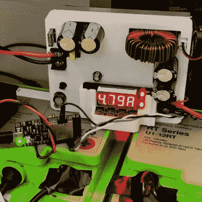

# ESP32 是低成本太阳能装置中的优秀 MPPT 控制器

> 原文：<https://hackaday.com/2019/11/04/esp32-makes-great-mppt-controller-in-low-cost-solar-installation/>

总的来说，太阳能发电项目已经变成了选择电池板和电池等组件，用行业标准的连接器将它们连接在一起，然后坐下来观看自由电流的问题。因此，太阳能项目已经变得有点无聊，所以我们并不经常看到一个像这个极其便宜的开源太阳能项目一样吸引我们注意力的项目。

 【蒂姆·奥布莱恩】的 DIY 离网光伏系统的背景故事始于他想给他的[电动轮](https://www.ewheels.com/)充电，这相当于一辆电池供电的独轮车。如果你有必要的协调能力，它们看起来是在城市环境中出行的一个有趣的选择，而这显然是我们所缺乏的。但是给这样的东西或电子自行车充电是太阳能的一个很好的使用案例，特别是因为[蒂姆]碰巧发现了一个便宜的 450 瓦光伏电池板。可悲的是，该面板是一个商业单位，兼容现成的 MPPT，或[最大功率点跟踪](https://hackaday.com/2017/03/17/are-you-down-with-mppt-yeah-you-know-me/)，控制器价格昂贵。

他的解决方案是用一个便宜的 DC-DC 转换器制造他自己的控制器，这个转换器刚好有串行远程控制。ESP32 监控面板电压，并控制降压转换器运行任何他想要的。当他不给他的电子轮充电时，系统运行他的笔记本电脑和路由器。另外，ESP32 可以与 Adafruit.io 和 Thingspeak 等物联网服务进行对话，使他可以跟踪 MPPT 的数据，而不必将其发送到未知的地方。

虽然我们欣赏 DIY MPPT 控制器，喜欢[蒂姆]的建设，我们觉得像文档需要一点充实。对于太阳能装置来说，麻烦在于细节，不解决电缆布线和连接器安装等看似平常的问题会导致灾难。