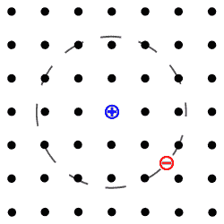

# 什么是激子？

> 原文：<https://hackaday.com/2019/12/19/whats-an-exciton/>

如果你阅读科学文献，你会看到你在学校学到的熟悉的亚原子粒子:质子、中子和电子。如果你足够年轻，你会看到其他你可能也听说过的东西，比如夸克和胶子。但是最近有很多关于激子的讨论，甚至一些晶体管电路展示了使用激子。但是什么是激子呢？

它实际上听起来像一个亚原子粒子，但它比那要复杂一点。激子是电子和电子空穴的束缚态，在技术上是玻色子。你可能对半导体物理学中的电子空穴概念很熟悉。从技术上讲，它是一种准粒子。科学家对这种野兽感兴趣的原因是，它可以在不传输净电荷的情况下传输能量。即状态本身是中性的，但也包含能量。

## 奇异粒子的激动时刻

这幅来自洛桑联邦理工学院 (EPFL)的一分钟漫画很好地解释了为什么激子是令人兴奋的。

 [https://www.youtube.com/embed/6hCVlRC_l5E?version=3&rel=1&showsearch=0&showinfo=1&iv_load_policy=1&fs=1&hl=en-US&autohide=2&wmode=transparent](https://www.youtube.com/embed/6hCVlRC_l5E?version=3&rel=1&showsearch=0&showinfo=1&iv_load_policy=1&fs=1&hl=en-US&autohide=2&wmode=transparent)

EPFL 去年有了突破，允许室温激子晶体管。解释这一切的论文并不那么有趣，但你可以在常见的地方找到“范德瓦尔斯异质结构中激子通量的室温电学控制”([https://doi.org/10.1038/s41586-018-0357-y](https://doi.org/10.1038/s41586-018-0357-y))。

 形成激子的一种方式是用高于其带隙能量的光子撞击材料。这将电子从价带移动到导带。导带上的新斑点是电子，价带上的空穴通过静电力与电子结合。特别是，空穴对周围所有电子的吸引力使一切保持稳定。这也消耗了这对搭档的一点精力。

 奇怪的是，激子并不新鲜。1931 年，一个名叫雅科夫·弗伦克尔的人首次提出了这一概念。他实际上是在描述 H. H .普尔观察到的绝缘体中的导电现象。事实上，弗伦克尔在物理学术语中引入了洞的概念，某些类型的洞仍然被称为弗伦克尔缺陷。

工作继续使激子实用化。康奈尔大学最近宣布他们[显著提高了激子的冷凝温度](https://news.cornell.edu/stories/2019/10/researchers-raise-temperature-exciton-condensation)(从 1 开尔文到 100 开尔文；离室温还很远)。

## 等待是最难的部分

这对我们意味着什么？这周什么都没有。但是在未来的某一天，你正在使用的集成电路可能会利用这些奇异的粒子。虽然这听起来有些牵强，但想象一下，在 20 世纪 30 年代，对于电子管收音机的设计者来说，在短短几十年内，我们将拥有一种像电子管一样的东西，可以放在你的指甲上，并且与电子管相比完全粗糙。