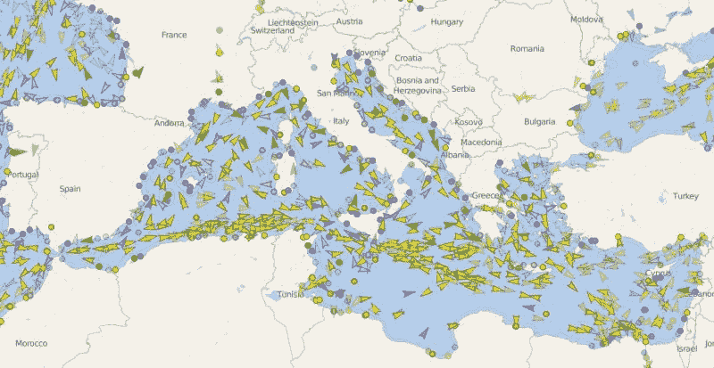

# 七大洋上的交通更新:使用 Raspberry Pi 的开源海图绘图仪

> 原文：<https://hackaday.com/2019/11/04/traffic-updates-on-the-seven-seas-open-source-chart-plotter-using-a-raspberry-pi/>

随着各种形式的 Raspberry Pi 继续成千上万地流入野外，有趣的是看到它的用户群扩展到黑客社区之外。一群也开始喜欢上它的人是航海爱好者。[詹姆斯·康格]就是这样一个水手，他建造了自己的 [AIS 海图绘图仪](https://www.youtube.com/watch?v=PdfLTA2CRL8)，其价格只是同类商业设备的一小部分。

AIS transponders in the Mediterranean. [VesselFinder](https://www.vesselfinder.com/)

自动识别系统(AIS)是一种 GPS 跟踪系统，它使用转发器将船舶的位置数据传送给一个区域内的其他船舶或接收站。这是用于避免碰撞，并由当局(和爱好者)保持对航运交通的眼睛，并允许受灾船只很容易被发现。[James]“DIY 海图绘图仪将接收到的 AIS 数据叠加在一个漂亮的大显示屏上的海图上。一个树莓皮 3B+， [AIS 接收帽](https://www.tindie.com/products/astuder/daisy-hat-ais-receiver-for-raspberry-pi/)，USB GPS 加密狗和一个组成了系统的核心。整套设备大约花费 350 美元。Pi 运行 [OpenCPN](https://opencpn.org/OpenCPN/info/about.html) ，这是一个开源的海图绘图仪和导航软件包，【约翰】说它可以与大多数商业软件相媲美。正如大多数 Pi 用户所知，SD 卡通常是一个薄弱环节，因此有一个已经安装了所有软件的备份 SD 卡可能是值得的，以防它在航行中出现故障。

我们已经看到了使用 RTL-SDR 建造的 [AIS 接收站](https://hackaday.com/2013/05/06/tracking-ships-using-software-defined-radio-sdr/)，以及围绕航空领域的 AIS 等效物 [ADS-B](https://hackaday.com/2019/08/14/remote-ads-b-install-listens-in-on-all-the-aircraft-transmissions-with-rtl-sdr-trio-phones-home-on-cellular/) 的许多项目。休息之后看看[John]的视频。

 [https://www.youtube.com/embed/PdfLTA2CRL8?version=3&rel=1&showsearch=0&showinfo=1&iv_load_policy=1&fs=1&hl=en-US&autohide=2&wmode=transparent](https://www.youtube.com/embed/PdfLTA2CRL8?version=3&rel=1&showsearch=0&showinfo=1&iv_load_policy=1&fs=1&hl=en-US&autohide=2&wmode=transparent)

