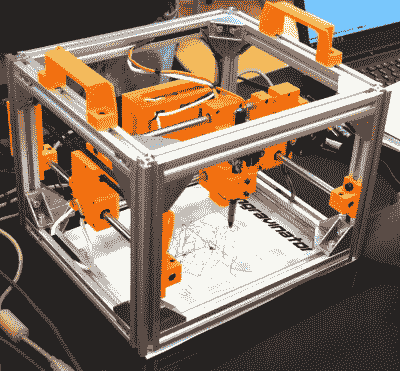
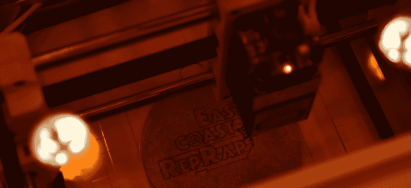

# 面向所有人的开放式硬件激光雕刻机

> 原文：<https://hackaday.com/2019/11/06/an-open-hardware-laser-engraver-for-everyone/>

现在，你可以花大约 100 美元在易贝买到一台二极管激光雕刻机。这听起来像一个交易，但它可能会使用一些神秘的专有软件，不会非常准确，而且激光器本身几乎肯定会完全暴露。当然，并不缺少 DIY 构建，这极大地改善了这种情况，但不幸的是，自己复制它们的文档和说明往往有很多不足之处。

为了让安全和精确的激光平台落入各地黑客的手中，我们需要更多有据可查的开源设计，这些设计实际上是以社区为中心构建的。像【亚当·海尔】中的[雕刻师这样的项目。这不是一个一次性的设计，事后将文档扔在一起，这是一个完全开放的硬件雕刻师，具有简明的组装指南，由 3D 打印零件和现成的组件构建而成。你可以自由地自己寻找和打印零件，或者最终将所有东西作为一个套件购买。](https://engravinator.com/)

Pen-equipped Engravinator

微波尺寸的雕刻器由标准的 2020 铝挤压制成，可工作面积为 130 毫米 x130 毫米。外壳的前面有一个舱口，用于放置足够小的物体，以便放入机器中，但开放的底部和顶部的手柄也允许用户将雕刻器直接放在工作台上。[Adam]说，如果你想在桌面或其他大型物体上刻录设计，这个功能会特别有用。

除了构成框架的铝挤压件和各种硬件之外，其他大部分零件都是 3D 打印的。根据 CERN 开放硬件许可证 1.2 版发布，并以 STL 和 STEP 文件的形式分发，雕刻师的可打印部分已经成熟，可以进行修改了。外壳面板的 DXF 文件也是如此，它需要用 CNC 或(讽刺的是)激光从橙色丙烯酸材料中切割出来。

运动由两个 NEMA 17 步进器和一个 GT2 皮带装置提供，亚当甚至用 TMC2100 驱动器组装了一个定制的控制板，他称之为鸭嘴兽；不过，如果你打算自己动手做，你也可以把它换成一个简单的跳板。你可以使用任何脉宽调制控制的二极管激光器与常见的 16x40mm 毫米 M3 螺栓模式，其中不乏易贝的选择。

[Adam]估计雕刻师的总成本，假设你从零开始，在 300 到 400 美元之间。但是很自然的，这个价格会随着你翻遍你的零件箱或者甚至从其他地方回收的硬件的多少而有很大的不同。如果你有一台落满灰尘的过时 3D 打印机，你可以从那里获得大量所需的硬件。

 
在最近的 2019 年东海岸 RepRap 节上，我们有机会看到雕刻师的作品，并留下了深刻的印象。这是一台坚固的机器，展示的结果看起来非常清晰。我们最喜欢的功能(似乎是可选的)是安装在外壳顶部的小型摄像头，它允许用户将待烧图像叠加在工件视图上，以便在烧之前检查对准情况。

有些人可能会认为雕刻师的总成本对于广泛采用来说仍然有点太高，尤其是考虑到你可以以大约相同的价格买到 K40。但是，如果你宁愿坚持使用二极管激光器，而不想冒险使用目前市场上有问题的硬件，我们认为这是一个值得关注的项目。

 [https://www.youtube.com/embed/gxyTThEgWBA?version=3&rel=1&showsearch=0&showinfo=1&iv_load_policy=1&fs=1&hl=en-US&autohide=2&wmode=transparent](https://www.youtube.com/embed/gxyTThEgWBA?version=3&rel=1&showsearch=0&showinfo=1&iv_load_policy=1&fs=1&hl=en-US&autohide=2&wmode=transparent)

