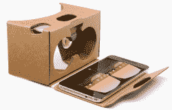
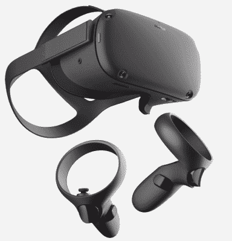

# 问 Hackaday:有人难过手机 VR 死了吗？

> 原文：<https://hackaday.com/2019/11/13/ask-hackaday-is-anyone-sad-phone-vr-is-dead/>

官方消息:基于智能手机的虚拟现实已经死亡。这一领域的两大玩家是[三星 Gear VR](https://www.samsung.com/global/galaxy/gear-vr/) (由脸书旗下的 Oculus 驱动)和[谷歌 Daydream](https://arvr.google.com/daydream/) 。两家公司都宣布退出，谷歌不再支持他们的新手机，Oculus 确认 Gear VR 已经走到了尽头。事情还没有完全结束，但当它结束时，肯定会留下许多空耳机。这些东西以百万计存在，但是有人*真的*使用基于手机的虚拟现实吗？看到它消失，你们有谁难过吗？

Google Cardboard, lowering cost and barrier to entry about as low as it could go.

如果你不熟悉基于手机的虚拟现实，这是它的工作方式:用户将智能手机放入耳机，戴在头上，并可选地使用无线控制器与事物进行交互。智能手机负责跟踪运动和显示 3D 内容，而耳机本身负责光学，并将一切都呈现在用户的眼球面前。低端是谷歌 Cardboard，高端是 Daydream 和 Gear VR。它很好用，而且既便宜又便携，那么发生了什么呢？

简而言之，基于手机的虚拟现实有一些限制，限制了它在提供虚拟现实体验方面能走多远，这些限制使它从长远来看是不可行的。以下是基于智能手机的虚拟现实走到尽头的一些原因:

这是用户和他们手机之间的一个楔子。使用手机进行虚拟现实是一个消耗电池的过程，这也意味着手机在忙于为虚拟现实体验供电时无法正常工作。这限制了用户的采用，因为大多数人*真的*不喜欢没有手机。

这可能会很麻烦。用户保留是一个问题，部分原因是基于手机的虚拟现实可能有点麻烦。Oculus 首席技术官约翰·卡马克承认，如果使用一款设备意味着将手机从手机壳中取出，将其接入耳机，然后将其拔出，再放回手机壳，“你会使用它两次。”

**沉浸感受到限制**因为基于手机的虚拟现实中的运动感应仅限于三个自由度(DoF)。这意味着只有坐着的体验，人们可以在虚拟现实中旋转头部四处张望，但耳机无法跟踪像靠近或在虚拟世界中四处移动这样的运动。

**基于手机的虚拟现实无法跟上**开发者发现在虚拟现实中运行良好的功能和体验。一个例子是在虚拟空间中移动的能力。像 Oculus Rift 和 HTC Vive 这样的专用 VR 头戴设备允许六个自由度的运动。这使得用户可以更加自然地移动，提供更加引人注目的交互式体验。

最终，基于手机的虚拟现实是当今更先进的虚拟现实耳机的重要前身，但即使是它的利基功能也不再让它与众不同。基于手机的虚拟现实提供的一个引人注目的优势是它是便携的、无线的和独立的。但即使这样，它也不再是最擅长的了。Oculus Quest(2019 年早些时候发布)也是独立的，完全无线的，但没有基于手机的系统固有的限制。电话 VR 只是一直跟不上。

Oculus Quest

电话虚拟现实的终结还意味着其他事情:一大堆空耳机。到 2017 年，谷歌已经出货超过 1000 万个纸板耳机。仅 Gear VR 全球销量就超过 500 万。由于用户保留率很低，而且至少其中一些耳机是免费捆绑的，可以说其中很多已经落灰了。但是现在这种支持正式结束了，所有这些基于手机的虚拟现实耳机会发生什么呢？

好消息是，耳机是相当简单的设备，很容易被篡改。由于它们包含光学元件，所以在其中放置一个屏幕就可以制作一个基本的头戴式显示器。我们已经看到了一些利用这一点的项目，如[这个远程控制的网真坦克](https://hackaday.com/2016/05/12/vr-telepresence-tank-from-raspberry-pi-google-cardboard-and-xbox-controller/)使用智能手机作为显示器，但避免任何电话 VR SDK，以及[这个自制系统使用小型 HDMI 显示器代替电话](https://hackaday.com/2019/01/03/a-low-cost-vr-headset/)。也许保留虚拟现实兼容性的旧手机可以找到一个家，作为特殊项目的显示器。有一件事可能会有所帮助，那就是谷歌[刚刚宣布了谷歌 Cardboard](https://developers.googleblog.com/2019/11/open-sourcing-google-cardboard.html) 的开源。你怎么想呢?这些旧耳机会有什么用处吗，或者它们会和空的 3D 打印机灯丝线轴一起成为半囤积的科技垃圾吗？