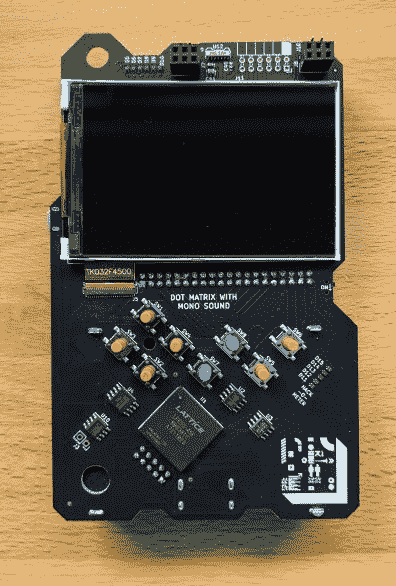
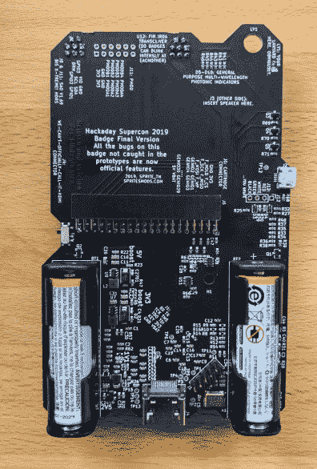
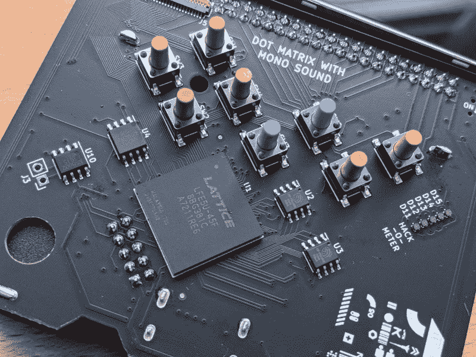
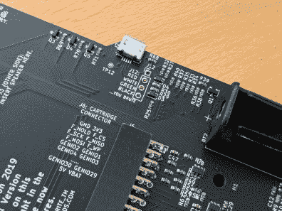
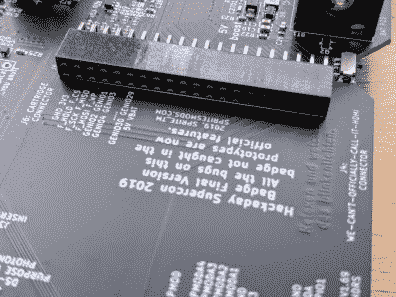
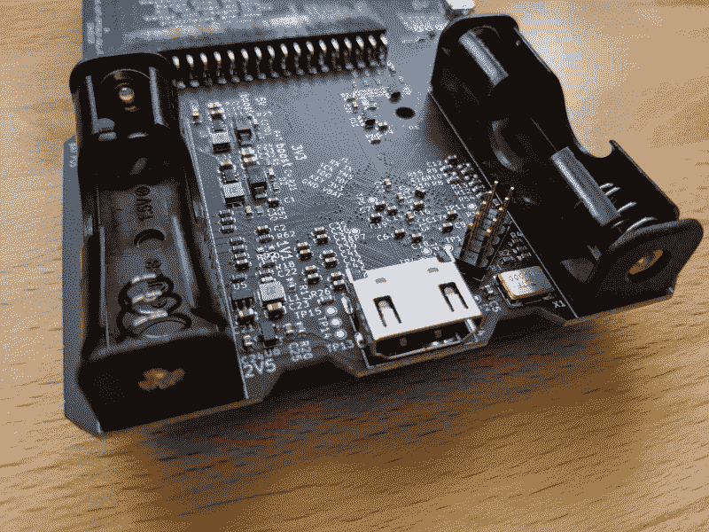
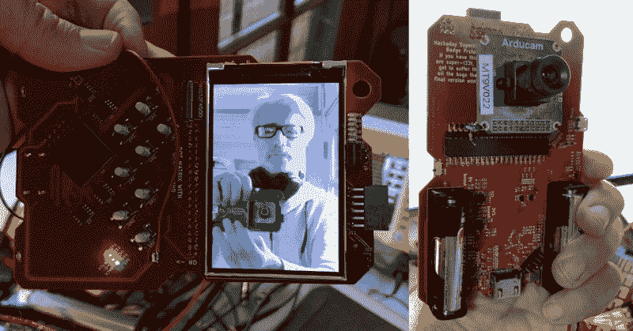

# 游戏机外形中的巨型 FPGA，2019 年 Supercon 徽章是一首硬件警笛歌

> 原文：<https://hackaday.com/2019/11/04/gigantic-fpga-in-a-game-boy-form-factor-2019-supercon-badge-is-a-hardware-siren-song/>

看着这个会议徽章，和你的自由时间吻别吧。 [2019 Hackaday Superconference 徽章](https://hackaday.io/project/167255-2019-hackaday-superconference-badge)是一个 ECP5 FPGA，在 Game Boy 外形规格中运行 RISC-V 内核，配有比我们以前见过的任何东西都更开放的墨盒插槽:多个开源 CPU 设计被嵌入到一个开放系统中，使用开源 FPGA 工具中的尖端技术开发，并在上面运行(自然地)开源软件。这是一个 3000 元的活动套件，适用于硬件人员、软件人员以及介于两者之间的所有人。

这个设计是耶鲁安·多姆伯格(又名 Sprite_TM)的创意，从今年年初就已经开始工作了。对于下周前往 Supercon 的 500 多人来说，这是为期三天的精彩娱乐和学习的来源。让我们来看看徽章上有什么，你需要知道什么来破解它，以及在徽章破解仪式结束后的很长一段时间里，该设计如何作为一个强大的开发工具。

## 最重要的是开放

在过去的几年里，已经有几个人要求围绕 FPGA 设计一个黑客日会议徽章，但直到今年，我们才认为时机成熟了。随着几个开源工具链的成熟，以及 RISC-V 内核为开源生态系统提供强大的现代指令集架构，FPGAs 最终实现了全方位的开放。

这是一个巨大的项目，耶鲁安一直在做令人难以置信的繁重工作，但为了支持这项工作，一个大型 badge 团队冲进来帮助稳定设计，根除并修复工具链中的错误，围绕 badge 设计研讨会以帮助教授 FPGA 原理，并编写运行在所有这些之上的 C 程序。

这不是轻描淡写——作为一个分布式工程团队使用这种硬件是对开放的真正方式的庆祝。最终的结果是，你可以从焊料和硅开始戳戳系统的几乎任何层次。

## 硬件

    

我怀疑这是你的坚韧不拔的细节后，所以这里的芯片纲要。FPGA 是 Lattice LFE5U-45F，这是一款具有 45k LUTs 的 ECP5。对于门外汉来说，这是一个巨大的芯片——最大的可能是 85k，但这仍然比你在三天的黑客攻击中可能需要的要多。(如果你证明我是错的，我会很高兴。)支持该芯片的是两个 Lyontek LY68L6400 64 Mbit SPI SRAM 芯片和一个 Winbond w25q 128 JVs IQ 128 Mbit NOR flash 芯片。理论上，你可以在这个徽章上勉强运行 Linux 看到有人把额外的 DDR 内存挂在盒式磁带插槽上是一个很好的黑客，让 Linux 发出咕噜声会很有趣，不是吗？

为了与 Game Boy 的外形保持一致，您会发现一个漂亮的 480 x 320 彩色 LCD 显示屏和八个用户按钮排列在熟悉的 D-pad/select/start/B/A 布局中。JBOY3 乐队上有单声道声音，我们手头会有扬声器，只需两个焊点即可添加。一个受 SID 芯片启发的“硬件”合成器在库中新鲜出炉，供您试用。

在徽章的背面，您可以找到一个用于加载软件的 USB 端口。FPGA 比特流可以通过 DFU 引导加载程序进行刷新，编译后的 RISC-V C 程序甚至更容易加载，因为徽章枚举为 USB 大容量存储。

    

其中最吸引人的是徽章底部的 HDMI 端口。我们希望把徽章黑客放在大屏幕上——这是一个 demoscene 展示。在屏幕上方的正面，有两个附加连接器，中间有一个 IRDA 模块和一个未填充的 PMOD。背面是一个 40 针 2.54 毫米的母分接头，每个获得徽章的人还会获得一个 protoboard 墨盒，其中包括一个闪存芯片和插头。没错，~~死星~~卡带插槽完全可以运行，徽章可以加载写入突破卡带芯片的游戏(或任何其他程序)。在两个 AA 电池座之间还有一个 JTAG 连接器，用于在出现任何问题时直接刷新 FPGA。

徽章硬件的最终生产版本令人叹为观止。哑光黑色阻焊膜作为支撑组件的微型大都市的画布，加上丝网标签的加盐——既实用又有趣——构成了一种令人愉悦的美感。

## 软件

 [https://www.youtube.com/embed/A3nuErB94jk?version=3&rel=1&showsearch=0&showinfo=1&iv_load_policy=1&fs=1&hl=en-US&autohide=2&wmode=transparent](https://www.youtube.com/embed/A3nuErB94jk?version=3&rel=1&showsearch=0&showinfo=1&iv_load_policy=1&fs=1&hl=en-US&autohide=2&wmode=transparent)

在这种情况下，软件*是这个项目的硬件*,因为 FPGA 必须被编程才能工作。一直到晶体管都是开放的。[架构的两个主要部分](https://github.com/Spritetm/hadbadge2019_fpgasoc)是片上系统(SoC)和初始程序加载器(IPL)。SoC 是 FPGA gateware，它创建了 CPU 及其所有外设，服务于从按钮和音频到 HDMI 和盒式磁带连接器的一切。IPL 是一个运行在此之上的系统软件，实现了一系列经典游戏控制台的最佳图形技巧。如果你在 SNES 上看到它，你可以在这个徽章上做同样的事情。

很难夸大 FPGA 的强大功能。徽章上有许多不受 RISC-V 处理器直接控制的 led。相反，耶鲁安在 SoC 中实现了一个 PIC 微控制器内核来处理低级驱动任务。需要额外的计时器或其他“硬件”外设？在 FPGA 上实现它，并将其连接到 RISC-V 内核。把一些古怪的硬件挂在盒式连接器上，利用芯片内部的门来构建你需要的任何适配器。你的 CPU 不应该为比特碰撞或周期计数而烦恼。这就是可编程逻辑的用途。

David Williams will be speaking about the FPGA revolution in small electronics. He added a camera to the cartridge slot of his prototype badge.

IPL 软件“OS”层为任何想写 C 游戏和其他程序的人提供了强大的能力。它从徽章或扩展盒上的闪存芯片中取出编译好的`.elf`文件，将它们添加到菜单系统中，允许用户运行它们。如果你只是想编写游戏程序，你甚至不用担心它下面的 FPGA。只是另一个微处理器，或者四个。

用 C 编写的 SDK 充满了好东西。有一个背景图像的功能，两个平铺层显示来自 16 x 32 平铺地图的 16 x 16 像素平铺，带有 16 色调色板。在它上面是一个精灵层。不仅这些都可以并发运行，而且您可以通过硬件驱动的速度来扩展和倾斜它们，远远超过您通常用单个 CPU 完成的速度。Sprite_TM 本质上在这里搭建了自己的自定义 GPU，邀请你使用。

## 你需要知道的；你要带什么

首先跳起来，用这个徽章尝试一些新的东西。如果你一直是 FPGA 的旁观者，现在是涉足它的时候了，数百名使用徽章注册了初级 FPGA 研讨会的人正计划这样做。如果你以前从未编写过基于磁贴的游戏，那么现在你有机会在你的项目列表中写下你已经拥有的那个*蛙人*克隆。自上而下的开放式项目的美妙之处在于，你可以随意进入任何一层。

首先，你需要带一台笔记本电脑和一根微型 USB 线。如果你带着预装的工具链到达，你会有更好的体验。在这方面有好消息，Sean Cross 已经为 Linux、Mac 和 Windows 开发了[无依赖性工具链](https://github.com/xobs/ecp5-toolchain)。只需前往他的 repo，为您的操作系统下载归档文件，并确保包含二进制文件的文件夹在您的路径中。它附带了所有开源的优点:`yosys`和`nextpnr-ecp5`用于 FPGA 开发，`dfu-util`和`riscv-gcc`用于 C 工作。

那些打算花大量时间在徽章黑客领域的人可能想多带点东西。额外的 AA 电池，可充电或一次性的，在这里是一个非常非常明智的选择。确保打包好你的 USB 转串行电缆，这样你就可以摆脱任何麻烦。如果你要用 FPGA 工作，你应该带上手头所有的 PMOD 板。如前所述，你的徽章将会有一个原型盒，所以你可以制作你的原理图，甚至提前组装一些原型。带上任何你想用来挂在这头野兽身上的东西。

这件硬件艺术品的工作量是惊人的，耶鲁安将在 11 月 16 日周六的 Hackady Superconference 上讲述完整的故事。如果你不能到场，去 Hackaday 的 YouTube 页面看看直播。如果你是在门票售罄前获得门票的幸运儿之一，接下来的冒险就是你的了。我们很高兴成为开放 FPGA 革命的一部分。超级广场见！