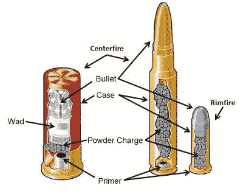

# 弹药温度如何影响射击精度

> 原文：<https://hackaday.com/2019/11/05/how-ammo-temperature-will-affect-shooting-accuracy/>

上次我们参观 Hackaday 射击场时，我们都很兴奋地保持正确的姿势，正确呼吸，降低心率，并在游荡的十字准星对准目标的正确时刻扣动扳机……最后还要适应不可避免的反冲。但我们从没想过检查弹药的温度！好吧，那里的温度不太可能变化太大，除非野猫选择躺在弹药箱上，但是在野外，温度很容易变化到 30 度，这肯定是个问题。

如果我们快速浏览一下强尼的重装工作台[上发生的事情，我们会得到不同温度下不同粉末的深度比较](https://www.youtube.com/watch?v=lcy8zqclIns)，数据是通过子弹速度雷达收集的。如果没有别的事情，仅仅是窥视一下“重新装填”的神秘世界就很有趣，在这个世界里，每一个微小的颗粒或粉末“球”都有所不同，不同的粉末需要特定的底漆来使它们正确燃烧。

先说清楚，子弹速度对弹道影响很大，尤其是远距离。例如，如果子弹以接近光速的速度行进，那么几乎不会有任何弹道，射手也不必为了距离而调整垂直瞄准。通常，我们必须向上瞄准才能击中目标:

可能我们在室温下“瞄准”我们的目标，但最终却在一个寒冷、霜冻的早晨用冰冷的弹药射击火器，鉴于我们现在从视频中了解到的情况，我们现在可以根据我们使用的特定弹药对这种可能性进行小的调整。休息之后是强尼的视频:

 [https://www.youtube.com/embed/lcy8zqclIns?version=3&rel=1&showsearch=0&showinfo=1&iv_load_policy=1&fs=1&hl=en-US&autohide=2&wmode=transparent](https://www.youtube.com/embed/lcy8zqclIns?version=3&rel=1&showsearch=0&showinfo=1&iv_load_policy=1&fs=1&hl=en-US&autohide=2&wmode=transparent)

奇怪的是，我们之前只在 Hackaday 上讨论过两次重装，[auto-trickler-gently-doles-out-powder-to-assist-Reloading/](https://hackaday.com/2019/05/02/auto-trickler-gently-doles-out-powder-to-assist-reloading/)，[case-feeder-makes-your-ammony-Reloading-more-efficient/](https://hackaday.com/2013/01/04/case-feeder-makes-your-ammo-reloading-more-efficient/)